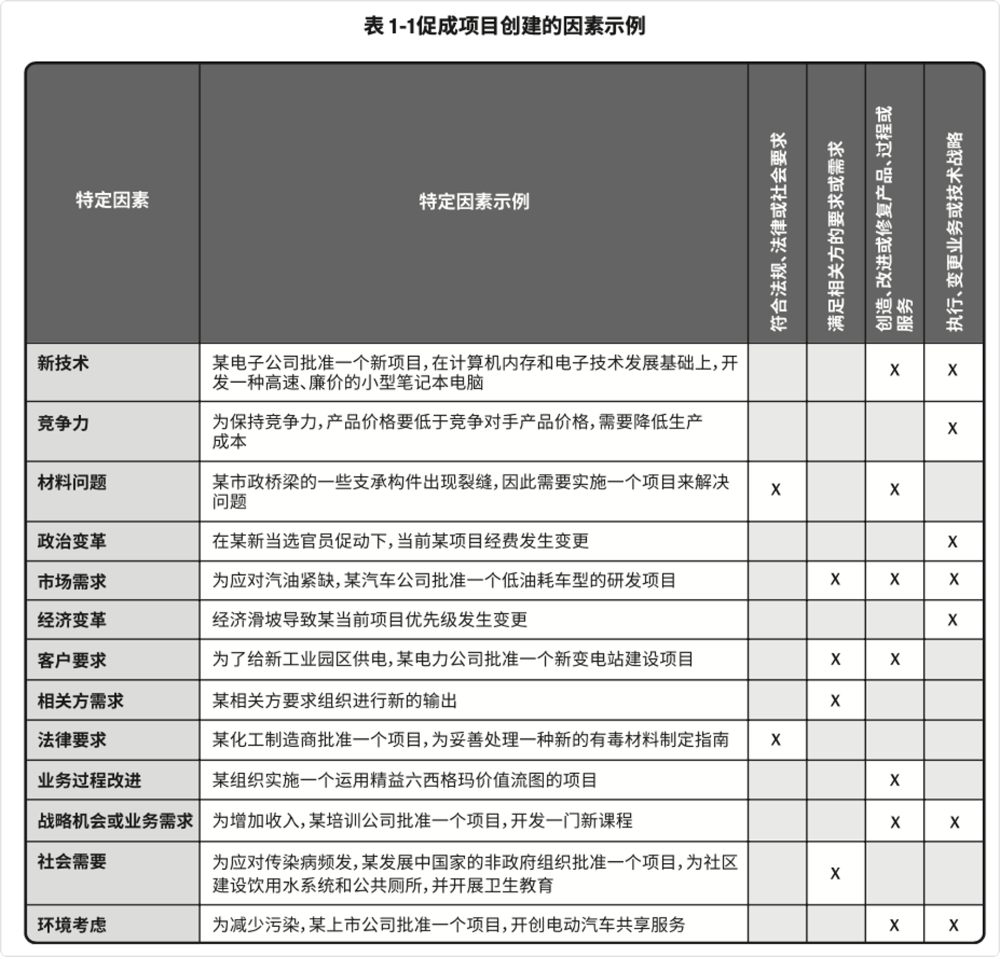
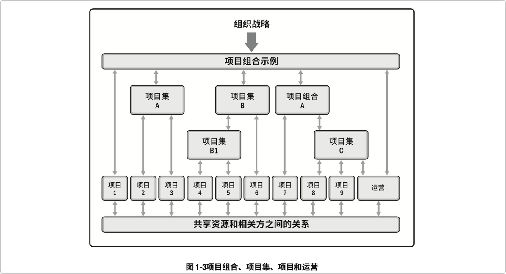
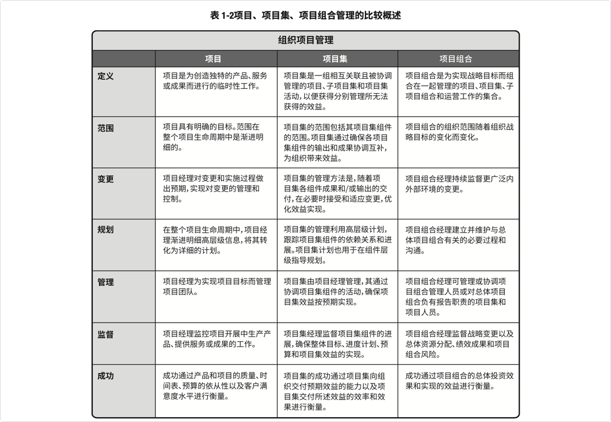
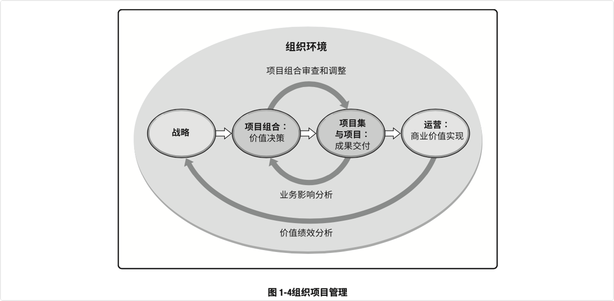
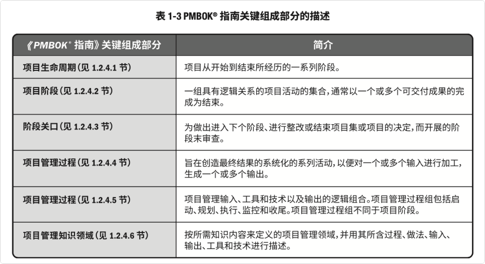
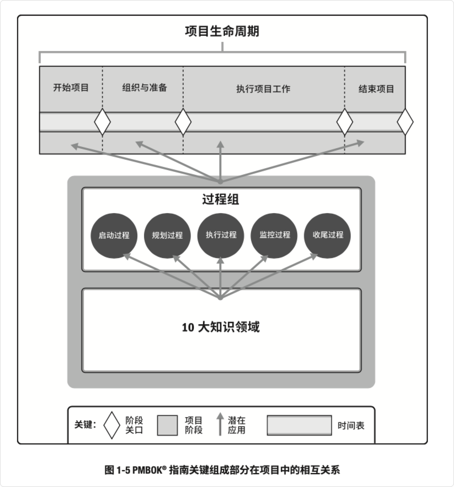
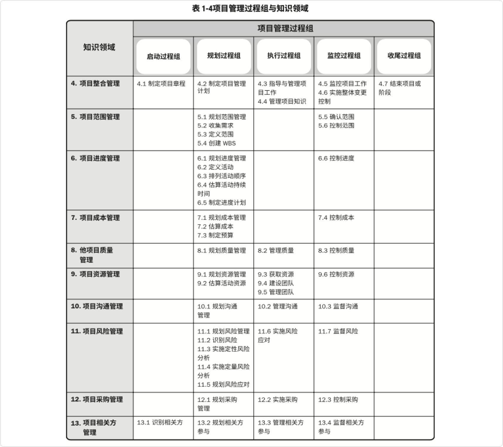
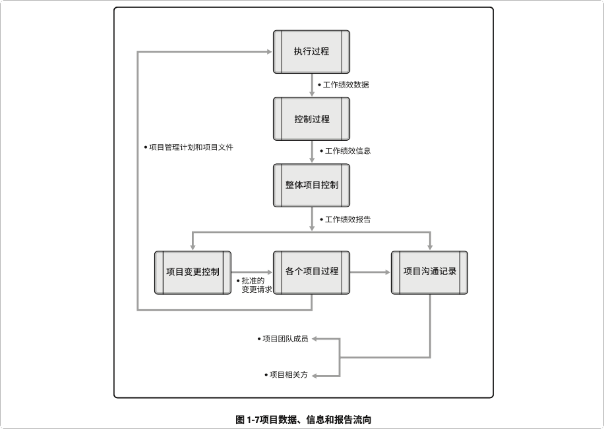
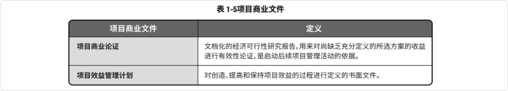
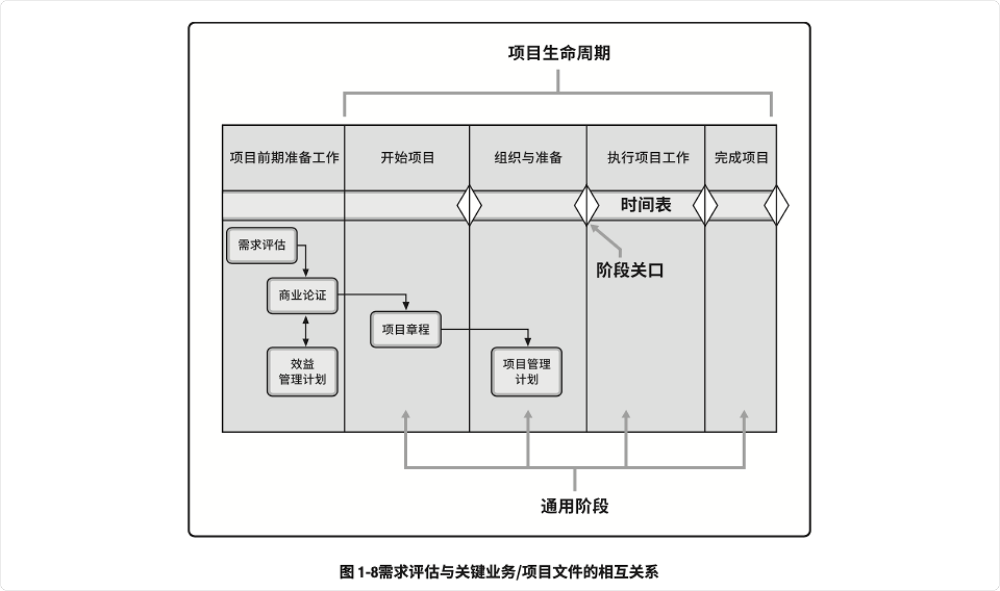

# 引论
## 基本要素
### 项目
项目是为创造独特的产品、服务或成果而进行的临时性工作。
* **独特的产品、服务或成果：**开展项目是为了通过可交付成果达成目标
  * 一个独特的产品，可能是其他产品的组成部分、某个产品的升级版或修正版，也可能其本 身就是新的最终产品
  * 一种独特的服务或提供某种服务的能力
  * 一项独特的成果，例如某个结果或文件
  * 一个或多个产品、服务或成果的独特组合
* **临时性工作：**项目的“临时性”是指项目有明确的起点和终点，`临时性`并不一定意味着项 目的持续时间短
  * 以下一种或多种情况下，项目即宣告结束
    * 达成项目目标
    * 不会或不能达到目标
    * 项目资金缺乏或没有可分配资金
    * 项目需求不复存在
    * 无法获得所需人力或物力资源
    * 出于法律或便利原因而终止项目
* **项目驱动变更：**项目驱动组织进行变更
* **项目创造商业价值：**PMI将商业价值定义为从商业运作中获得的可量化净效益
  * 有形效益
    * 货币资产
    * 股东权益
    * 公共事业
    * 固定设施
    * 工具
    * 市场份额
  * 无形效益
    * 商誉
    * 品牌认知度
    * 公共利益
    * 商标
    * 战略一致性
    * 声誉
* **项目启动背景：**组织领导者启动项目是为了应对影响该组织的因素
  * 符合法规、法律或社会要求
  * 满足相关方的要求或需求
  * 执行、变更业务或技术战略
  * 创造、改进或修复产品、过程或服务。

###  项目管理的重要性

​        项目管理就是将知识、技能、工具与技术应用于项目活动，以满足项目的要求。项目管理通过合理运用与整合特定项目所需的项目管理过程得以实现。项目管理使组织能够有效且高效地开展项目。

* 有效的项目管理能够帮助个人、群体以及公共和私人组织:
  * 达成业务目标;
  * 满足相关方的期望
  * 提高可预测性
  * 提高成功的概率
  * 在适当的时间交付正确的产品
  * 解决问题和争议
  * 及时应对风险
  * 优化组织资源的使用
  * 识别、挽救或终止失败项目
  * 管理制约因素(范围、质量、进度、成本、资源)
  * 平衡制约因素对项目的影响(围扩大可能会增加成本或延长进度)
  * 以更好的方式管理变更
* 项目管理不善或缺乏项目管理可能会导致
  * 超过时限
  * 成本超支
  * 质量低劣
  * 返工
  * 项目范围扩大失控
  * 组织声誉受损
  * 相关方不满意
  * 正在实施的项目无法达成目标

​    项目是组织创造价值和效益的主要方式。

* 有效和高效的项目管理应被视为组织的战略能力。它使组织能够:
  * 将项目成果与业务目标联系起来
  * 更有效地展开市场竞争
  * 支持组织发展
  * 通过适当调整项目管理计划，以应对商业环境改变给项目带来的影响

### 项目、项目集、项目组合、运营管理

​    项目管理过程、工具和技术的运用为组织达成目的和目标奠定了坚实的基础，一个项目可以采用 三种不同的模式进行管理：作为一个独立项目、在项目集内或在 项目组合内

* 为达成组织的一系列目的和目标，可能需要实施多个项目。在这种情况下，项目 可能被归入项目集中。
* 项目集是一组相互关联且被协调管理的项目、子项目集和项目集活动，以便 获得分别管理所无法获得的利益。
* 项目组合是指为实现战略目标而组合在一起管理的项目、项目集、子项目组合和运营工作。
* 项目集管理和项目组合管理的生命周期、活动、目标、重点和效益都与项目管理不同。
* 项 目组合、项目集、项目和运营通常都涉及相同的相关方，还可能需要使用同样的资源， 可能会导致组织内出现冲突。
* 这种情况促使组织增强内部协调，通过项目组合、项目集和项目 管理达成组织内部的有效平衡。

**项目集、项目、共享资源和相关方关系图**

* 从组织的角度来看项目、项目集和项目组合管理
  * 项目集和项目管理的重点在于以“正确”的方式开展项目集和项目
  * 项目组合管理则注重于开展“正确”的项目集和项目。

#### 项目集管理

​	项目集管理指在项目集中应用知识、技能与原则来实现项目集的目标，获得分别管理项目集组成 部分所无法实现的利益和控制。

* 项目集和项目间依赖关系的具体管理措施可 能包括
  * 调整对项目集和项目的目的和目标有影响的组织或战略方向
  * 将项目集范围分配到项目集组成部分
  * 管理项目集组成部分之间的依赖关系，从而以最佳方式实施项目集
  * 管理可能影响项目集内多个项目的项目集风险
  * 解决影响项目集内多个项目的制约因素和冲突
  * 解决作为组成部分的项目与项目集之间的问题
  * 在同一个治理框架内管理变更请求
  * 将预算分配到项目集内的多个项目
  * 确保项目集及其包含的项目能够实现效益。

#### 项目组合管理

​	项目组合是指为实现战略目标而组合在一起管理的项目、项目集、子项目组合和运营工作。

* 项目组合管理的目的
  * 指导组织的投资决策
  * 选择项目集与项目的最佳组合方式，以达成战略目标
  * 提供决策透明度。 uu确定团队和实物资源分配的优先顺序
  * 提高实现预期投资回报的可能性
  * 实现对所有组成部分的综合风险预测的集中式管理

项目组合管理还可确定项目组合是否符合组织战略。

#### 运营管理

​	运营管理是另外一个领域，超出了本指南所描述的规范的项目管理范围。

​	营管理关注产品的持续生产和服务的持续运作。它使用最优资源满足客户要求，来保证 业务运作的持续高效。它重点管理那些把各种输入转变为输出的过程。

#### 运营与项目管理

​	业务或组织运营的改变也许就是某个项目的关注焦点，尤其当项目交付的新产品或新服务将导致业务运营的有实质性改变时。持续运营不属于项目的范畴，但是它们之间存在交叉。

* 项目与运营会在产品生命周期的不同时点交叉
  * 在新产品开发、产品升级或提高产量时
  * 在改进运营或产品开发流程时
  * 在产品生命周期结束阶段
  * 在每个收尾阶段。

        在每个交叉点，可交付成果及知识在项目与运营之间转移，以完成工作交接。在这一过程中，将 转移项目资源或知识到运营中，或转移运营资源到项目中。

#### 组织级项目管理 (OPM) 和战略

​	项目组合、项目集和项目均需符合组织战略，或由组织战略驱动，并以不同的方式服务于战略目标的实现。

* 项目组合管理通过选择适当的项目集或项目，对工作进行优先排序，以及提供所需资源，来与 组织战略保持一致
* 项目集管理对其组成部分进行协调，对它们之间的依赖关系进行控制，从而实现既定收益
* 项目管理使组织的目的和目标得以实现

作为项目组合或项目集的组成部分，项目是实现组织战略和目标的一种手段，常常应用于作为项 目投资主要引导因素的战略规划之中

### 指南的组成部分

|  |  |
| ------------------------------------------------------------ | ------------------------------------------------------------ |

#### 项目和开发生命周期

​        项目生命周期指项目从启动到完成所经历的一系列阶段。项目生命周期可以是预测型或适应型。项目生命周期内通常有一个或多个阶段与产品、服务或成 果的开发相关，这些阶段称为开发生命周期。

* 开发生命周期分类
  * **预测型生命周期：**在生命周期的早期阶段确定项目范围、时间和成本。对任何范围的变更都要 进行仔细管理。预测型生命周期也称为瀑布型生命周期
  * **迭代型生命周期：**项目范围通常于项目生命周期的早期确定，但时间及成本估算将随着项目团 队对产品理解的不断深入而定期修改。迭代方法是通过一系列重复的循环活动来开发产品，而 增量方法是渐进地增加产品的功能
  * **增量型生命周期：**通过在预定的时间区间内渐进增加产品功能的一系列迭代来产出可交付成 果。只有在最后一次迭代之后，可交付成果具有了必要和足够的能力，才能被视为完整的
  * **适应型生命周期：**属于敏捷型、迭代型或增量型。详细范围在迭代开始之前就得到了定义和批 准。适应型生命周期也称为敏捷或变更驱动型生命周期
  * **混合型生命周期：**是预测型生命周期和适应型生命周期的组合。充分了解或有确定需求的项目要 素遵循预测型开发生命周期，而仍在发展中的要素遵循适应型开发生命周期。
* 实现生命周期灵活性的方法
  * 确定需要在各个阶段实施的一个或多个过程
  * 在合适的阶段实施确定的一个或多个过程
  * 调整阶段的各种属性(名称、持续时间、退出标准和准入标准)

​    项目生命周期与产品生命周期相互独立，后者可能由项目产生。产品生命周期指一个产品从概 念、交付、成长、成熟到衰退的整个演变过程的一系列阶段。

#### 项目阶段

​    项目阶段是一组具有逻辑关系的项目活动的集合，通常以一个或多个可交付成果的完成为结束

* 项目阶段属性
  * 名称
  * 数量
  * 持续时间
  * 资源需求
  * 项目进入某一阶段的准入标准
  * 项目完成某一阶段的退出标准
* 阶段名称(包括但不限于)
  * 概念开发
  * 可行性研究
  * 客户要求
  * 解决方案开发
  * 设计
  * 原型法
  * 建造
  * 测试
  * 转换
  * 试运行
  * 里程碑审查
  * 经验教训
* 项目阶段建立因素(包括但不限于):
  * 管理需求
  * 项目性质
  * 组织、行业或技术的独特性
  * 项目的组成要素，包括但不限于技术、工程、业务、过程或法律
  * 决策点(资金、继续/终止项目，里程碑审查)。

​    分为多个阶段的方式有助于更好地掌控项目管理，同时还提供了评估项目绩效并在后续阶段采取 必要的纠正或预防措施的机会。

#### 阶段关口

​	阶段关口在项目阶段结束时进行，将项目的绩效和进度与项目和业务文件比较。

* 文件(包括但不限于)
  * 项目商业论证
  * 项目章程
  * 项目管理计划
  * 效益管理计划
* 根据比较结果做出决定
  * 进入下个阶段
  * 整改后进入下个阶段
  * 结束项目
  * 停留在当前阶段
  * 重复阶段或某个要素

​    在不同的组织、行业或工作类型中，阶段关口可能被称为阶段审查、阶段门、关键决策点和阶 段入口或阶段出口。

#### 项目管理过程

​	项目生命周期是通过一系列项目管理活动进行的，即项目管理过程。

* 各项目管理过程通过它们所产生的输出建立逻辑联系。一个过程的输出将是
  * 另一个过程的输入
  * 项目或项目阶段的可交付成果

过程迭代的次数和过程间的相互作用因具体项目的需求而不同。

* 过程通常分为三类
  * **仅开展一次或仅在项目预定义点开展的过程：**制定项目章程以及结束项目或阶段
  * **根据需要定期开展的过程：**在需要资源时执行获取资源。在需要采购之前执行实施采购
  * **贯穿项目始终执行的过程：**从项目开始到项目结束需要持续开展许多监控过程

#### 项目管理过程组

​	项目管理过程组指对项目管理过程进行逻辑分组，以达成项目的特定目标。过程组不同于项目阶段。

* 项目管理过程分类
  * **启动过程组：**定义一个新项目或现有项目的一个新阶段，授权开始该项目或阶段的一组过程
  * **规划过程组：**明确项目范围，优化目标，为实现目标制定行动方案的一组过程
  * **执行过程组：**完成项目管理计划中确定的工作，以满足项目要求的一组过程
  * **监控过程组：**正式完成或结束项目、阶段或合同所执行的过程。

#### 项目管理知识领域

​	除了过程组，过程还可以按知识领域进行分类。知识领域指按所需知识内容来定义的项目管理领 域，并用其所含过程、实践、输入、输出、工具和技术进行描述。

* 十个知识领域
  * **项目整合管理：**包括为识别、定义、组合、统一和协调各项目管理过程组的各个过程和活动而开展的过程与活动
  * **项目范围管理：**包括确保项目做且只做所需的全部工作以成功完成项目的各个过程
  * **项目进度管理：**包括为管理项目按时完成所需的各个过程
  * **项目成本管理：**包括为使项目在批准的预算内完成而对成本进行规划、估算、预算、融资、筹资、管理和控制的各个过程
  * **项目质量管理：**包括把组织的质量政策应用于规划、管理、控制项目和产品质量要求，以满足相 关方的期望的各个过程
  * **项目资源管理：**包括识别、获取和管理所需资源以成功完成项目的各个过程
  * **项目沟通管理：**包括为确保项目信息及时且恰当地规划、收集、生成、发布、存储、检索、管理、控制、监督和最终处置所需的各个过程
  * **项目风险管理：**包括规划风险管理、识别风险、开展风险分析、规划风险应对、实施风险应对和 监督风险的各个过程
  * **项目采购管理：**包括从项目团队外部采购或获取所需产品、服务或成果的各个过程
  * **项目相关方管理：**包括用于开展下列工作的各个过程:识别影响或受项目影响的人员、团队或组织，分析相关方对项目的期望和影响，制定合适的管理策略来有效调动相关方参与项目决策和执行。

#### 项目管理数据和信息

​	整个项目生命周期需要收集、分析和转化大量的数据。从各个过程收集项目数据，并在项目团队 内共享。在整个项目生命周期中需要定期收集和分析项目数据。

* 项目数据和信息的主要术语定义
  * **工作绩效数据：**在执行项目工作的过程中，从每个正在执行的活动中收集到的原始观察结果和测量值
  * **工作绩效信息。**从各控制过程收集，并结合相关背景和跨领域关系进行整合分析而得到的 绩效数据
  * **工作绩效报告。**为制定决策、提出问题、采取行动或引起关注，而汇编工作绩效信息所形成 的实物或电子项目文件

#### 裁剪

​	项目经理通常将项目管理方法论应用于工作。方法论是由专门的从业人员所采用的实践、技术、程序和规则所组成的体系。

* 项目管理方法论来源
  * 由组织内的专家开发
  * 从供应商采购而来
  * 从专业协会获取
  * 从政府机构获取

     应选择恰当的项目管理过程、输入、工具、技术、输出和生命周期阶段以管理项目。这一选择活 动即为针对项目裁剪的项目管理。项目经理与项目团队、发起人或组织管理层合作进行裁剪。

* 裁剪注意事项
  * 每个项目都是独特的，所以有必要进行裁剪
  * 并非每个项目都需要《PMBOK® 指南》所确定的 每个过程、工具、技术、输入或输出
  * 裁剪应处理关于范围、进度、成本、资源、质量和风险的相 互竞争的制约因素
  * 项目经理应根据项目环境、组织文 化、相关方需求和其他变量裁剪管理这些制约因素的方法

### 项目管理商业文件

​	项目经理需要确保项目管理方法紧扣商业文件的意图。

​    项目发起人通常负责项目商业论证文件的制定和维护。项目经理负责提供建议和见解，使项目商 业论证、项目管理计划、项目章程和项目效益管理计划中的成功标准相一致，并与组织的目的和目标保持一致。

​    项目经理应适当地为项目裁剪上述项目管理文件。某些组织会维护项目集层面的商业论证和效益 管理计划。项目经理应与相应的项目集经理合作，确保项目管理文件与项目集文件保持一致。

#### 项目商业论证

​	项目商业论证指文档化的经济可行性研究报告，用来对尚缺乏充分定义的所选方案的收益进行有 效性论证，是启动后续项目管理活动的依据。

* 商业论证的作用
  * 商业论证列出了项目启动的目标和理由
  * 有助于在 项目结束时根据项目目标衡量项目是否成功
  * 是一种项目商业文件，可在整个项目生命周 期中使用
  * 项目启动之前通过商业论证，可能会做出继续/终止项目的决策

​    需求评估通常是在商业论证之前进行，包括了解业务目的和目标、问题及机会，并提出处理建议。需求评估结果可能会在商业论证文件中进行总结。

* 商业论证可能记录以下内容(包括但不限于)
  * 业务需要
    * 确定促进采取行动的动机
    * 情况说明，记录了待处理的业务问题或机会，包括能够为组织创造的价值
    * 确定受影响的相关方
    * 确定范围
  * 形势分析
    * 确定组织战略、目的和目标
    * 确定问题的根本原因或机会的触发因素
    * 分析项目所需能力与组织现有能力之间的差距
    * 识别已知风险
    * 识别成功的关键因素
    * 确定可能用于评估各种行动的决策准则
    * 确定一套方案，用以处理业务问题或机会
  * 推荐
    * 一种给出了针对项目的建议方案的说明书
    * 说明书的内容可能有(包括但不限于)
      * 潜在方案的分析结果
      * 潜在方案的制约因素、假设、风险和依赖关系
      * 成功标准
    * 一种实施方法，可能有(包括但不限于)
      * 里程碑
      * 依赖关系
      * 角色与职责
    * 评估
      * 一种描述了衡量项目交付效益的计划的说明书，应包含在初步实施之后，任何持续运营层面的可选方案

​    通过将成果与目标和确定的成功标准进行比较，商业论证文件为衡量整个项目生命周期的成功和进展奠定了基础

#### 项目效益管理计划

​	项目效益管理计划描述了项目实现效益的方式和时间，以及应制定的效益衡量机制。项目效益指 为发起组织和项目预期受益方创造价值的行动、行为、产品、服务或成果的结果。项目生命周期早期应确定目标效益，并据此制定效益管理计划。

* 效益的关键要素，可能记录以下内容(包括但不限于) 
  * **目标效益：**例如预计通过项目实施可以创造的有形价值和无形价值；财务价值体现为净现值
  * **战略一致性：**例如项目效益与组织业务战略的一致程度
  * **实现效益的时限：**例如阶段效益、短期效益、长期效益和持续效益
  * **效益责任人：**例如在计划确定的整个时限内负责监督、记录和报告已实现效益的负责人
  * **测量指标：**例如用于显示已实现效益的直接测量值和间接测量
  * **假设：**例如预计存在或显而易见的因素
  * **风险：**例如实现效益的风险

​    制定效益管理计划需要使用商业论证和需求评估中的数据和信息，在成本效益分析中已经把成本估算与项目拟实现的效益进行了比较。效益管理计划和项目管理计划 描述了项目创造的商业价值如何能够成为组织持续运营的一部分，包括使用的测量指标。测量指标 可核实商业价值并确认项目成功与否。

​    项目效益管理计划的制定和维护是一项迭代活动。它是商业论证、项目章程和项目管理计划的补 充性文件。项目经理与发起人共同确保项目章程、项目管理计划和效益管理计划在整个项目生命周 期内始终保持一致。

#### 项目章程和项目管理计划

​    项目章程是由项目发起人发布的，正式批准项目成立，并授权项目经理动用组织资源开展项目活动的文件。

​	项目管理计划是描述如何执行、监督和控制项目的一份文件。

#### 项目成功标准

​	确定项目是否成功是项目管理中最常见的挑战之一，时间、成本、范围和质量等项目管理测量指标历来被视为确定项目是否成功的最重要的因素。 

* 项目成功的关键问题

  * 怎样才是项目成功? 
  * 如何评估项目成功? 
  * 哪些因素会影响项目成功?

* 项目目标可能有(包括但不限于)

  * 完成项目效益管理计划
  * 达到商业论证中记录的已商定的财务测量指标。测量指标(包括但不限于)
    * 净现值 (NPV)
    * 投资回报率 (ROI)
    * 内部报酬率 (IRR)
    * 回收期 (PBP)
    * 效益成本比率 (BCR)
  * 达到商业论证的非财务目标
  * 完成组织从`当前状态`转到`将来状态`
  * 履行合同条款和条件
  * 达到组织战略、目的和目标
  * 使相关方满意
  * 可接受的客户/最终用户的采纳度
  * 将可交付成果整合到组织的运营环境中
  * 满足商定的交付质量
  * 遵循治理规则
  * 满足商定的其他成功标准或准则

  为了取得项目成功，项目团队必须能够正确评估项目状况，平衡项目要求，并与相关方保持积极主动的沟通。