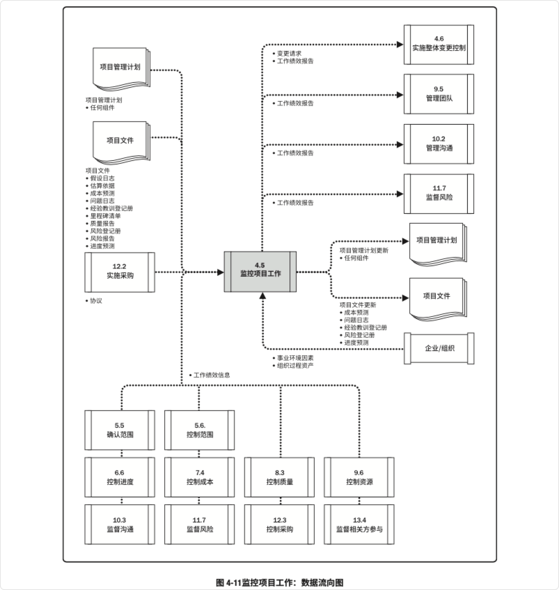

# 项目整合管理

​	项目整合管理包括对隶属于项目管理过程组的各种过程和项目管理活动进行识别、定义、组合、 统一和协调的各个过程。在项目管理中，整合兼具统一、合并、沟通和建立联系的性质，这些行动 应该贯穿项目始终。

* 项目整合管理的选择
  * 资源分配
  * 平衡竞争性需求
  * 研究各种备选方法
  * 为实现项目目标而裁剪过程
  * 管理各个项目管理知识领域之间的依赖关系

* 项目整合管理过程包括
  * **制定项目章程：** 编写一份正式批准项目并授权项目经理在项目活动中使用组织资源的文 件的过程
  * **制定项目管理计划：** 定义、准备和协调项目计划的所有组成部分，并把它们整合为一份综合项 目管理计划的过程
  * **指导与管理项目工作：**为实现项目目标而领导和执行项目管理计划中所确定的工作，并实施已 批准变更的过程
  * **管理项目知识：**使用现有知识并生成新知识，以实现项目目标，并且帮助组织学习的过程
  * **监控项目工作：** 跟踪、审查和报告整体项目进展，以实现项目管理计划中确定的绩效目标的过程
  * **实施整体变更控制：**审查所有变更请求，批准变更，管理对可交付成果、组织过程资产、 项目文件和项目管理计划的变更，并对变更处理结果进行沟通的过程
  * **结束项目或阶段：**终结项目、阶段或合同的所有活动的过程

## -项目整合管理的核心概念

​	虽然其他知识领域可以由相关专家管理，但是项目整合管理的责任不能被授权或转移。只能由项目经理负责整 合所有其他知识领域的成果，并掌握项目总体情况。项目经理必须对整个项目承担最终责任。

* 项目整合管理内容
  * 确保产品、服务或成果的交付日期，项目生命周期以及效益管理计划这些方面保持一致
  * 编制项目管理计划以实现项目目标
  * 确保创造合适的知识并运用到项目中，并从项目中获取必要的知识
  * 管理项目管理计划中活动的绩效和变更
  * 做出针对影响项目的关键变更的综合决策
  * 测量和监督项目进展，并采取适当措施以实现项目目标
  * 收集关于已达成结果的数据，分析数据以获取信息，并与相关方分享信息
  * 完成全部项目工作，正式关闭各个阶段、合同以及整个项目
  * 管理可能需要的阶段过渡

项目越复杂，相关方的期望越多样化，就需要越全面的整合方法。

## -项目整合管理发展趋势和新兴实践

项目整合管理知识领域要求整合所有其他知识领域的成果。

* 整合管理过程相关发展趋势
  * **使用自动化工具:**项目经理需要整合大量的数据和信息，因此有必要使用项目管理信息系统 (PMIS) 和自动化工具来收集、分析和使用信息，以实现项目目标和项目效益
  * **使用可视化管理工具:**有些项目团队使用可视化管理工具，而不是书面计划和其它文档，来获 取和监督关键的项目要素。便于整个团队直观地看到项目的实时状态，促进知识转移，并提高团队成员和其他相关方识别和解决问题的能力
  * **项目知识管理:**项目人员的流动性和不稳定性越来越高，就要求采用更严格的过程，在整个项 目生命周期中积累知识并传达给目标受众，以防止知识流失
  * **增加项目经理的职责:**项目经理被要求介入启动和结束项目，按照以往的惯例，这些事务均由管理层和项目管理办公室负责。现在，项目经理需要频繁地与他们合作处理这些事务，以便更好地实现项目目标以及交付项目效益。项目经理也需要更全面地识别相关方，并引导他们参与项目，包括管理项目经理与各职能部门、运营部门和高级 管理人员之间的接口
  * **混合型方法：**经实践检验的新做法会不断地融入项目管理方法，例如采用敏捷或其他迭代做法，为开展需求管理而采用商业分析技术，为分析项目复杂性而采用相关工具，以及为在组织 中应用项目成果而采用组织变革管理方法。

## -裁剪时需要考虑的因素

​	因为每个项目都是独特的，所以项目经理可能需要裁剪项目整合管理过程。

* 裁剪时应考虑的因素(包括但不限于)
  * **项目生命周期：**什么是合适的项目生命周期?项目生命周期应包括哪些阶段？
  * **开发生命周期：**对特定产品、服务或成果而言，什么是合适的开发生命周期和开发方法?预测 型或适应型方法是否适当?如果是适应型，开发产品是该采用增量还是迭代的方式?混合型方法是否为最佳选择?
  * **管理方法：**考虑到组织文化和项目的复杂性，哪种管理过程最有效?
  * **知识管理：**在项目中如何管理知识以营造合作的工作氛围?
  * **变更：**在项目中如何管理变更?
  * **治理：**有哪些监控机构、委员会和其他相关方该参与项目治理?对项目状态报告的要求是什么?
  * **经验教训：**在项目期间及项目结束时，应收集哪些信息?历史信息和经验教训是否适用于未来 的项目?
  * **效益：**应该在何时以何方式报告效益:在项目结束时还是在每次迭代或阶段结束时?
  * **在敏捷或适应型环境中需要考虑的因素：**迭代和敏捷方法能够促进团队成员以相关领域专家的身份参与整合管理

## 制定项目章程

​	制定项目章程是编写一份正式批准项目并授权项目经理在项目活动中使用组织资源的文件的过程。本过程的主要作用是，明确项目与组织战略目标之间的直接联系，确立项目的正式地位，并展 示组织对项目的承诺。本过程仅开展一次或仅在项目的预定义点开展。

* 项目章程相关事项	
  * 项目章程在项目执行组织与需求组织之间建立起伙伴关系
  * 可以使用项目章程来建立组织内部的合作关系，以确保正确交付合同内容
  * 项目章程一旦被批准，就标志着项目的正式启动
  * 最好在制定项目章程时就任命项目经理，且总应在规划开始之前任命
  * 项目章程可由发起人编制，或者由项目经理与发起机构合作编制
  * 项目章程授权项目经理规划、执行和控制项目

### 制定项目章程:输入

#### 商业文件

虽然商业文件是在项目之前制定的，但需要定期审核

**商业论证。**经批准的商业论证或类似文件是最常用于制定项目章程的商业文件。商业论证从商业视角描述必要的信息，并且据此决定项目的期望结果是否值得所需投资。高于项目级别的经 理和高管们通常使用该文件作为决策的依据。一般情况下，商业论证会包含商业需求和成本效益分析，以论证项目的合理性并确定项目边界。

* 引发商业论证编制的因素
  * **市场需求：**为应对汽油紧缺，某汽车制造商批准一个低油耗车型的研发项目
  * **组织需要：**因为管理费用太高，公司决定合并一些职能并优化流程以降低成本
  * **客户要求：**为了给新工业园区供电，某电力公司批准一个新变电站建设项目
  * **技术进步：**基于技术进步，某航空公司批准了一个新项目，来开发电子机票以取代 纸质机票
  * **法律要求：**某油漆制品厂批准一个项目，来编写有毒物质处理指南
  * **生态影响：**某公司批准一个项目，来降低对环境的影响
  * **社会需要：**为应对霍乱频发，某发展中国家的非政府组织批准一个项目，为社区建设饮用水系统和公共厕所

	项目章程包含来源于商业文件中的相关项目信息。既然商业文件不是项目文件，项目经理就不可以对它们进行更新或修改，只可以提出相关建议。

#### 协议

​	协议用于定义启动项目的初衷。协议有多种形式，包括合同、谅解备忘录(MOUs)、 服务水平协议(SLA)、协议书、意向书、口头协议、电子邮件或其他书面协议。为外部客户做项 目时，通常就以合同的形式出现。

#### 事业环境因素

* **政府或行业标准：**产品标准、质量标准、安全标准和工艺标准
* **法律法规要求和制约因素**
* **市场条件**
* **组织文化和政治氛围**
* **组织治理框架：**通过安排人员、制定政策和确定过程，以结构化的方式实施控制、指导和协调，以实现组织的战略和运营目标
* **相关方的期望和风险临界值**

#### 组织过程资产

* **组织的标准政策、流程和程序**
* **项目组合、项目集和项目的治理框架：**用于提供指导和制定决策的治理职能和过程
* **监督和报告方法**
* **模板：**项目章程模板
* **历史信息与经验教训知识库：**项目记录与文件、关于以往项目选择决策的结果及以往项目绩 效的信息

### 制定项目章程:工具与技术

#### 专家判断

​	专家判断是指基于某应用领域、知识领域、学科和行业等的专业知识而做出的，关于当前活动的 合理判断，这些专业知识可来自具有专业学历、知识、技能、经验或培训经历的任何小组或个人。

* 需要专家判断的主题
  * 组织战略
  * 效益管理
  * 关于项目所在的行业以及项目关注的领域的技术知识
  * 持续时间和预算的估算
  * 风险识别

#### 数据收集

* 数据收集技术(包括但不限于)
  * **头脑风暴：**本技术用于在短时间内获得大量创意，适用于团队环境，需要引导者进行引导。
    *  创意产生
    * 创意分析
    * 制定项目章程时可通过头脑风暴向相关方、 主题专家和团队成员收集数据、解决方案或创意
  * **焦点小组：**焦点小组召集相关方和主题专家讨论项目风险、成功标准和其他议 题，比一对一访谈更有利于互动交流
  * **访谈：**访谈是指通过与相关方直接交谈来了解高层级需求、假设条件、制约因 素、审批标准以及其他信息。

#### 人际关系与团队技能

* **冲突管理：**冲突管理有助于相关方就目标、成功标准、高层级需求、项目描述、 总体里程碑和其他内容达成一致意见
* **引导：**引导是指有效引导团队活动成功以达成决定、解决方案或结论的能力。引导者确保参与者有效参与，互相理解，考虑所有意见，按既定决策流程全力支持得到的结论或结果，以及所 达成的行动计划和协议在之后得到合理执行
* **会议管理：**会议管理包括准备议程、确保邀请每个关键相关方群体的代表， 以及准备和发送后续的会议纪要和行动计划

#### 会议

​	与关键相关方举行会议的目的是识别项目目标、成功标准、主要可交付成果、高层级需求、总体里程碑和其他概述信息。

### 制定项目章程:输出

#### 项目章程

​	项目章程是由项目启动者或发起人发布的，正式批准项目成立，并授权项目经理使用组织资源开展项目活动的文件。项目团队把项目章程作为初始项目规划的起始点。在项目章程中至少应该定义项目的高层级信息，供将来在项 目管理计划的各个组成部分中进一步细化。

* 项目章程记录的内容
  * **项目目的**
  * **可测量的项目目标和相关的成功标准**
  * **高层级需求**
  * **高层级项目描述、边界定义以及主要可交付成果**
  * **整体项目风险**
  * **总体里程碑进度计划**
  * **预先批准的财务资源**
  * **关键相关方名单**
  * **项目审批要求：**用什么标准评价项目成功，由谁对项目成功下结论，由谁来签署项目结束
  * **项目退出标准：**在何种条件下才能关闭或取消项目或阶段
  * **委派的项目经理及其职责和职权**
  * **发起人或其他批准项目章程的人员的姓名和职权**

项目章程确保相关方在总体上就主要可交付成果、里程碑以及每个项目参与者的角色和职责达 成共识。

#### 假设日志

​	在项目启动之前编制商业论证时，识别高层级的战略和运营假设条件与制约因素。这些假 设条件与制约因素应纳入项目章程。较低层级的活动和任务假设条件在项目期间随着诸如定义技术 规范、估算、进度和风险等活动的开展而生成。假设日志用于记录整个项目生命周期中的所有假设条件和制约因素。

## 制定项目管理计划

​	制定项目管理计划是定义、准备和协调项目计划的所有组成部分，并把它们整合为一份综合项目 管理计划的过程。本过程的主要作用是，生成一份综合文件，用于确定所有项目工作的基础及其执行方式，它仅开展一次或仅在项目的预定义点开展。

* 项目管理计划要求
  * 确定项目的执行、监控和收尾方式
  * 项目管理计划可以是概括或详细的
  * 项目管理 计划应足够强大，可以应对不断变化的项目环境
  * 项目管理计划应基准化，至少应规定项目的范围、时间和成本方面的基准，以便据此考核项目执行情况和管理项目绩效
  * 一旦确定了基准，就只能通过实施整体变更控制过程进行更新

### 制定项目管理计划:输入

#### 项目章程

​	项目团队把项目章程作为初始项目规划的起始点，至少应该定义项目的高层级信息。

#### 其他过程的输出

​	创建项目管理计划需要整合诸多过程的输出。其他规划过程所输出的 子计划和基准都是本过程的输入。

#### 事业环境因素

* **政府或行业标准：**产品标准、质量标准、安全标准和工艺标准
* **法律法规要求和制约因素**
* **垂直市场和专门领域的项目管理知 识体系**
* **组织的结构、文化、管理实践和可持续性**
* **组织治理框架：**通过安排人员、制定政策和确定过程，以结构化的方式实施控制、指导和协调，以实现组织的战略和运营目标
* **基础设施：**现有的设施和固定资产

#### 组织过程资产

* **组织的标准政策、流程和程序**
* **项目管理计划模板**
  * **根据项目的特定要求而裁剪组织的标准流程的指南和标准**
  * **项目收尾指南或要求：**产品确认及验收标准
* **变更控制程序：**修改正式的组织标准、政策、计划、程序或项目文件，以及批准和确认变 更所须遵循的步骤
* **监督和报告方法、风险控制程序，以及沟通要求**
* **以往类似项目的相关信息：**范围、成本、进度与绩效测量基准、项目日历、项目进度网络图和风险登记册
* **历史信息和经验教训知识库。**

### 制定项目管理计划:工具与技术

#### 专家判断

* 需要专家判断的主题
  * 根据项目需要裁剪项目管理过程，包括这些过程间的依赖关系和相互影响，以及这些过程的主 要输入和输出
  * 根据需要制定项目管理计划的附加组成部分
  * 确定这些过程所需的工具与技术
  * 编制应包括在项目管理计划中的技术与管理细节
  * 确定项目所需的资源与技能水平
  * 定义项目的配置管理级别
  * 确定哪些项目文件受制于正式的变更控制过程
  * 确定项目工作的优先级，确保把项目资源在合适的时间分配到合适的工作

#### 数据收集

* **头脑风暴：**制定项目管理计划时，经常以头脑风暴的形式来收集关于项目方法的创意和解决方案。参会者包括项目团队成员，其他主题专家 (SME) 或相关方也可以参与

* **核对单：**很多组织基于自身经验制定了标准化的核对单，或者采用所在行业的核对单。核对单可以指导项目经理制定计划或帮助检查项目管理计划是否包含所需全部信息

* **焦点小组：**焦点小组召集相关方讨论项目管理方法以及项目管理计划各个组成部分的整合方式

* **访谈：**访谈用于从相关方获取特定信息，用以制定项目管理计划、任何子计划或项目文件

#### 人际关系与团队技能

* **冲突管理：**必要时可以通过冲突管理让具有差异性的相关方就项目管理计划的所有方面达成共识
* **引导：**引导者确保参与者有效参与，互相理解，考虑所有意见，按既定决策流程全力支持得到的结论或结果
* **会议管理：**有必要采用会议管理来确保有效召开多次会议，以便制定、统一和商定项目管理计划

#### 会议

​	过会议讨论项目方法，确定为达成项目目标而采用的工作执行方式，以及制定项目监控方式。项目开工会议通常意味着规划阶段结束和执行阶段开始，旨在传达项目目标、获得团队对项 目的承诺，以及阐明每个相关方的角色和职责。

* 开工会议不同时间举行的项目特征
  * 对于小型项目，通常由同一个团队开展项目规划和执行。项目在启动之后很快就 会开工，因为执行团队参与了规划。
  * 对于大型项目，通常由项目管理团队开展大部分规划工作。在初始规划工作完成、开发阶段开始时，项目团队其他成员才参与进来。将随同执行过程组的相关过程 召开开工会议。
  * 对于多阶段项目，通常在每个阶段开始时都要举行一次开工会议。

### 制定项目管理计划:输出

#### 项目管理计划

​	项目管理计划是说明项目执行、监控和收尾方式的一份文件，它整合并综合了所有子管理计划和 基准，以及管理项目所需的其他信息。

* 项目管理计划组件
  * 资管理计划
    * **范围管理计划：**确立如何定义、制定、监督、控制和确认项目范围
    * **需求管理计划：**确定如何分析、记录和管理需求
    * **进度管理计划：**为编制、监督和控制项目进度建立准则并确定活动
    * **成本管理计划：**确定如何规划、安排和控制成本
    * **质量管理计划：**确定在项目中如何实施组织的质量政策、方法和标准
    * **资源管理计划：**指导如何对项目资源进行分类、分配、管理和释放
    * **沟通管理计划：**确定项目信息将如何、何时、由谁来进行管理和传播
    * **风险管理计划：**确定如何安排与实施风险管理活动
    * **采购管理计划：**确定项目团队将如何从执行组织外部获取货物和服务
    * **相关方参与计划：**确定如何根据相关方的需求、利益和影响让他们参与项目决策和执行。
  * 基准
    * **范围基准：**经过批准的范围说明书、工作分解结构 (WBS) 和相应的 WBS 词典，用作比较依据
    * **进度基准：**经过批准的进度模型，用作与实际结果进行比较的依据
    * **成本基准：**经过批准的、按时间段分配的项目预算，用作与实际结果进行比 较的依据。
  * **其他组件：**大多数项目管理计划组件都来自于其他过程，虽然有些组件是在本过程生成的
    * **变更管理计划：**描述在整个项目期间如何正式审批和采纳变更请求
    * **配置管理计划：**描述如何记录和更新项目的特定信息，以及该记录和更新哪些信息，以保持产品、服务或成果的一致性和(或)有效性
    * **绩效测量基准：**经过整合的项目范围、进度和成本计划，用作项目执行的比较依据，以测 量和管理项目绩效
    * **项目生命周期：**描述项目从开始到结束所经历的一系列阶段
    * **开发方法：**描述产品、服务或成果的开发方法，例如预测、迭代、敏捷或混合型模式
    * **管理审查：**确定项目经理和有关相关方审查项目进展的时间点，以考核绩效是否符合预 期，或者确定是否有必要采取预防或纠正措施。

## 指导与管理项目工作

​	指导与管理项目工作是为实现项目目标而领导和执行项目管理计划中所确定的工作，并实施已批 准变更的过程。本过程的主要作用是，对项目工作和可交付成果开展综合管理，以提高项目成功的 可能性。本过程需要在整个项目期间开展。

​	指导与管理项目工作包括执行计划的项目活动，以完成项目可交付成果并达成既定目标。本过程 需要分配可用资源并管理其有效使用，也需要执行因分析工作绩效数据和信息而提出的项目计划变更

​	项目经理与项目管理团队一起指导实施已计划好的项目活动，并管理项目内的各种技术接口和组 织接口。指导与管理项目工作还要求回顾所有项目变更的影响，并实施已批准的变更，包括纠正措 施、预防措施和缺陷补救

​	在项目执行过程中，收集工作绩效数据并传达给合适的控制过程做进一步分析。通过分析工作绩 效数据，得到关于可交付成果的完成情况以及与项目绩效相关的其他细节，工作绩效数据也用作监 控过程组的输入，并可作为反馈输入到经验教训库，以改善未来工作包的绩效

### 指导与管理项目工作:输入

#### 项目管理计划

​	项目管理计划的任何组件都可用作本过程的输入

#### 项目文件

* **变更日志：**变更日志记录所有变更请求的状态
* **经验教训登记册：**经验教训用于改进项目绩效，以免重犯错误。登记册有助于确定针对哪些方面设定规则或指南，以使团队行动保持一致
* **里程碑清单**里程碑清单列出特定里程碑的计划实现日期
* **项目沟通记录：**项目沟通记录包含绩效报告、可交付成果的状态，以及项目生 成的其他信息
* **项目进度计划：**进度计划至少包含工作活动清单、持续时间、资源，以及计划的 开始与完成日期
* **需求跟踪矩阵：**需求跟踪矩阵把产品需求连接到相应的可交付成果，有助于把关 注点放在最终结果上
* **风险登记册：**风险登记册提供可能影响项目执行的各种威胁和机会的信息
* **风险报告：**风险报告提供关于整体项目风险来源的信息，以及关于已识别单个项目风险的概括信息

#### 批准的变更请求

​	批准的变更请求是实施整体变更控制过程的输出，包括经项目经理审查和批准的变 请求，必要时可经变更控制委员会 (CCB) 审查和批准。

#### 事业环境因素

* **组织的结构、文化、管理实践和可持续性**
* **基础设施：**现有的设施和固定资产
* **相关方的风险临界值：**允许的成本超支百分比

#### 组织过程资产

* **组织的标准政策、流程和程序**
* **问题与缺陷管理程序：**定义问题与缺陷控制、问题与缺陷识别及其解决，以及行动事项跟踪
* **问题与缺陷管理数据库：**历史问题与缺陷状态、问题和缺陷解决情况，以及行动事 项的结果
* **绩效测量数据库：**用来收集与提供过程和产品的测量数据
* **变更控制和风险控制程序**
* **以往项目的项目信息：**范围、成本、进度与绩效测量基准，项目日历，项目进度网络图， 风险登记册，风险报告以及经验教训知识库

### 指导与管理项目工作:工具与技术

#### 专家判断

* 相关主题
  * 关于项目所在的行业以及项目关注的领域的技术知识
  * 成本和预算管理
  * 法规与采购
  * 法律法规
  * 组织治理

#### 项目管理信息系统 (PMIS)

​	PMIS 提供信息技术 (IT) 软件工具，自动收集和报告关键绩效指标(KPI)可以是本系统的一项功能。

#### 会议

​	在指导与管理项目工作时，可以通过会议来讨论和解决项目的相关事项。参会者可包括项目经 理、项目团队成员，以及与所讨论事项相关或会受该事项影响的相关方。应该明确每个参会者的角色，确保有效参会。

* 会议类型
  * 开工会议
  * 技术会议
  * 敏捷或迭代规划会议
  * 每 日站会
  * 指导小组会议
  * 问题解决会议
  * 进展跟进会议
  * 回顾会议

### 指导与管理项目工作:输出

#### 可交付成果

​	可交付成果是在某一过程、阶段或项目完成时，必须产出的任何独特并可核实的产品、成果或服务能力。一旦完成了可交付成果的第一个版本，就应该执行变更控制。

#### 工作绩效数据

​	工作绩效数据是在执行项目工作的过程中，从每个正在执行的活动中收集到的原始观察结果和测量值。

#### 问题日志

​	在整个项目生命周期中，项目经理通常会遇到问题、差距、不一致或意外冲突。项目经理需要采取某些行动加以处理，以免影响项目绩效。问题日志是一种记录和跟进所有问题的项目文件。

* 问题日志内容
  * 问题类型
  * 问题提出者和提出时间
  * 问题描述
  * 问题优先级
  * 由谁负责解决问题
  * 目标解决日期
  * 问题状态
  * 最终解决情况

问题日志可以帮助项目经理有效跟进和管理问题，确保它们得到调查和解决。在整个项目生命周期应该随 同监控活动更新问题日志。

#### 变更请求

​	变更请求是关于修改任何文件、可交付成果或基准的正式提议。在开展项目工作时发现问 题，就可提出变更请求，对项目政策或程序、项目或产品范围、项目成本或预算、项目进度计划、 项目或产品结果的质量进行修改。其他变更请求包括必要的预防措施或纠正措施，用来防止以后的 不利后果。任何项目相关方都可以提出变更请求，应该通过实施整体变更控制过程对变更请求进行审查和处理。变更请求源自项目内部或外部，是可选或由法律(合同)强制的。

* 变更请求内容
  * **纠正措施：**为使项目工作绩效重新与项目管理计划一致，而进行的有目的的活动
  * **预防措施：**为确保项目工作的未来绩效符合项目管理计划，而进行的有目的的活动
  * **缺陷补救：**为了修正不一致产品或产品组件的有目的的活动
  * **更新：**对正式受控的项目文件或计划等进行的变更，以反映修改或增加的意见或内容。

#### 项目管理计划更新

​	项目管理计划的任何变更都以变更请求的形式提出，且通过组织的变更控制过程进行处理。项目管理计划的任一组成部分都可在本过程中通过变更请求加以更新。

#### 项目文件更新

* u**活动清单：**为完成项目工作，可以通过增加或修改活动来更新活动清单
* **假设日志。**可以增加新的假设条件和制约因素，也可以更新或关闭已有的假设条件和制约因素
* **经验教训登记册：**任何有助于提高当前或未来项目绩效的经验教训都应得到 及时记录
* **需求文件：**在本过程中可以识别新的需求，也可以适时更新需求的实现情况
* **风险登记册：**在本过程中可以识别新的风险，也可以更新现有风险。风险登记册用于在风险管理过程中记录风险
* **相关方登记册：**如果在本过程中收集到了现有或新相关方的更多信息，则记录 到相关方登记册中。

#### 组织过程资产更新

## 管理项目知识

​	管理项目知识是使用现有知识并生成新知识，以实现项目目标，并且帮助组织学习的过程。本过程的主要作用是，利用已有的组织知识来创造或改进项目成果，并且使当前项目创造的知识可用于支持组织运营和未来的项目或阶段。本过程需要在整个项目期间开展。

​	知识管理指管理显性和 隐性知识，旨在重复使用现有知识并生成新知识。有助于达成这两个目的的关键活动是知识分享和知识集成。

### 管理项目知识:输入

#### 项目管理计划

#### 项目文件

* **经验教训登记册：**经验教训登记册提供了有效的知识管理实践
* **项目团队派工单：**项目团队派工单说明了项目已具有的能力和经验以及可能缺乏的知识
* **资源分解结构：**资源分解结构包含有关团队组成的信息，有助于了解团队拥有和 缺乏的知识
* **相关方登记册：**相关方登记册包含已识别的相关方的详细情况，有助于了解他 们可能拥有的知识

#### 可交付成果

* 可交付成果是在某一过程、阶段或项目完成时，必须产出的任何独特并可核实的产品、成果或服务能力。

#### 事业环境因素

* **组织文化、相关方文化和客户文化：**相互信任的工作关系和互不指责的文化对知识管理尤其重 要。其他因素则包括赋予学习的价值和社会行为规范
* **设施和资源的地理分布：**团队成员所在的位置有助于确定收集和分享知识的方法
* **组织中的知识专家：**有些组织拥有专门从事知识管理的团队或员工
* **法律法规要求和制约因素：**包括对项目信息的保密性要求

#### 组织过程资产

* **组织的标准政策、流程和程序：**可能包括:信息的保密性和获取渠道、安全与数据保护、记录 保留政策、版权信息的使用、机密信息的销毁、文件格式和最大篇幅、注册数据和元数据、授 权使用的技术和社交媒体等
* **人事管理制度：**包括员工发展与培训记录以及关于知识分享行为的能力框架
* **组织对沟通的要求：**正式且严格的沟通要求有利于信息分享。对于生成新知识和整合不同相关方群体的知识，非正式沟通更加有效
* **正式的知识分享和信息分享程序：**包括项目和项目阶段开始之前、开展期间和结束之后的学习 回顾，例如识别、吸取和分享从当前项目和其他项目获得的经验教训

### 管理项目知识:工具与技术

#### 专家判断

* 需要专家判断的主题
  * 知识管理
  * 信息管理
  * 组织学习
  * 知识和信息管理工具
  * 来自其他项目的相关信息

#### 知识管理

​	知识管理工具和技术将员工联系起来，使他们能够合作生成新知识、分享隐性知识，以及集成不同团队成员所拥有的知识。

* 知识管理工具和技术
  * **人际交往：**非正式的社交和在线社交。可以进行开放式提问的在线论坛有助于与专家进行知识分享对话
  * **实践社区和特别兴趣小组** 
  * **会议：**使用通信技术进行互动的虚拟会议
  * **工作跟随和跟随指导**
  * **讨论论坛：**焦点小组
  * **知识分享活动：**专题讲座和会议
  * **研讨会：**问题解决会议和经验教训总结会议
  * **讲故事**
  * **创造力和创意管理技术**
  * **知识展会和茶座**
  * **交互式培训**

#### 信息管理

* **编撰显性知识的方法：**如何确定经验教训登记册的条目
* **经验教训登记册**
* **图书馆服务**
* **信息收集：**搜索网络和阅读已发表的文章
* **项目管理信息系统 (PMIS)：**项目管理信息系统通常包括文档管理系统

#### 人际关系与团队技能

* **积极倾听：**积极倾听有助于减少误解并促进沟通和知识分享

* **引导：**引导有助于有效指引团队成功地达成决定、解决方案或结论

* **领导力：**领导力可帮助沟通愿景并鼓舞项目团队关注合适的知识和知识目标

* **人际交往：**人际交往促使项目相关方之间建立非正式的联系和关系，为显性和隐性知识的分享创造条件

* **政治意识：**政治意识有助于项目经理根据项目环境和组织的政治环境规划沟通

### 管理项目知识:输出

#### 经验教训登记册

* 包含情况的类别和描述，经验教训登记册还可包括与情况相关的影响、建议和行动方案
* 记录遇到的挑战、问题、意识到的风险和机会，或其他适用的内容
* 经验教训登记册在项目早期创建，作为本过程的输出
* 在整个项目期间，它可以作为很多 过程的输入，也可以作为输出而不断更新
* 参与工作的个人和团队也参与记录经验教训
* 通过 视频、图片、音频或其他合适的方式记录知识，确保有效吸取经验教训

#### 项目管理计划更新

​	项目管理计划的任何变更都以变更请求的形式提出，且通过组织的变更控制过程进行处理。项目管理计划的任一组成部分都可在本过程中更新。

### 组织过程资产更新

​	所有项目都会生成新知识。有些知识应该被编撰，并在管理项目知识过程中被嵌入可交付成果， 或者被用于改进过程和程序。可在本过程更新任一组织过程资产。

## 监控项目工作

​	监控项目工作是跟踪、审查和报告整体项目进展，以实现项目管理计划中确定的绩效目标的 过程。本过程的主要作用是，让相关方了解项目的当前状态并认可为处理绩效问题而采取的行动，以及通过成本和进度预测，让相关方了解未来项目状态。本过程需要在整个项目期间开展。

​	监督是贯穿于整个项目的项目管理活动之一，包括收集、测量和分析测量结果，以及预测趋势， 以便推动过程改进。持续的监督使项目管理团队能洞察项目的健康状况，并识别须特别关注的任何方面。控制包括制定纠正或预防措施或重新规划，并跟踪行动计划的实施过程，以确保它们能有效解决问题。

* 监控项目工作过程关注内容
  * 把项目的实际绩效与项目管理计划进行比较
  * 定期评估项目绩效，决定是否需要采取纠正或预防措施，并推荐必要的措施
  * 检查单个项目风险的状态
  * 在整个项目期间，维护一个准确且及时更新的信息库，以反映项目产品及相关文件的情况
  * 为状态报告、进展测量和预测提供信息
  * 做出预测，以更新当前的成本与进度信息
  * 监督已批准变更的实施情况
  * 如果项目是项目集的一部分，还应向项目集管理层报告项目进展和状态
  * 确保项目与商业需求保持一致

### 监控项目工作:输入

#### 项目管理计划

​	监控项目工作包括查看项目的各个方面。项目管理计划的任一组成部分都可作为本过程的输入。

#### 项目文件

* **假设日志:**假设日志包含会影响项目的假设条件和制约因素的信息
* **估算依据：**估算依据说明不同估算是如何得出的，用于决定如何应对偏差
* **成本预测：**成本预测基于项目以往的绩效，用于确定项目是否仍处于预算的公差 区间内，并识别任何必要的变更
* **问题日志：**问题日志用于记录和监督由谁负责在目标日期内解决特定问题
* **经验教训登记册：**经验教训登记册可能包含应对偏差的有效方式以及纠正措施和预防措施
* **里程碑清单：**里程碑清单列出特定里程碑的实现日期，用于检查是否达到计划 的里程碑
* **质量报告：**质量报告包含质量管理问题，针对过程、项目和产品的改善建议， 纠正措施建议和在控制质量过程中发现的情况的概述
* **风险登记册：**风险登记册提供在项目执行过程中发生的各种威胁和机会的相 关信息
* **风险报告：**风险报告提供关于整体项目风险和单个风险的信息
* **进度预测：**进度预测基于项目以往的绩效，用于确定项目是否仍处于进度的公差区间内，并识别任何必要的变更

#### 工作绩效信息

​	在工作执行过程中收集工作绩效数据，再交由控制过程做进一步分析。将工作绩效数据与项目 管理计划组件、项目文件和其他项目变量比较之后生成工作绩效信息。

​	在项目开始时，就在项目管理计划中规定关于范围、进度、预算和质量的具体工作绩效测量 指标。项目期间通过控制过程收集绩效数据，与计划和其他变量比较，为工作绩效提供背景。

#### 协议

​	采购协议中包括条款和条件，也可包括其他条目。

#### 事业环境因素

* **项目管理信息系统：**进度、成本、资源工具、绩效指标、数据库、项目记录和财务数据
* **基础设施：**现有设施、设备、组织通讯渠道
* **相关方的期望和风险临界值**
* **政府或行业标准：**监管机构条例、产品标准、质量标准和工艺标准

#### 组织过程资产

* **组织的标准政策、流程和程序**
* **财务控制程序：**必需的费用与支付审查、会计编码及标准合同条款等
* **监督和报告方法**
* **问题管理程序：**用于定义问题控制、问题识别及其解决，以及行动事项跟踪
* **缺陷管理程序：**用于定义缺陷控制、缺陷识别及其解决，以及行动事项跟踪
* **组织知识库：**尤其是过程测量和经验教训知识库。

### 监控项目工作:工具与技术

#### 专家判断

* 需要专家判断的主题有
  * 挣值分析
  * 数据的解释和情境化
  * 持续时间和成本的估算技术
  * 趋势分析
  * 关于项目所在的行业以及项目关注的领域的技术知识
  * 风险管理
  * 合同管理

#### 数据分析

* **备选方案分析：**备选方案分析用于在出现偏差时选择要执行的纠正措施或纠正措施和预防措施的组合
* **成本效益分析：**成本效益分析有助于在项目出现偏差时确定最节约成本的纠正措施
* **挣值分析：**挣值分析对范围、进度和成本绩效进行了综合分析
* **根本原因分析：**根本原因分析关注识别问题的主要原因，它可用于识别出现偏差的原因以及项目经理为达成项目目标应重点关注的领域
* **趋势分析：**趋势分析根据以往结果预测未来绩效，它可以预测项目的进度延误，提前让项目 经理意识到，按照既定趋势发展，后期进度可能出现的问题。应该在足够早的项目时间进行 趋势分析，使项目团队有时间分析和纠正任何异常。可以根据趋势分析的结果，提出必要的 预防措施建议
* **偏差分析：**偏差分析审查目标绩效与实际绩效之间的差异，可涉及持续时间估算、 成本估算、资源使用、资源费率、技术绩效和其他测量指标。

### 决策

​	可用于本过程的决策技术包括但不限于投票。

* 投票的决策方法
  * 一致同意
  * 大多数同意
  * 相对多数原则

#### 会议

​	议可以是面对面或虚拟会议，正式或非正式会议。参会者可以包括项目团队成员和其他合适的项目相关方；

* 会议的类型
  * 用户小组会议
  * 用户审查会议

### 监控项目工作:输出

#### 工作绩效报告

​	工作绩效信息可以用实体或电子形式加以合并、记录和分发。基于工作绩效信息，以实体或电 子形式编制工作绩效报告，以制定决策、采取行动或引起关注。根据项目沟通管理计划，通过沟 通过程向项目相关方发送工作绩效报告。

#### 变更请求

​	通过比较实际情况与计划要求，可能需要提出变更请求，来扩大、调整或缩小项目 范围与产品范围，或者提高、调整或降低质量要求和进度或成本基准。变更请求可能导致需要收集 和记录新的需求。变更可能会影响项目管理计划、项目文件或产品可交付成果。应该通过实施整体 变更控制过程对变更请求进行审查和处理。

* 变更内容
  * **纠正措施：**为使项目工作绩效重新与项目管理计划一致，而进行的有目的的活动
  * **预防措施：**为确保项目工作的未来绩效符合项目管理计划，而进行的有目的的活动
  * **缺陷补救：**为了修正不一致产品或产品组件而进行的有目的的活动

#### 项目管理计划更新

​	项目管理计划的任何变更都以变更请求的形式提出，且通过组织的变更控制过程进行处理。在监控项目工作过程中提出的变更可能会影响整体项目管理计划。

#### 项目文件更新

* **成本预测：**本过程引起的成本预测的变更应通过成本管理过程进行记录
* **问题日志：**在本过程中产生的新问题应该记录到问题日志中
* **经验教训登记册：**更新经验教训登记册，记录应对偏差的有效方式以及纠正措施 和预防措施
* **风险登记册：**在本过程中识别的新风险应记录在风险登记册中，并通过风险管 理过程进行管理
* **进度预测：**本过程引起的进度预测的变更应通过进度管理过程进行记录

## 实施整体变更控制

​	实施整体变更控制是审查所有变更请求、批准变更，管理对可交付成果、项目文件和项目管理计 划的变更，并对变更处理结果进行沟通的过程。本过程审查对项目文件、可交付成果或项目管理计 划的所有变更请求，并决定对变更请求的处置方案。本过程的主要作用是确保对项目中已记录在案 的变更做综合评审。本过程需要在整个项目期间开展。

​	实施整体变更控制过程贯穿项目始终，项目经理对此承担最终责任。变更请求可能影响项目范 围、产品范围以及任一项目管理计划组件或任一项目文件。在整个项目生命周期的任何时间，参与 项目的任何相关方都可以提出变更请求。变更控制的实施程度，取决于项目所在应用领域、项目复 杂程度、合同要求，以及项目所处的背景与环境。

​	在基准确定之前，变更无需正式受控于实施整体变更控制过程。一旦确定了项目基准，就必须通 过本过程来处理变更请求。依照常规，每个项目的配置管理计划应规定哪些项目工件受控于配置控 制程序。对配置要素的任何变更都应该提出变更请求，并经过正式控制。

​	尽管也可以口头提出，但所有变更请求都必须以书面形式记录，并纳入变更管理和(或)配置管 理系统中。在批准变更之前，可能需要了解变更对进度的影响和对成本的影响。在变更请求可能影 响任一项目基准的情况下，都需要开展正式的整体变更控制过程。每项记录在案的变更请求都必须 由一位责任人批准、推迟或否决，这个责任人通常是项目发起人或项目经理。应该在项目管理计划 或组织程序中指定这位责任人，必要时，应该由变更控制委员会(CCB)来开展实施整体变更控制 过程。CCB 是一个正式组成的团体，负责审查、评价、批准、推迟或否决项目变更，以及记录和传 达变更处理决定。

​	变更请求得到批准后，可能需要新编(或修订)成本估算、活动排序、进度日期、资源需求 和(或)风险应对方案分析，这些变更可能要求调整项目管理计划和其他项目文件。某些特定的变 更请求，在 CCB 批准之后，可能还需要得到客户或发起人的批准，除非他们本身就是 CCB 的成员。

### 实施整体变更控制:输入

#### 项目管理计划

* **变更管理计划：**变更管理计划为管理变更控制过程提供指导，并记录变更控制委 员会(CCB)的角色和职责
* **配置管理计划：**配置管理计划描述项目的配置项、识别应记录和更新的配置项， 以便保持项目产品的一致性和有效性
* **范围基准：**范围基准提供项目和产品定义
* **进度基准：**进度基准用于评估变更对项目进度的影响
* **成本基准：**成本基准用于评估变更对项目成本的影响

#### 项目文件

* **估算依据：**估算依据指出了持续时间、成本和资源估算是如何得出的，可用于计 算变更对时间、预算和资源的影响
* **需求跟踪矩阵：**需求跟踪矩阵有助于评估变更对项目范围的影响
* **风险报告：**风险报告提供了与变更请求有关的整体和单个项目风险的来源的信息。

#### 工作绩效报告

 * 对实施整体变更控制过程特别有用的工作绩效报告包括
   	* 资源可用情况
   	* 进度和成本数据
   	* 挣值报告
   	* 燃烧图或燃尽图

#### 变更请求

​	很多过程都会输出变更请求。变更请求可能包含纠正措施、预防措施、缺陷补 救，以及对正式受控的项目文件或可交付成果的更新，以反映修改或增加的意见或内容。变更可 能影响项目基准，也可能不影响项目基准，而只影响相对于基准的项目绩效。变更决定通常由项 目经理做出。

​	对于会影响项目基准的变更，通常应该在变更请求中说明执行变更的成本、所需的计划日期修 改、资源需求以及相关的风险。这种变更应由 CCB(如有)和客户或发起人审批，除非他们本身就 是 CCB 的成员。只有经批准的变更才能纳入修改后的基准。

#### 事业环境因素

* **法律限制：**如国家或地区法规
* **政府或行业标准：**产品标准、质量标准、安全标准和工艺标准
* **法律法规要求和制约因素**
* **组织治理框架**：通过安排人员、制定政策和确定过程，以结构化的方式实施控制、指导和协调，以实现组织的战略和运营目标
* **合同和采购制约因素**

#### 组织过程资产

* **变更控制程序：** 包括修改组织标准、政策、计划和程序所须遵循的步骤， 以及如何批准和确认变更
* **批准与签发变更的程序**
* **配置管理知识库：**包括组织标准、政策、程序和项目文件的各种版本及基准

### 实施整体变更控制:工具与技术

#### 专家判断

* 专家判断主题
  * 关于项目所在的行业以及项目关注的领域的技术知识
  * 法律法规
  * 法规与采购
  * 配置管理
  * 风险管理

#### 变更控制工具

​	为了便于开展配置和变更管理，可以使用一些手动或自动化的工具。配置控制重点关注可交付成 果及各个过程的技术规范，而变更控制则着眼于识别、记录、批准或否决对项目文件、可交付成果或基准的变更。

* 工具应该支持的配置管理活动
  * **识别配置项：**识别与选择配置项，从而为定义与核实产品配置、标记产品和文件、管理变更和 明确责任提供基础
  * **记录并报告配置项状态：**关于各个配置项的信息记录和报告
  * **进行配置项核实与审计：**通过配置核实与审计，确保项目的配置项组成的正确性，以及相 应的变更都被登记、评估、批准、跟踪和正确实施，从而确保配置文件所规定的功能要求 都已实现。
* 工具应该支持的变更管理活动
  * **识别变更：**识别并选择过程或项目文件的变更项
  * **记录变更：**将变更记录为合适的变更请求
  * **做出变更决定：**审查变更，批准、否决、推迟对项目文件、可交付成果或基准的变更或做出其他决定
  * **跟踪变更：**确认变更被登记、评估、批准、跟踪并向相关方传达最终结果

#### 数据分析

* **备选方案分析：**该技术用于评估变更请求，并决定哪些请求可接受、应否决或 需修改
* **成本效益分析：**该分析有助于确定变更请求是否值得投入相关成本

#### 决策

* **投票：**投票可以采取一致同意、大多数同意或相对多数原则的方式，以决定是否 接受、推迟或否决变更请求
* **独裁型决策制定：**采用这种决策技术，将由一个人负责为整个集体制定决策
* **多标准决策分析：**该技术借助决策矩阵，根据一系列预定义的准则，用系统分析方法评估变更请求

#### 会议

​	与变更控制委员会(CCB)一起召开变更控制会。变更控制委员会负责审查变更请求，并做出批准、否决或推迟的决定。大部分变更会对时间、成本、资源或风险产生一定的影响，因此，评估变 更的影响也是会议的基本工作。此外，会议上可能还要讨论并提议所请求变更的备选方案。最后， 将会议决定传达给提出变更请求的责任人或小组。

​	CCB 也可以审查配置管理活动。应该明确规定变更控制委员会的角色和职责，并经相关方一致 同意后，记录在变更管理计划中。CCB 的决定都应记录在案，并向相关方传达，以便其知晓并采取后续行动。

### 实施整体变更控制:输出

#### 批准的变更请求

​	由项目经理、CCB或指定的团队成员，根据变更管理计划处理变更请求，做出批 准、推迟或否决的决定。批准的变更请求应通过指导与管理项目工作过程加以实施。对于推迟或否 决的变更请求，应通知提出变更请求的个人或小组。以项目文件更新的形式，在变更日志中记录所有变更请求的处理情况。

#### 项目管理计划更新

​	项目管理计划的任一正式受控的组成部分，都可通过本过程进行变更。对基准的变更，只能基于 最新版本的基准且针对将来的情况，而不能变更以往的绩效。这有助于保护基准和历史绩效数据的 严肃性和完整性。

#### 项目文件更新

​	正式受控的任一项目文件都可在本过程变更，通常在本过程更新的一种项目文件是变更日志。变更日志用于记录项目期间发生的变更。

## 结束项目或阶段

​	结束项目或阶段是终结项目、阶段或合同的所有活动的过程。本过程的主要作用是，存档项目或 阶段信息，完成计划的工作，释放组织团队资源以展开新的工作。它仅开展一次或仅在项目的预定 义点开展。

​	在结束项目时，项目经理需要回顾项目管理计划，确保所有项目工作都已完成以及项目目标均已实现。

* 项目或阶段行政收尾所需的必要活动
  * 为达到阶段或项目的完工或退出标准所必须的行动和活动
    * 确保所有文件和可交付成果都已是最新版本，且所有问题都已得到解决
    * 确认可交付成果已交付给客户并已获得客户的正式验收
    * 确保所有成本都已记入项目成本账
    * 关闭项目账户
    * 重新分配人员
    * 处理多余的项目材料
    * 重新分配项目设施、设备和其他资源
    * 根据组织政策编制详尽的最终项目报告
  * 为关闭项目合同协议或项目阶段合同协议所必须开展的活动
    * 确认卖方的工作已通过正式验收
    * 最终处置未决索赔
    * 更新记录以反映最后的结果
    * 存档相关信息供未来使用
  * 为完成下列工作所必须开展的活动
    * 收集项目或阶段记录
    * 审计项目成败
    * 管理知识分享和传递
    * 总结经验教训
    * 存档项目信息以供组织未来使用
  * 为向下一个阶段，或者向生产和运营部门移交项目的产品、服务或成果所必须开展的行动和活动
    * 收集关于改进或更新组织政策和程序的建议，并将它们发送给相应的组织部门
    * 测量相关方的满意程度

​	如果项目在完工前就提前终止，结束项目或阶段过程还需要制定程序，来调查和记录提前终止的原因。为了实现上述目的，项目经理应该引导所有合适的相关方参与本过程。

### 结束项目或阶段:输入

#### 项目章程

​	项目章程记录了项目成功标准、审批要求，以及由谁来签署项目结束。

#### 项目管理计划

​	项目管理计划的所有组成部分均为本过程的输入。

#### 项目文件

* **假设日志：**假设日志记录了与技术规范、估算、进度和风险等有关的全部假设条 件和制约因素
* **估算依据：**估算依据用于根据实际结果来评估持续时间、成本和资源 估算，以及成本控制
* **变更日志：**变更日志包含了整个项目或阶段期间的所有变更请求的状态
* **问题日志：**问题日志用于确认没有未决问题
* **经验教训登记册：**在归入经验教训知识库之前，完成对阶段或项目经验教训 的总结
* **里程碑清单：**里程碑清单列出了完成项目里程碑的最终日期
* **项目沟通记录：**项目沟通记录包含整个项目期间所有的沟通
* **质量控制测量结果：**质量控制测量结果记录了控制质量活动的结果，证明符合质量要求
* **质量报告：**质量报告的内容可包括由团队管理或需上报的全部质量保证事项、 改进建议，以及在控制质量过程中发现的情况的概述
* **需求文件：**需求文件用于证明符合项目范围
* **风险登记册：**风险登记册提供了有关项目期间发生的风险的信息
* **风险报告：**风险报告提供了有关风险状态的信息，用于确认项目结束时没有未关闭的风险

#### 验收的可交付成果

​	验收的可交付成果可包括批准的产品规范、交货收据和工作绩效文件。对于分阶段实施的项目或提前取消的项目，还可能包括部分完成或中间的可交付成果。

#### 商业文件

**商业论证：**商业论证记录了作为项目依据的商业需求和成本效益分析

**效益管理计划：**效益管理计划概述了项目的目标效益

#### 协议

​	常在合同条款和条件中定义对正式关闭采购的要求，并包括在采购管理计划中。在复杂项目中，可能需要同时或先后管理多个合同。

#### 采购文档

​	为关闭合同，需收集全部采购文档，并建立索引和加以归档。有关合同进度、范围、 质量和成本绩效的信息，以及全部合同变更文档、支付记录和检查结果，都要归类收录。在项目结束时，应将`实际执行的`计划或`初始编制的`文档、手册、故障排除文档和其他技术文档视为采购文件的组成部分。这些信息可用于总结经验教训，并为签署以后的合同而用作评价承包商的基础。

#### 组织过程资产

* **项目或阶段收尾指南或要求：**经验教训、项目终期审计、项目评价、产品确认、验收标准、 合同收尾、资源重新分配、团队绩效评估，以及知识传递
* **配置管理知识库：**组织标准、政策、程序和项目文件的各种版本及基准。

### 结束项目或阶段:工具与技术

#### 专家判断

* 需要专家判断的主题
  * 管理控制
  * 审计
  * 法规与采购
  * 法律法规

#### 数据分析

* **件分析：**评估现有文件有助于总结经验教训和分享知识，以改进未来项目和组织资产
* **回归分析：**该技术分析作用于项目结果的不同项目变量之间的相互关系，以提高未来项 目的绩效
* **趋势分析：**趋势分析可用于确认组织所用模式的有效性，并且为了未来项目而进 行相应的模式调整
* **偏差分析：**偏差分析可通过比较计划目标与最终结果来改进组织的测量指标

#### 会议

​	会议用于确认可交付成果已通过验收，确定已达到退出标准，正式关闭合同，评估相关方满意 度，收集经验教训，传递项目知识和信息，以及庆祝成功。参会者可包括项目团队成员，以及参与 项目或受项目影响的其他相关方。会议可以是面对面或虚拟会议，正式或非正式会议。

* 会议的类型
  * 收尾报告会
  * 客户总结会
  * 经验教训总结会
  * 以及庆祝会

### 结束项目或阶段:输出

#### 项目文件更新

​	可在本过程更新所有项目文件，并标记为最终版本。特别值得注意的是，经验教训登记册的最 终版本要包含阶段或项目收尾的最终信息。

* 最终版本的经验教训登记册可包含关于以下事项的信息
  * 效益管理
  * 商业论证的准确性
  * 项目和开发生命周期
  * 风险和问题管理
  * 相关方参与
  * 其他项目管理过程

#### 最终产品、服务或成果移交

​	项目交付的产品、服务或成果可转交给另一团队或组织，并由其在整个生命周期中进行运营、维护和支持。

#### 最终报告

* 用最终报告总结项目绩效，包含如下信息
  * 项目或阶段的概述
  * 范围目标、范围的评估标准，以及证明达到完工标准的证据
  * 质量目标、项目和产品质量的评估标准、相关核实信息和实际里程碑交付日期以及偏差原因
  * 成本目标，包括可接受的成本区间、实际成本，以及产生任何偏差的原因
  * 最终产品、服务或成果的确认信息的总结
  * 进度计划目标包括成果是否实现项目所预期的效益。如果在项目结束时未能实现效益，则指出 效益实现程度并预计未来实现情况
  * 关于最终产品、服务或成果如何满足商业计划所述业务需求的概述。如果在项目结束时未能满 足业务需求，则指出需求满足程度并预计业务需求何时能够得到满足
  * 关于项目过程中发生的风险或问题及其解决情况的概述。

#### 组织过程资产更新

* **项目文件：**在项目活动中产生的各种文件，项目管理计划，范围文件、成本文件、进度文 件和项目日历，以及变更管理文件
* **运营和支持文件：**组织维护、运营和支持项目交付的产品或服务时所需的文件。可包括新生成 的文件，或对已有文件的更新
* **项目或阶段收尾文件：**项目或阶段收尾文件包括表明项目或阶段完工的正式文件，以及用来 将完成的项目或阶段可交付成果移交给他人的正式文件。在项目 收尾期间，项目经理应该回顾以往的阶段文件，确认范围过程所产生的客户验 收文件，以及合同协议，以确保在达到全部项目要求之后才正式关闭项目。 如果项目在完工前提前终止，则需要在正式的收尾文件中说明项目终止的原因，并规定正式 程序，把该项目的已完成和未完成的可交付成果移交他人
* **经验教训知识库：**将在整个项目期间获得的经验教训和知识归入经验教训知识库，供未来项目使用

