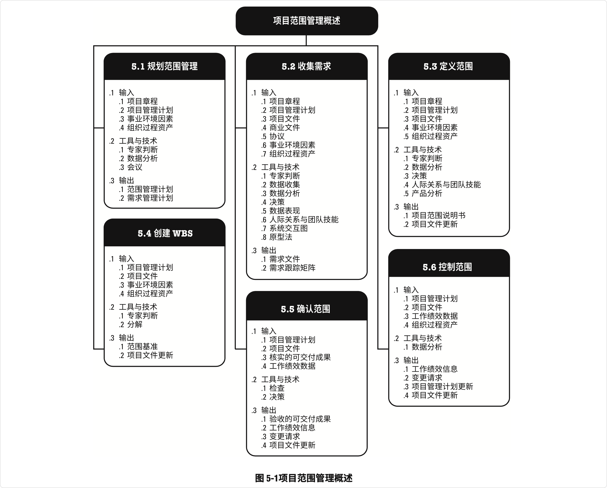

# 5 项目管理范围

项目范围管理包括确保项目做且只做所需的全部工作，以成功完成项目的各个过程。

* 项目范围管理过程包括
  * **5.1 规划范围管理：**为记录如何定义、确认和控制项目范围及产品范围，而创建范围管理计划 的过程
  * **5.2 收集需求：** 为实现项目目标而确定、记录并管理相关方的需要和需求的过程
  * **5.3 定义范围：** 制定项目和产品详细描述的过程
  * **5.4 创建WBS：** 将项目可交付成果和项目工作分解为较小的、更易于管理的组件的过程
  * **5.5 确认范围：** 正式验收已完成的项目可交付成果的过程
  * **5.6 控制范围：** 监督项目和产品的范围状态，管理范围基准变更的过程

