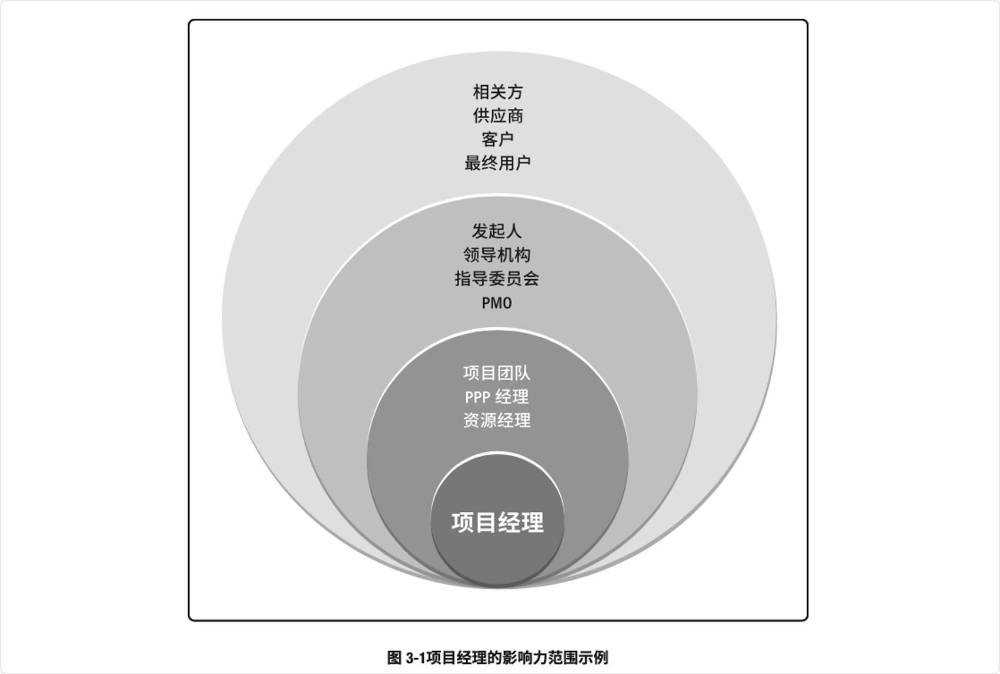
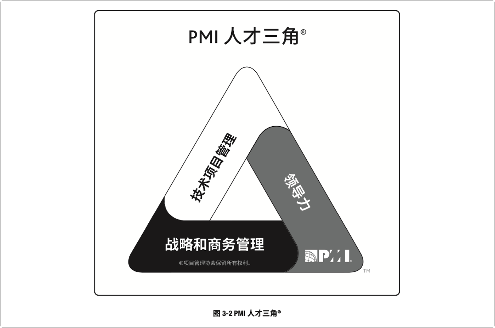
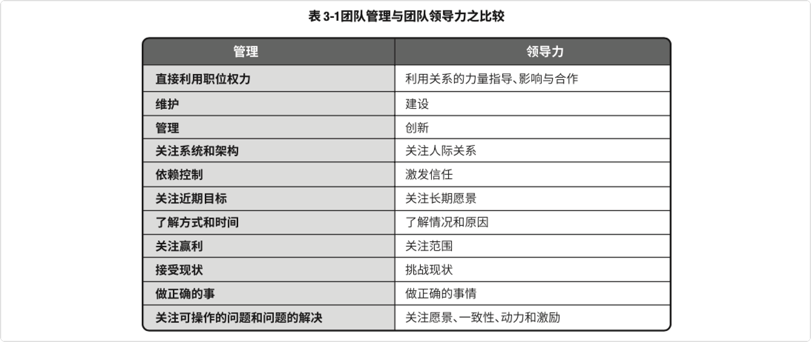

# 项目经理角色

​	项目经理的角色不同于职能经理或运营经理。一般而言，职能经理专注于对某个职能领域或业务部门的管理监督。运营经理负责保证业务运营的高效性。项目经理是由执行组织委派，领导团队实现项目目标的个人。

## 项目经理的影响力范围

​	项目经理在其影响力范围内担任多种角色。这些角色反映了项目经理的能力，体现了项目经理这 一职业的价值和作用。

### 项目

​	项目经理领导项目团队实现项目目标和相关方的期望。项目经理利用可用资源，以平衡相互竞争的制约因素。

​	项目经理还充当项目发起人、团队成员与其他相关方之间的沟通者，包括提供指导和展示项目成功的愿景。项目经理使用软技能(人际关系技能和人员管理技能)来平衡项目相关方之间相互冲突和竞争的目标，以达成共识。

* 与团队和发起人等相关方沟通的能力适用于项目的各个方面(包括但不限于)
  * **通过多种方法培养完善的技能：**口头、书面和非言语
  * **创建、维护和遵循沟通计划和进度计划**
  * **不断地以可预见的方式进行沟通**
  * **寻求了解项目相关方的沟通需求：**沟通可能是某些相关方在最终产品或服务实现之前获取信息的唯一渠道
  * **以简练、清晰、完整、简单、相关和经过裁剪的方式进行沟通**
  * **包含重要的正面和负面消息**
  * **合并反馈渠道**
  * **人际关系技能：**通过项目经理的影响力范围拓展广泛的人际网络。这些人际网络包括正式的人际网络，例如组织架构图;但项目经理发展、维护和培养的非正式人际网络更加重要。非正式人际网络包括与主题专家和具有影响力的领导者建立的个人人际关系。通过这些正式和非正 式的人际网络，项目经理可以让很多人参与解决问题并探询项目中遇到的官僚主义障碍。

### 组织

​	项目经理需要积极地与其他项目经理互动。其他独立项目或同一项目集的其他项目可能会对项目造成影响

* 影响的原因有
  * 对相同资源的需求
  * 资金分配的优先顺序
  * 可交付成果的接受或发布
  * 项目与组织的目的和目标的一致性

​    与其他项目经理互动有助于产生积极的影响，以满足项目的各种需求。

* 项目经理应该致力于
  * 在组织内扮演强有力的倡导者的角色
  * 在项目过程中，项目经理积极地与组织中的各位经理互动
  * 与项目发起人合作处理内部的政治和战略问题，这些问题可能会影响团队或项目的可行性或质量
  * 提高自己在组织内的总体项目管理能力和技能，并参与隐性和显性知识的转移或整合计划
  * 展现项目管理的价值
  * 提高组织对项目管理的接受度
  * 提高组织内现有 PMO 的效率

### 行业

项目经理应时刻关注行业的最新发展趋势，获得并思考这一信息对当前项目是否有影响或可用

* 行业趋势(包括但不限于)
  * **产品和技术开发**
  * **新且正在变化的市场空间**
  * **标准：** 项目管理标准、质量管理标准、信息安全管理标准
  * **技术支持工具**
  * **影响当前项目的经济力量**
  * **影响项目管理学科的影响力**
  * **过程改进和可持续发展战略**

### 专业学科

​	对项目经理而言，持续的知识传递和整合非常重要。项目管理专业和项目经理担任主题专家的其他领域都在持续推进相应的专业发展。

* 知识传递和整合(包括但不限于)
  * 在当地、全国和全球层面向其他专业人员分享知识和专业技能
  * 参与培训、继续教育和发展
    * **项目管理专业:**大学、PMI
    * **相关专业**系统工程、配置管理
    * **其他专业**例如信息技术、航空航天

### 跨领域

​	专业的项目经理针对组织的价值可以选择指导和教育其他专业人员项目管理方法。项目经理还可以担任非正式的宣传大使，让组织了解项目管理在及时性、质量、创新和资源管理方面的优势。

## 项目经理的能力

PMI 研究通过PMI人才三角指出了项目经理根据《项目经理能力发展 (PMCD) 框架》需要具备的技能

* 人才三角重点关注三个关键技能组合
  * **技术项目管理：**与项目、项目集和项目组合管理特定领域相关的知识、技能和行为，即角色履 行的技术方面
  * **领导力：**指导、激励和带领团队所需的知识、技能和行为，可帮助组织达成业务目标
  * **战略和商务管理：**关于行业和组织的知识和专业技能，有助于提高绩效并取得更好的业务成果。

### 技术项目管理技能

​	技术项目管理技能指有效运用项目管理知识实现项目集或项目的预期成果的能力。项目经理经常会依赖专家判断来有效开展工作。要获得成功，重要的是项目经理必须了解个人专长以及如何找到具备所需专业知识的人员。

* 项目经理持续展的几种关键技能(包括但不限于)
  * 重点关注所管理的各个项目的关键技术项目管理要素。简单来说就是随时准备好合适的资料
    * 项目成功的关键因素
    * 进度
    * 指定的财务报告
    * 问题日志
  * 针对每个项目裁剪传统和敏捷工具、技术和方法
  * 花时间制定完整的计划并谨慎排定优先顺序
  * 管理项目要素，包括但不限于进度、成本、资源和风险。

### 战略和商务管理技能

​	战略和商务管理技能包括纵览组织概况并有效协商和执行有利于战略调整和创新的决策和行动的 能力。这项能力可能涉及其他职能部门的工作知识，战略和商务管理技能可能还包括发展和运用相关的产品和行业专业知识。这种业务知识也被称为领域知识。

* 项目 经理应掌握足够的业务知识以
  * 向其他人解释关于项目的必要商业信息
  * 与项目发起人、团队和主题专家合作制定合适的项目交付策略
  * 以实现项目商业价值最大化的方式执行策略。

* 项目经理至少应能够向其他人说明关于组织的以下信息
  * **战略**
  * **使命**
  * **目的和目标**
  * **产品和服务**
  * **运营：**位置、类型、技术
  * **市场和市场条件：** 客户、市场状况和上市时间因素等
  * **竞争：**什么、谁、市场地位

* 为确保一致性，项目经理应将以下信息运用到项目中
  * **战略**
  * **使命**
  * **目的和目标**
  * **优先级**
  * **策略**
  * **产品或服务：**可交付成果

​	战略和商业技能有助于项目经理确定应为其项目考虑哪些商业因素。项目经理应确定这些商业和 战略因素会对项目造成的影响，同时了解项目与组织之间的相互关系。

* 商业因素有
  * **风险和问题**
  * **财务影响**
  * **成本效益分析：**净现值、投资回报率，包括各种可选方案
  * **商业价值**
  * **效益预期实现情况和战略**
  * **范围、预算、进度和质量**

### 领导力技能

​	领导力技能包括指导、激励和带领团队的能力。

#### 人际交往

​	人际交往占据项目经理工作的很大一部分。项目经理应研究人的行为和动机，应尽力成为一个好 的领导者，因为领导力对组织项目是否成功至关重要。项目经理需要运用领导力技能和品质与所有 项目相关方合作，包括项目团队、团队指导和项目发起人。

#### 领导者的品质和技能

* 领导者的品质和技能(包括但不限于)
  * 有远见(例如帮助描述项目的产品、目的和目标;能够有梦想并向他人诠释愿景)
  * 积极乐观
  * 乐于合作
  * 通过以下方式管理关系和冲突
    * 建立信任
    * 解决顾虑
    * 寻求共识
    * 平衡相互竞争和对立的目标
    * 运用说服、协商、妥协和解决冲突的技能
    * 发展和培养个人及专业网络
    * 以长远的眼光来看待人际关系是与项目同样重要
    * 持续发展和运用政治敏锐性
  * 通过以下方式进行沟通
    * 花大量的时间沟通
    * 管理期望
    * 诚恳地接受反馈
    * 提出建设性的反馈
    * 询问和倾听
  * 尊重他人、谦恭有礼、友善待人、诚实可信、忠诚可靠、遵守职业道德
  * 展现出诚信正直和文化敏感性，果断、勇敢，能够解决问题
  * 适当时称赞他人
  * 终身学习，以结果和行动为导向
  * 关注重要的事情，包括
    * 通过必要的审查和调整，持续优化工作
    * 寻求并采用适用于团队和项目的优先级排序方法
    * 区分高层级战略优先级，尤其是与项目成功的关键因素相关的事项
    * 对项目的主要制约因素保持警惕
    * 在战术优先级上保持灵活
    * 能够从大量信息中筛选出最重要的信息
  * 以整体和系统的角度来看待项目，同等对待内部和外部因素
  * 能够运用批判性思维并将自己视为变革推动者
  * 能够创建高效的团队、以服务为导向、展现出幽默的一面，与团队成员有效地分享乐趣。

#### 权术、权力和办好事情

​	领导和管理的最终目的是办好事情。很多技能和品质归根究底就是处理政治的能力。政治涉及影响、谈判、自主和权力。

* 行使权力的方式(包括但不限于)
  * **地位：**有时称为正式的、权威的、合法的，例如组织或团队授予的正式职位
  * **信息：**收集或分发的控制
  * **参考：**因为他人的尊重和赞赏，获得的信任
  * **情境：**例如在危机等特殊情况下获得的权力
  * **个性或魅力：**魅力、吸引力
  * **关系：**参与人际交往、联系和结盟
  * **专家：**拥有的技能和信息、经验、培训、教育、证书
  * **奖励相关的：**能够给予表扬、金钱或其他奖励
  * **处罚或强制力：**给予纪律处分或施加负面后果的能力
  * **迎合：**运用顺从或其他常用手段赢得青睐或合作
  * **施加压力：**限制选择或活动自由，以符合预期的行动
  * **出于愧疚：**强加的义务或责任感
  * **说服力：**能够提供论据，使他人执行预期的行动方案
  * **回避：**拒绝参与

### 领导力与管理之比较

**管理：**运用 一系列已知的预期行为指示另一个人从一个位置到另一个位置

**领导力：**通过讨论或辩 论与他人合作，带领他们从一个位置到另一个位置

为获得成功，项目经理必须同时采用领导力和管理这两种方式。技巧在于如何针对各种情况找到 恰当的平衡点。

#### 领导力风格

* 领导团队考虑主要因素
  * **领导者的特点：**态度、心情、需求、价值观、道德观
  * **团队成员的特点：**态度、心情、需求、价值观、道德观
  * **组织的特点：**目标、结构、工作类型
  * **环境特点：**社会形势、经济状况和政治因素

研究显示项目经理可以采用的多种领导力风格。

* 最常见的风格(包括但不限于)
  * **放任型领导：**允许团队自主决策和设定目标，又被称为“无为而治”
  * **交易型领导：**关注目标、反馈和成就以确定奖励，例外管理
  * **服务型领导：**做出服务承诺，处处先为他人着想;关注他人的成长、学习、发展、自主性和福祉；关注人际关系、团体与合作；服务优先于领导
  * **变革型领导：**通过理想化特质和行为、鼓舞性激励、促进创新和创造，以及个人关怀提 高追随者的能力
  * **魅力型领导：**能够激励他人;精神饱满、热情洋溢、充满自信;说服力强
  * **交互型领导：**结合了交易型、变革型和魅力型领导的特点

#### 个性

​	个性指人与人之间在思维、情感和行为的特征模式方面的差异。

* 个人性格特点或特征可能(包括但不限于)
  * **真诚：**接受他人不同的个性，表现出包容的态度
  * **谦恭：**能够举止得体、有礼貌
  * **创造力：**抽象思维、不同看法、创新的能力
  * **文化：**具备对其他文化的敏感性，包括价值观、规范和信仰
  * **情绪：**能够感知情绪及其包含的信息并管理情绪，衡量人际关系技能
  * **智力：**以多元智能理论衡量的人的智商
  * **管理：**管理实践和潜力的衡量
  * **政治：**政治智商和把事办好的衡量
  * **以服务为导向：**展现出愿意服务他人的态度
  * **社会：**能够理解和管理他人
  * **系统化：**了解和构建系统的驱动力

## 执行整合

​	整合是项目经理的一项关键技能。

* 执行项目整合时，项目经理承担双重角色
  * 项目经理扮演重要角色，与项目发起人携手合作，既要了解战略目标并确保项目目标和成果与项目组合、项目集以及业务领域保持一致。项目经理以这种方式有助于项目的整合与执行
  * 在项目层面上，项目经理负责指导团队关注真正重要的事务并协同工作。项目经理需要整合过程、知识和人员。

### 在过程层面执行整合

​	在整个项目期间实施整体变更控制过程是为了整合变更请求。

### 认知层面的整合

​	项目经理应尽量掌握所有项目管理知识领域，整合这些知识 领域所涵盖的过程才有可能实现预期的项目结果。

### 背景层面的整合

​	在管理整合时，项目经理需要意识到项目背景和这些新因素，然后可以决定如何在项目中最好地利用这些新环境因素，以获得项目成功。

### 整合与复杂性

​	项目的复杂性来源于组织的系统行为、人类行为以及组织或环境中的不确定性。

* 复杂性的三个维度定义
  * **系统行为：**组成部分与系统之间的依赖关系
  * **人类行为：**不同个体和群体之间的相互作用
  * **不明确性：**出现问题、缺乏理解或造成困惑引发的不确定性

复杂性本身指个体基于自身经验、观察和技能的一种感知，更准确的描述应该是项目包含复杂性 的要素，而不是项目本身复杂。

* 复杂性通常定义
  * 包含多个部分
  * 不同部分之间存在一系列连接
  * 不同部分之间有动态交互作用
  * 这些交互作用所产生的行为远远大于各部分简单的相加

这些因素会增加项目的复杂性，通过检查，有助于项目经理在规划、管理和控制项目时可以识别 关键领域，确保完成整合。

