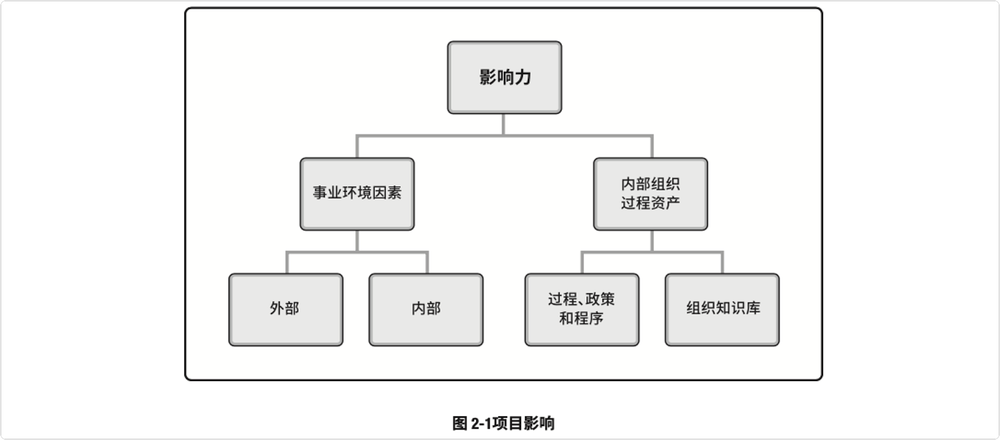
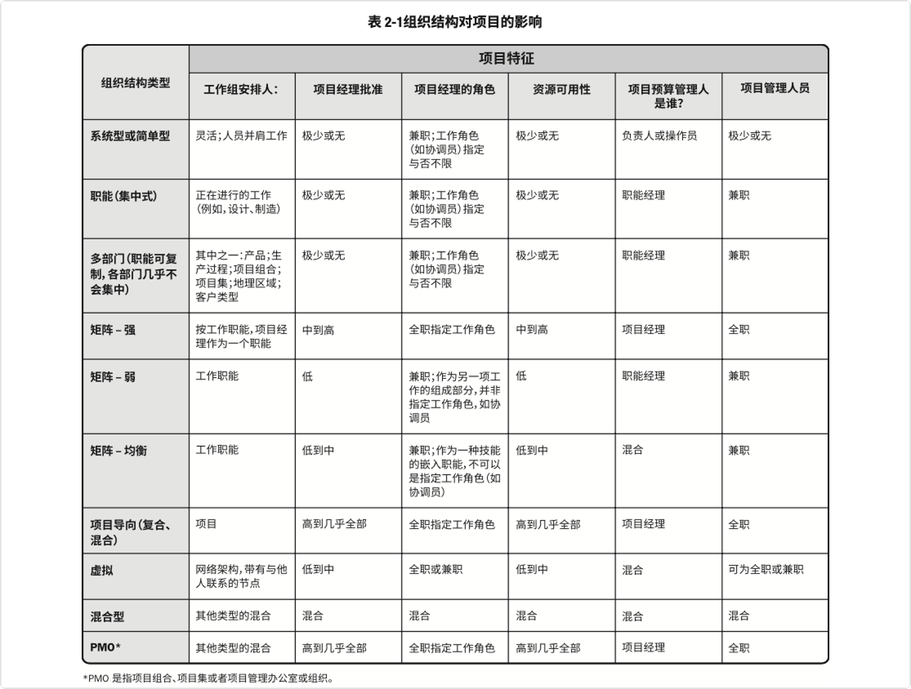

# 项目运行环境

​    项目所处的环境可能对项目的开展产生有利或不利的影响。这些影响的两大主要来源为事业环境因素 (EEF) 和组织过程资产 (OPA)。

​	事业环境因素源于项目外部的环境，事业环境因素可能对整个企业、项目组合、项目集或项目产生影响。

​	组织过程资产源于企业内部，可能来自企业自身、项目组合、项目集、其他项目或这些的组合。

​    除了事业环境因素和组织过程资产，组织系统对项目生命周期也起着重要的作用。组织系统进一步讨论了影响了组织系统内部人员的权力、影响力、利益、技能和政治能力的系统因素。

## 2.2 事业环境因素

​    事业环境因素(EEFs)是指项目团队不能控制的，将对项目产生影响、限制或指令作用的各种条件。这些条件可能来自于组织的内部和外部。事业环境因素是很多项目管理过程，尤其是大多数规划过程的输入。这些因素可能会提高或限制项目管理的灵活性，并可能对项目结果产生积极 或消极的影响。

* 组织内部的事业环境因素
  * **组织文化、结构和治理：**愿景、使命、价值观、信念、文化规范、领导风格、等级制度和职权关系、组织风格、道德和行为规范
  * **设施和资源的地理分布：**工厂位置、虚拟团队、共享系统和云计算
  * **基础设施：**现有设施、设备、组织通讯渠道、信息技术硬件、可用性和功能
  * **信息技术软件：**进度计划软件工具、配置管理系统、进入其他在线自动化系统的网络 界面和工作授权系统
  * **资源可用性：**合同和采购制约因素、获得批准的供应商和分包商以及合作协议
  * **员工能力：**现有人力资源的专业知识、技能、能力和特定知识。

* 组织外部的事业环境因素
  * **市场条件：**竞争对手、市场份额、品牌认知度和商标
  * **社会和文化影响与问题：**政治氛围、行为规范、道德和观念
  * **法律限制：**安全、数据保护、商业行为、雇佣和采购有关的国家或地方法律法规
  * **商业数据库：**标杆对照成果、标准化的成本估算数据、行业风险研究资料和风险 数据库
  * **学术研究：**行业研究、出版物和标杆对照成果
  * **政府或行业标准：**产品、生产、环境、质量和工艺有关的监管机构条例和标准
  * **财务考虑因素：**货币汇率、利率、通货膨胀率、关税和地理位置
  * **物理环境要素：**工作环境、天气和制约因素。

## 2.3 组织过程资产

​	组织过程资产是执行组织所特有并使用的计划、过程、政策、程序和知识库，会影响对具体项目的管理。

* 组织过程资产特点
  * 来自任何项目执行组织的，可用于执行或治理项目的任何工件、 实践或知识，以及组织以往项目的经验教训和历史信息
  * 可能还有完成的进 计划、风险数据和挣值数据
  * 是许多项目管理过程的输入
  * 存在 于组织内部，在整个项目期间，项目团队成员可对组织过程资产进行必要的更新和增补
* 组织过程资产分类
  * 过程、政策和程序
    * 更新通常不是项目工作的一部分，由项目管理办公室 (PMO) 或项目以外的其他职能部门完成
    * 更新工作仅须遵循与过程、政策和程序更新相关的组织政策
  * 组织知识库
    * 在整个项目期间结合项目信息而更新

### 过程、政策和程序

* 组织用于执行项目工作的流程与程序有(包括但不限于)
  * **启动和规划**
    * **指南和标准：**用于裁剪组织标准流程和程序以满足项目的特定要求
    * **特定的组织标准：**人力资源政策、健康与安全政策、安保与保密政策、质量 政策、采购政策和环境政策
    * **产品和项目生命周期以及方法和程序：**如项目管理方法、评估指标、过程审计、改进目 标、核对单、组织内使用的标准化的过程定义
    * **模板：**如项目管理计划、项目文件、项目登记册、报告格式、合同模板、风险分类、风险描述模板、概率与影响的定义、概率和影响矩阵，以及相关方登记册模板
    * **预先批准的供应商清单和各种合同协议类型：**如总价合同、成本补偿合同和工料合同
  * **执行、监控**
    * **变更控制程序：**修改组织标准、政策、计划和程序(或任何项目文件)所须遵循的步骤，以及如何批准和确认变更
    * **跟踪矩阵**
    * **财务控制程序：**定期报告、必需的费用与支付审查、会计编码及标准合同条款等
    * **问题与缺陷管理程序：**定义问题和缺陷控制、识别与解决问题和缺陷，以及跟踪行 动方案
    * **资源的可用性控制和分配管理**
    * **组织对沟通的要求：**可用的沟通技术、许可的沟通媒介、记录保存政策、视频会议、协同工具和安全要求
    * **确定工作优先顺序、批准工作与签发工作授权的程序**
    * **模板：**风险登记册、问题日志和变更日志
    * **标准化的指南、工作指示、建议书评价准则和绩效测量准则**
    * **产品、服务或成果的核实和确认程序**

### 组织知识库

* 组织用来存取信息的知识库(包括但不限于)
  * **配置管理知识库：**软件和硬件组件版本以及所有执行组织的标准、政策、程序和任何项目 文件的基准
  * **财务数据库：**人工时、实际成本、预算和成本超支等方面的信息
  * **历史信息与经验教训知识库：**项目记录与文件、完整的项目收尾信息与文件、关于以往项目选择决策的结果及以往项目绩效的信息，以及从风险管理活动中获取的信息
  * **问题与缺陷管理数据库：**问题与缺陷的状态、控制信息、解决方案以及相关行动的结果
  * **测量指标数据库：**用来收集与提供过程和产品的测量数据
  * **以往项目的项目档案：**范围、成本、进度与绩效测量基准，项目日历，项目进度网络图， 风险登记册，风险报告以及相关方登记册

## 2.4 组织系统

​	运行项目时需要应对组织结构和治理框架带来的制约因素。为有效且高效地开展项目，项目经理 需要了解组织内的职责、终责和职权的分配情况。这有助于项目经理有效地利用其权力、影响力、 能力、领导力和政治能力成功完成项目。

​	单个组织内多种因素的交互影响创造出一个独特的系统，会对在该系统内运行的项目造成影 响。这种组织系统决定了组织系统内部人员的权力、影响力、利益、能力和政治能力。

* 系统因素(包括但不限于)
  * 管理要素
  * 治理框架
  * 组织结构类型

* 系统的原则
  * 系统是动态的
  * 系统是可以优化
  * 系统组件是可以优化
  * 系统及其组件不能同时优化
  * 系统呈现非线性响应(输入的变更并不会产生可预测的输出)

​	系统内部以及系统与其环境之间可能会发生多个变更。出现这些变更时，各组件内部发生的适应 性行为反过来会增加系统的动态特性。这种特性取决于组件之间的联系和依赖关系的相互作用。

* 系统注意事项
  * 系统通常由组织管理层负责
  * 组织管理层检查组件与系统之间的优化权衡，以便采取合适的措施为组织实现最佳结果
  * 项目经理应考虑到组织的治理框架

### 组织治理框架

​	PMI 研究指出，治理指组织各个层面的有组织的或有结构的安排，旨在确定和影响组织成员的行为。

* 治理是一个多方面概念
  * 包括考虑人员、角色、结构和政策
  * 要求通过数据和反馈提供指导和监督

#### 治理框架

* 治理是在组织内行使职权的框架(包括但不限于)
  * 规则
  * 政策
  * 程序
  * 规范
  * 关系
  * 系统
  * 过程
* 治理框架会影响
  * 组织目标的设定和实现方式
  * 风险监控和评估方式
  * 绩效优化方式

#### 项目组合、项目集和项目治理

​	项目治理是指用于指导项目管理活动的框架、功能和过程，从而创造独特的产品、服务或结果以 满足组织、战略和运营目标。不存在一种治理框架适用于所有组织。组织应根据组织文化、项目类 型和组织需求裁剪治理框架，才能发挥其作用。

* 四个治理领域
  * 一致性
  * 风险
  * 绩效
  * 沟通

* 各个领域都具备的职能部门
  * 监督
  * 控制
  * 整合
  * 决策

### 管理要素

* 关键职能部门或一般管理原则(包括但不限于)
  * **基于专业技能和可用性开展工作的部门**
  * **组织授予的工作职权**
  * **工作职责，开展组织根据技能和经验等属性合理分派的工作任务**
  * **具有纪律性的行为：**尊重职权、人员和规定
  * **统一指挥原则：**一位员工仅接受一个上级对任何行动或活动给出的指示
  * **统一领导原则：**针对一组活动只能有一个计划或一个领导人，以及相同的目标
  * **组织的总体目标优先于个人目标**
  * **支付合理的薪酬**
  * **资源的优化使用**
  * **畅通的沟通渠道**
  * **在正确的时间让正确的人使用正确的材料做正确的事情**
  * **公正、平等地对待所有员工**
  * **明确工作岗位的安全职责**
  * **确保员工安全**
  * **允许任何员工参与计划和实施**
  * **保持员工士气**

### 组织结构类型

​	组织需要权衡两个关键变量之后才可确定合适的组织结构类型。这两个变量指可以采用的组织 结构类型以及针对特定组织如何优化组织结构类型的方式。不存在一种结构类型适用于任何特定 组织。

#### 组织结构类型

​	组织结构的形式或类型是多种多样的。

#### 组织结构选择的考虑因素

​	在确定组织结构时，每个组织都需要考虑大量的因素。在最终分析中，每个因素的重要性也各不相同。综合考虑因素及其价值和相对重要性为组织决策者提供了正确的信息，以便进行分析。

* 选择组织结构时应考虑的因素(包括但不限于)
  * **与组织目标的一致性**
  * **专业能力**
  * **控制、效率与效果的程度**
  * **明确的决策升级渠道**
  * **明确的职权线和范围**
  * **授权方面的能力**
  * **终责分配**
  * **职责分配**
  * **设计的灵活性**
  * 简单的设计
  * **实施效率**
  * **成本考虑**
  * **物理位置: **集中办公、区域办公和虚拟远程办公
  * **清晰的沟通:**政策、工作状态和组织愿景

#### 项目管理办公室

​	项目管理办公室 (PMO) 是对与项目相关的治理过程进行标准化，并促进资源、方法论、工具和技 术共享的一个组织结构。PMO 的职责范围可大可小，从提供项目管理支持服务，到直接管理一个 或多个项目。

* PMO分类
  * **支持型：**PMO担当顾问的角色，向项目提供模板、最佳实践、培训，以及来自其他项目的信息和经验教训。这种类型的 PMO 其实就是一个项目资源库，对项目的控制程度很低。 
  * **控制型：**PMO不仅给项目提供支持，而且通过各种手段要求项目服从，PMO对项目的控制程度属于中等，服从包含：
    * 采用项目管理框架或方法论
    * 使用特定的模板、格式和工具
    * 服从治理
  * **指令型：**PMO直接管理和控制项目。项目经理由PMO指定并向其报告。PMO对项目的控制程度很高。

* 项目管理办公室的特点
  * 可能会承担整个组织范围的职责，在支持战略调整和创造组织价值方面发挥重要的作用
  * 从组织战略项目中获取数据和信息，进行综合分析，评估如何实现更高级别的战略目标
  * 在组织的项目组合、项目集、项目与组织考评体系之间建立联系
  * 除了被集中管理以外，PMO所支持和管理的项目不一定彼此关联
  * PMO 的具体形式、职能和结构取决于所在组织的需要
* 为了保证项目符合组织的业务目标，PMO可能有权在每个项目的生命周期中充当重要相关方和关键决策者。PMO可以:
  * 提出建议
  * 领导知识传递
  * 终止项目
  * 根据需要采取其他行动
* PMO的一个主要职能是通过各种方式向项目经理提供支持(包括但不限于)
  * 对 PMO 所辖的全部项目的共享资源进行管理
  * 识别和制定项目管理方法、最佳实践和标准
  * 指导、辅导、培训和监督
  * 通过项目审计，监督对项目管理标准、政策、程序和模板的遵守程度
  * 制定和管理项目政策、程序、模板和其他共享的文件(组织过程资产)
  * 对跨项目的沟通进行协调。

