# 项目沟通管理

## 有效的沟通

|                           沟通效果                           |                                                              |
| :----------------------------------------------------------: | ------------------------------------------------------------ |
| 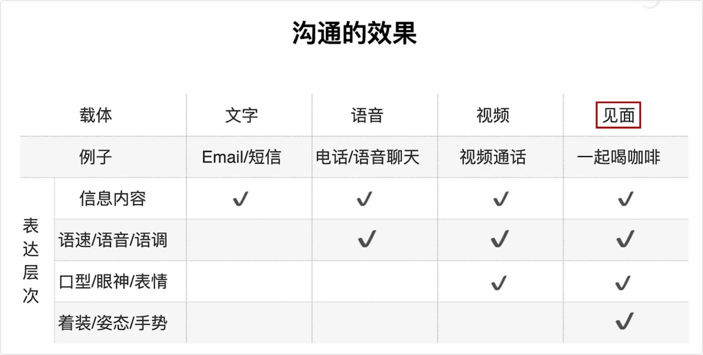 | 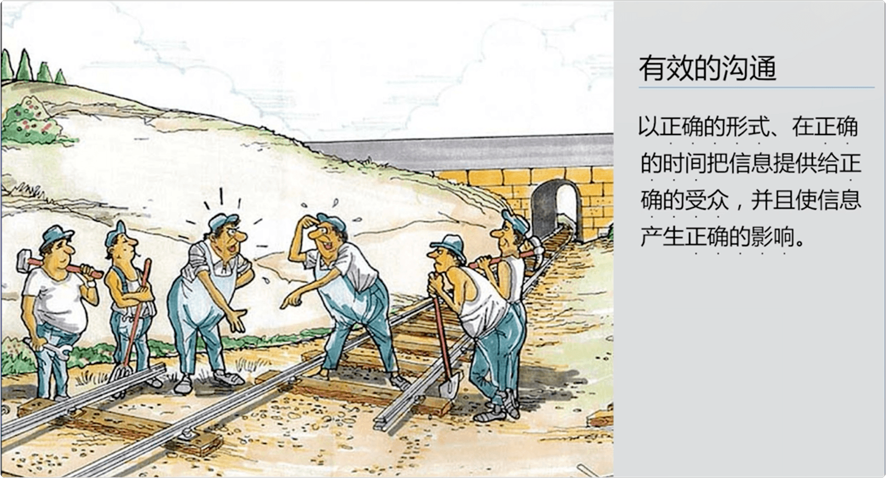 |

|                         沟通管理过程                         | 沟通管理                                                     |
| :----------------------------------------------------------: | ------------------------------------------------------------ |
| 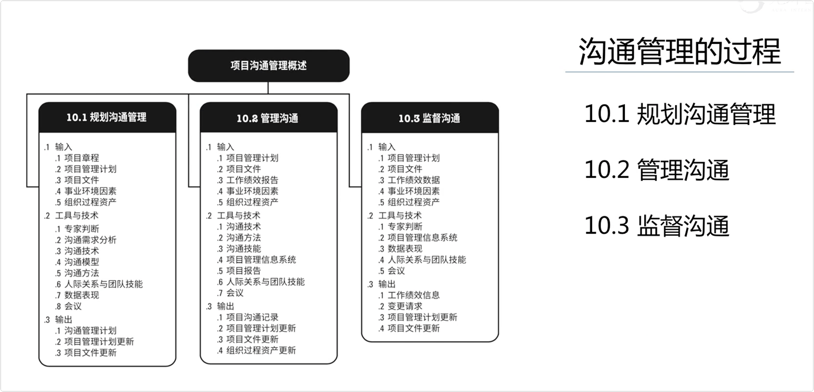 |  |

|                          沟通的方式                          | 乔哈里窗                                                     |
| :----------------------------------------------------------: | ------------------------------------------------------------ |
|  |  |

## 书面沟通的5c原则

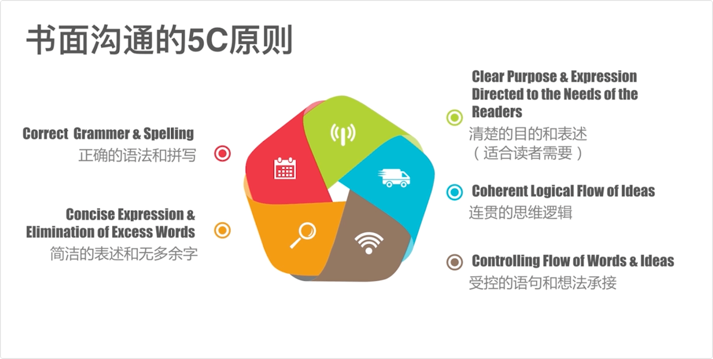

## 规划沟通管理需要考虑的要素和沟通模型

|                       规划沟通需要考虑                       | 沟通模型                                                     |
| :----------------------------------------------------------: | ------------------------------------------------------------ |
| 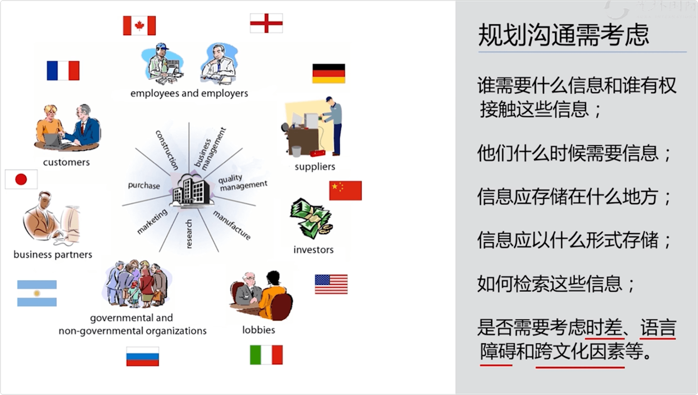 | 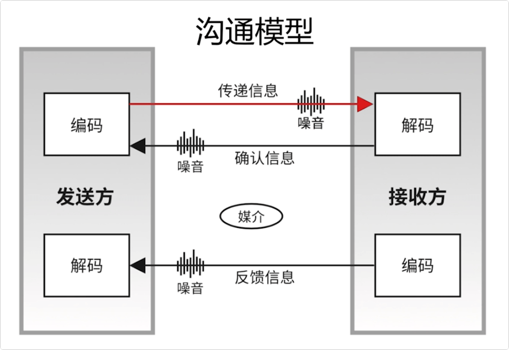 |

|                           沟通漏斗                           | 沟通路径                                                     |
| :----------------------------------------------------------: | ------------------------------------------------------------ |
| 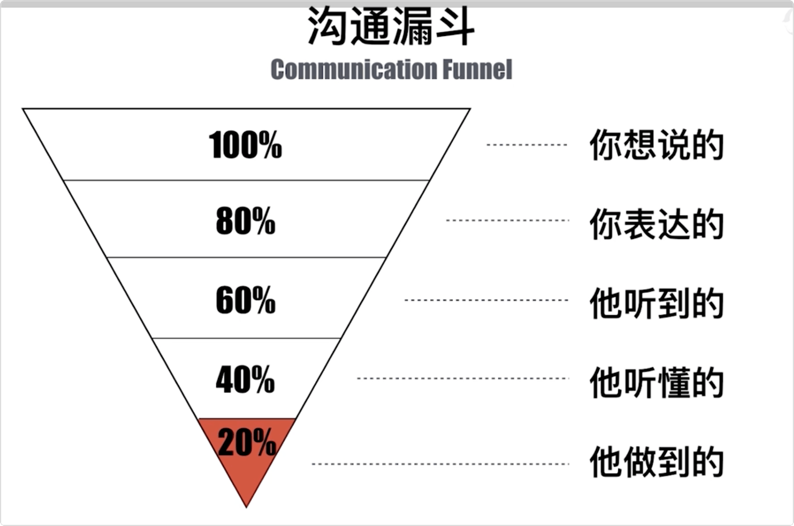 | 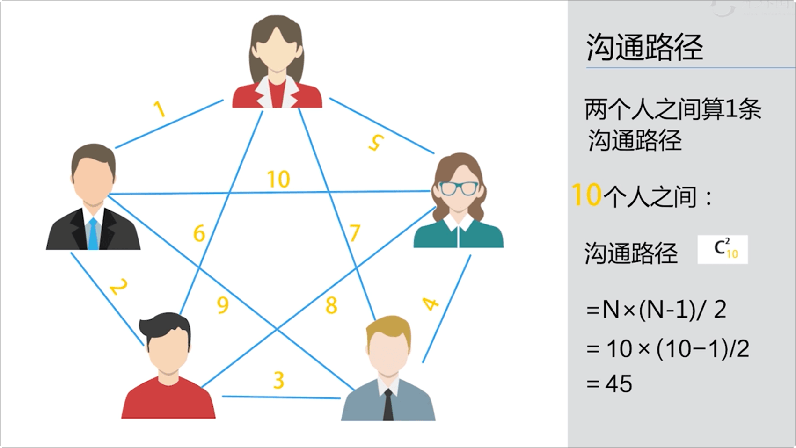 |

|                         信息过滤现象                         |                            知识点                            |
| :----------------------------------------------------------: | :----------------------------------------------------------: |
|  | 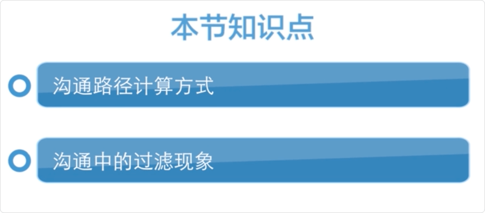 |

## 影响沟通的障碍

* 沟通障碍
  * 信息过载
  * 缺少知识
  * 文化差异
  * 分散注意力的环境因素
  * 有害的态度
  * 情绪
  * 不懂专业或技术术语
  * 沟通渠道过多
  * 选择性认知

|                        沟通障碍的原因                        |                            知识点                            |
| :----------------------------------------------------------: | :----------------------------------------------------------: |
|  | 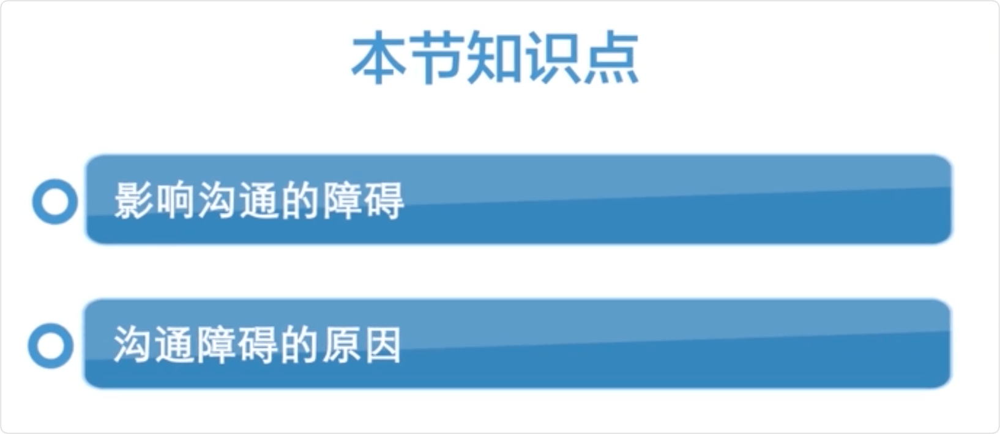 |

## 沟通技巧和方式

|                          沟通的技术                          |                         沟通方法对比                         |
| :----------------------------------------------------------: | :----------------------------------------------------------: |
|  | 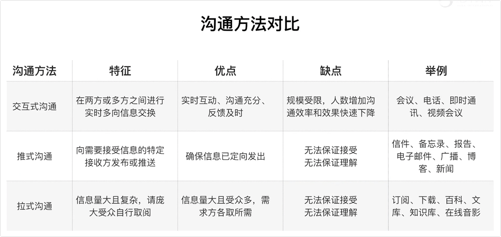 |

## 会议管理学问

|                           会议管理                           |                           章节总结                           |
| :----------------------------------------------------------: | :----------------------------------------------------------: |
| 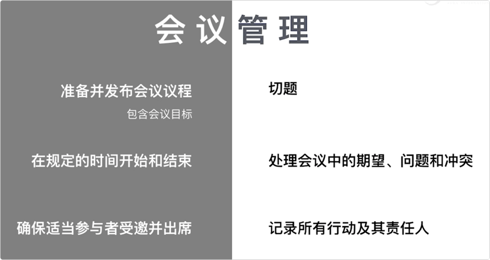 | 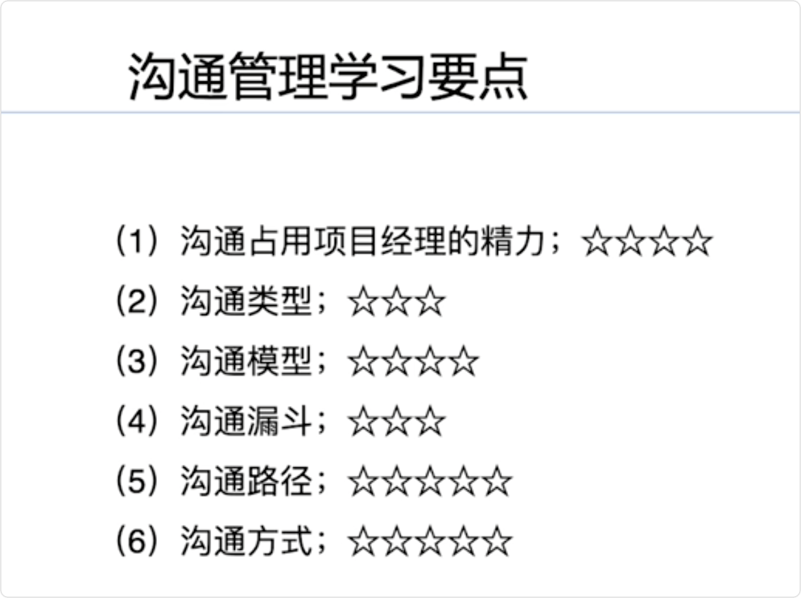 |

