# 项目运行环境

## 组织运行环境

|                         环境组成部分                         |
| :----------------------------------------------------------: |
| 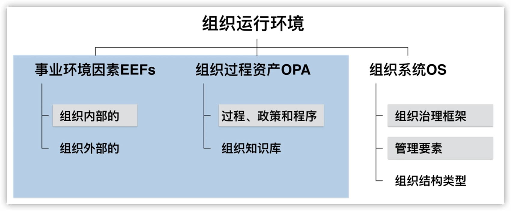 |

事业环境因素和组织过程资产是一对孪生兄弟，考题当中经常成对出现， 区分和对比两者的差异。

组织系统是从另一个视角去看管理要素。

蓝色部分和白色部分是两类不同的视角。

* 组成详细说明

| 事业环境因素                                                 | 组织过程资产                                                 | 组织系统                                                     |
| ------------------------------------------------------------ | ------------------------------------------------------------ | ------------------------------------------------------------ |
| 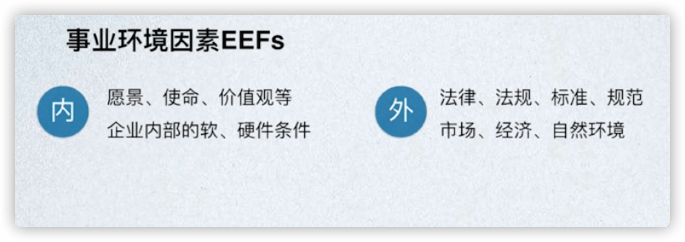 |  |  |

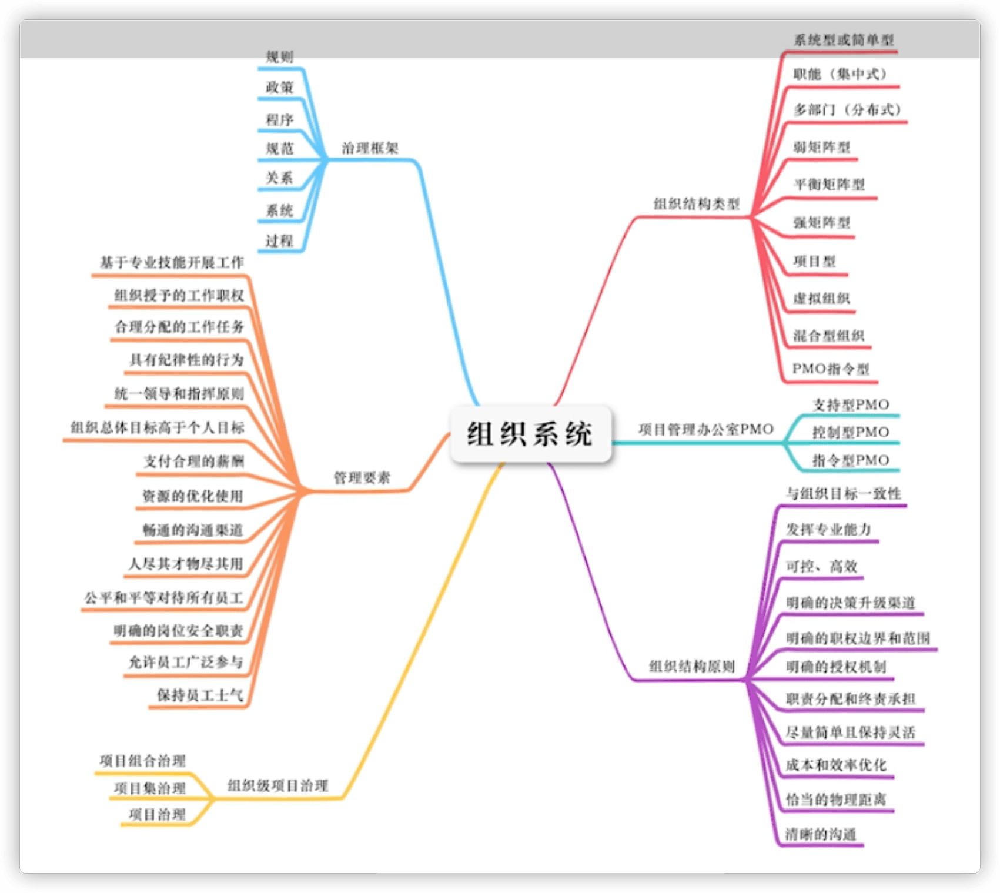

* 组成比较

|                 事业环境因素 VS 组织过程资产                 |                         治理 VS 管理                         |
| :----------------------------------------------------------: | :----------------------------------------------------------: |
| 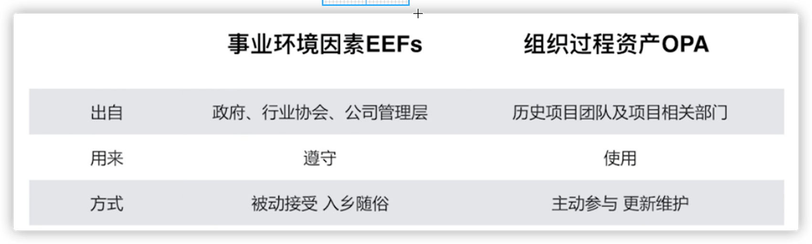 |  |

## 项目管理办公室PMO

|                          PMO的 职能                          |                         PMO的3种类型                         |
| :----------------------------------------------------------: | :----------------------------------------------------------: |
| 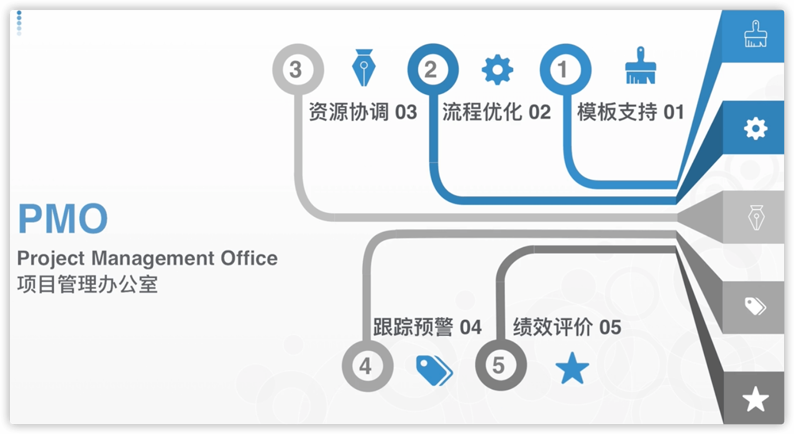 | 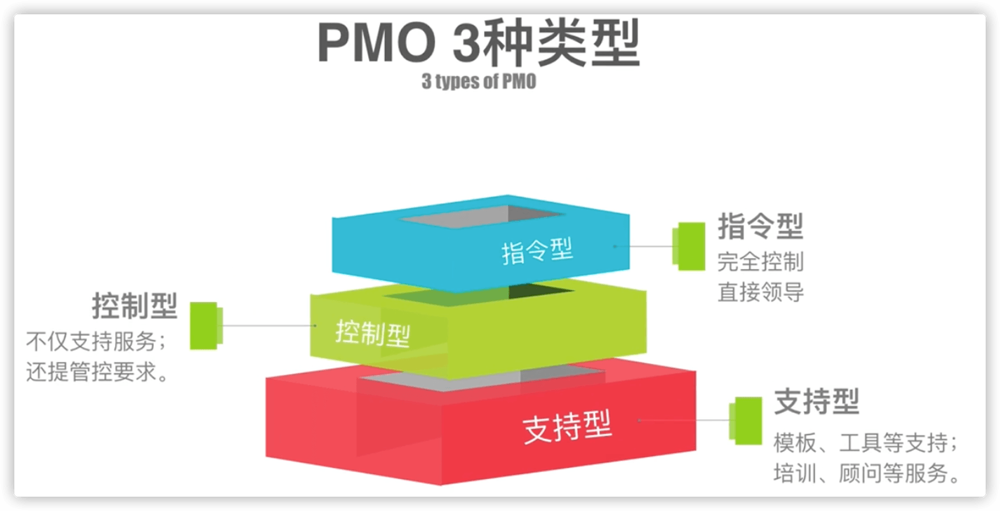 |

PMO应该优先做好前三个职能(服务好项目)，再去做后面两个职能。

## 法约尔原则与管理要素

|                          法约尔原则                          | 管理要素                                                     |
| :----------------------------------------------------------: | ------------------------------------------------------------ |
| 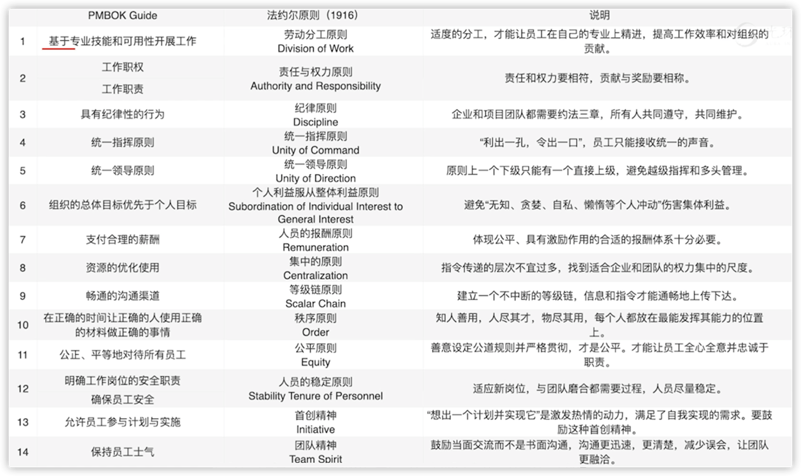 | 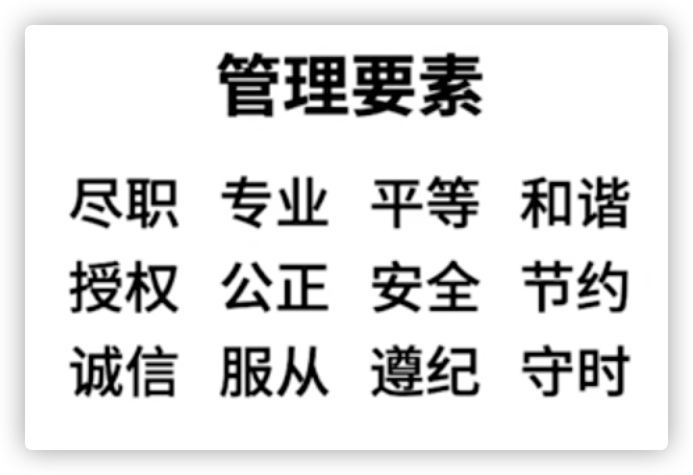 |

## **组织结构的类型**

|                           组织结构                           |
| :----------------------------------------------------------: |
|  |

* 组织类型详情

|                          职能型组织                          |                          项目型组织                          |
| :----------------------------------------------------------: | :----------------------------------------------------------: |
| 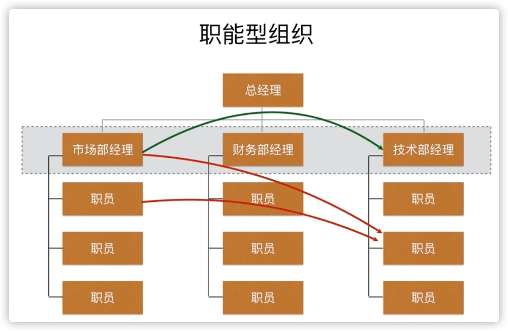 | 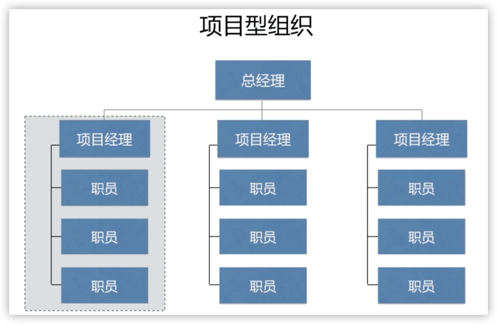 |

|                          矩阵型组织                          |
| :----------------------------------------------------------: |
| 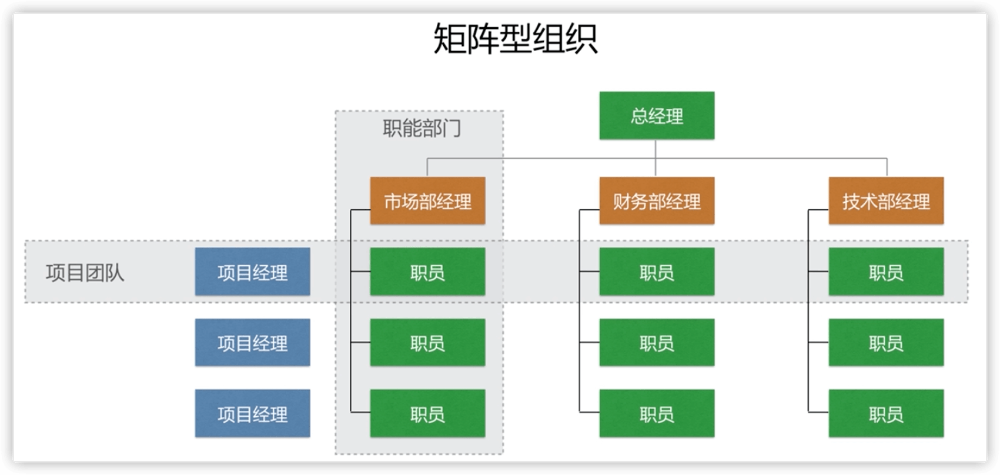 |

|                       组织结构类型对比                       |
| :----------------------------------------------------------: |
| 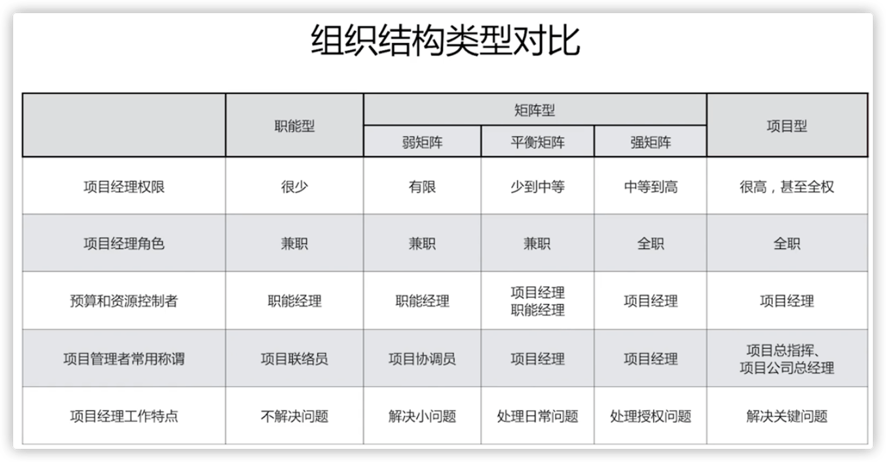 |

