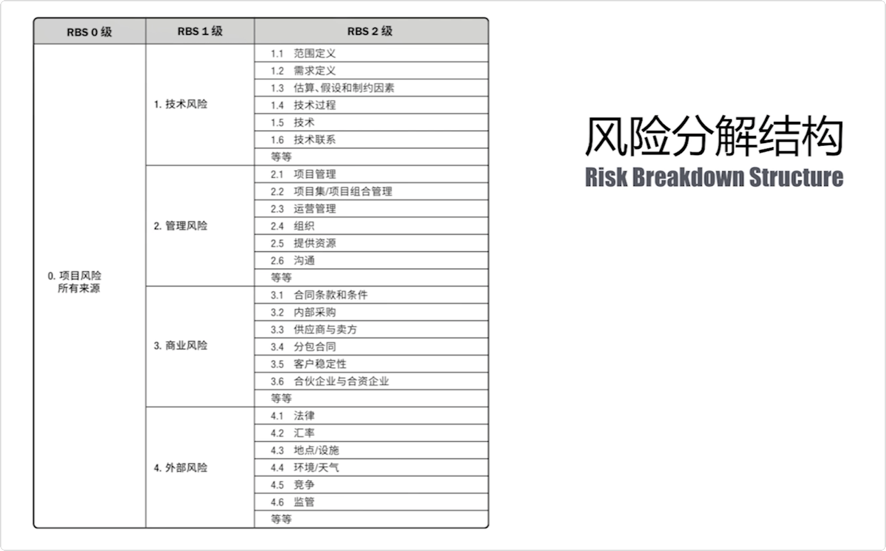
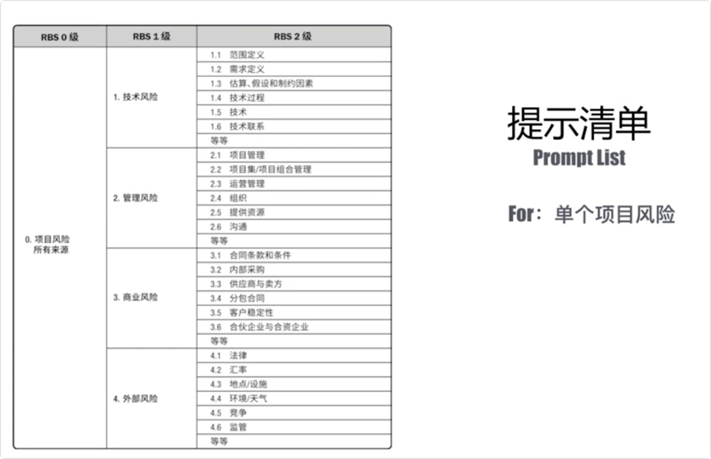
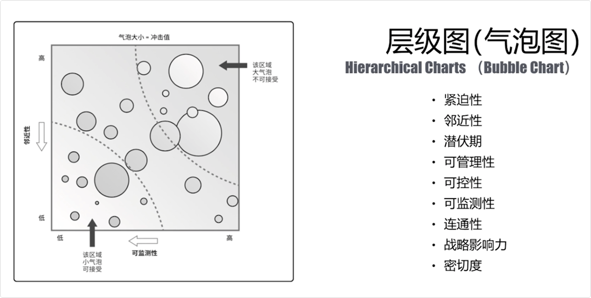

# 项目风险管理

## 风险的含义和类别

|                         风险管理过程                         |                             风险                             |
| :----------------------------------------------------------: | :----------------------------------------------------------: |
|  |  |

|                           风险敞口                           |                  单个项目风险vs整体项目风险                  |
| :----------------------------------------------------------: | :----------------------------------------------------------: |
|  |  |

## 风险的含义和类别

|                          变异性风险                          |                          模糊性风险                          |
| :----------------------------------------------------------: | :----------------------------------------------------------: |
|  |  |

|                           项目韧性                           |                        整合式风险管理                        |
| :----------------------------------------------------------: | :----------------------------------------------------------: |
|  |  |

## 风险分解结构和相关方的风险态度

|                        项目风险的分类                        |                         风险分解结构                         |
| :----------------------------------------------------------: | :----------------------------------------------------------: |
|  |  |

|                       相关方的风险态度                       |                            知识点                            |
| :----------------------------------------------------------: | :----------------------------------------------------------: |
|  |  |

## 识别风险的几种方法

|                          鱼骨图分析                          |                        识别风险的方法                        |
| :----------------------------------------------------------: | :----------------------------------------------------------: |
|  |  |

|                          系统流程图                          |                           专家判断                           |
| :----------------------------------------------------------: | :----------------------------------------------------------: |
|  |  |

|                    假设条件和制约因素分析                    | 假设条件和制约因素                                           |
| :----------------------------------------------------------: | ------------------------------------------------------------ |
|  |  |

|                           swot分析                           |                         swot分析进阶                         |
| :----------------------------------------------------------: | :----------------------------------------------------------: |
|  |  |

|                           提示清单                           | 战略框架                                                     |
| :----------------------------------------------------------: | ------------------------------------------------------------ |
|  |  |

|                            层级图                            | 知识点                                                       |
| :----------------------------------------------------------: | ------------------------------------------------------------ |
|  |  |

## 风险定性分析

|                      风险概率和影响定义                      | 风险概率和影响矩阵                                           |
| :----------------------------------------------------------: | ------------------------------------------------------------ |
|  |  |

## 风险定量分析

|                      模拟：蒙特卡洛技术                      | 敏感性分析                                                   |
| :----------------------------------------------------------: | ------------------------------------------------------------ |
|  |  |

|                            决策树                            |                            影响图                            |
| :----------------------------------------------------------: | :----------------------------------------------------------: |
|  |  |

* 敏感性分析案例

|                                                              |                                                              |
| ------------------------------------------------------------ | ------------------------------------------------------------ |
|  |  |

## 风险应对工具

|                         风险应对工具                         | 风险应对工具案例                                             |
| :----------------------------------------------------------: | ------------------------------------------------------------ |
|  |  |

## 风险和资源的关系及风险的应对流程

|                    风险和资源的关系 ⭐️⭐️⭐️⭐️⭐️                    | 风险应对流程                                                 |
| :----------------------------------------------------------: | ------------------------------------------------------------ |
|  |  |

## 风险应对策略

|                         风险应对策略                         | 选择应对策略时的影响因素                                     |
| :----------------------------------------------------------: | ------------------------------------------------------------ |
|  |  |

|                      风险和项目生命周期                      |                           章节总结                           |
| :----------------------------------------------------------: | :----------------------------------------------------------: |
|  |  |

