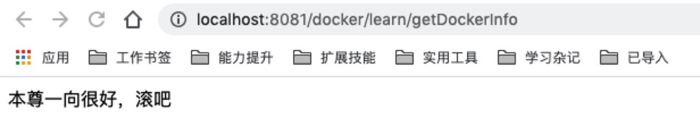

# 基于DockerFile构建镜像
**请注意:**  
全文中`[]`表示辅助说明，比如`[.]`表示的是`.`(文本中不能使用特殊标记);  
全文基于docker-file模块写成，所有路径以docker-file模块的为准；
## maven 打包
参考docker-file模块maven配置，打包后会在target目录下生成docker-file-bin.tar.gz文件。
```shell
mvn clean compile package -DskipTests
```
## DockerFile配置
```shell
#基础镜像
FROM java:8u111
#维护者信息
MAINTAINER zhanggangxue<zhanggangxue@mininglamp.com>
#设置环境变量
ENV PATH /usr/local/docker-file:$PATH
#拷贝文件到安装目录下，压缩文件会自动解压
ADD target/docker-file-bin.tar.gz /usr/local/
#修改安装路径权限
RUN chmod -R 777 /usr/local/docker-file
#移动到指定目录，相当于cd
WORKDIR /usr/local/docker-file
#对外开放端口
EXPOSE 8081
#CMD 运行以下命令
CMD ["/bin/bash","start.sh"]
```

## 构建镜像文件
```shell
# docker build -t user/imageName:version dockerFilePath
# -t表示为镜像打一个tag，tag内容是[用户名/镜像名:版本号]
# dockerFilePath 表示dockerFile文件的路径。当前路径用[.]表示。
docker build -t mlamp/dockerlearn:1.0 .
# 一个镜像可以同时打多个tag
docker build -t mlamp/dockerlearn:latest -t mlamp/dockerlearn:v1.0 .
```

## 查看镜像列表
```shell
# REPOSITORY: 镜像仓库源
# TAG: 镜像标签
# IMAGE ID: 镜像ID
# CREATED: 镜像创建时间
# CREATED: 镜像大小
$ docker images
REPOSITORY               TAG                 IMAGE ID            CREATED              SIZE
mlamp/dockerlearn        1.0                 5c493e5f0abc        About a minute ago   678MB
```

## 基于镜像启动容器
```shell
# docker run -d -p 主机端口:容器端口 imageId(镜像Id)
# docker run -d -p 8081:8081 5c493e5f0abc
# docker run -d -p 主机端口:容器端口 镜像名(镜像仓库源:镜像标签)
$ docker run -d -p 8081:8081 mlamp/dockerlearn:1.0
1521691a819343a04ad75bf3f7ad40392fa6c127fdb69455269d7ce267a0cb1a
```

## 查看启动的容器
```shell
$ docker ps
CONTAINER ID        IMAGE                   COMMAND                CREATED             STATUS              PORTS                    NAMES
1521691a8193        mlamp/dockerlearn:1.0   "/bin/bash start.sh"   12 minutes ago      Up 12 minutes       0.0.0.0:8081->8081/tcp   nervous_banzai

```

## 访问容器接口


## 停止容器
```shell
# docker stop containerId(容器Id)
$ docker stop 1521691a8193
1521691a8193
```

## 删除容器
```shell
# 删除容器前需要停止容器，否则无法删除
$ docker rm 1521691a8193
1521691a8193
```

## 删除镜像
```shell
# 删除镜像前需要先删除容器，否则无法删除
# docker rmi imageId(镜像Id)
# docker rmi 5c493e5f0abc
# docker rmi imageName(镜像仓库源:镜像标签)
$ docker rmi mlamp/dockerlearn:1.0
Untagged: mlamp/dockerlearn:1.0
Deleted: sha256:5c493e5f0abc24181ceede99442db044c002b167c562b31538e84833a998247e
Deleted: sha256:5e75f8d71d1a88f7d8864c65115ccc1b6de05059251f417e23208aa9b6de61a5
Deleted: sha256:e7821562408cf0e92cc1c9905821ffe3a32ac6c93cd91426e8fa91bc83d83090
Deleted: sha256:3e9158c48566d1774cdfe8251842d7bd3a54fc415f3eee093038fb03130259c5
Deleted: sha256:47371da14dfdb717c7fdf801d24d9dbec66b603229ae81ae0a0f69ccbdb06da7
Deleted: sha256:b2950174996e7e011594ab9a72de99885237e474d2cac5783ef6e9aaf2c2d560
Deleted: sha256:0f923e5c4ffd81c0b8d9f92067998ce88fcfe8aa929a5b1e2a45b588c1daa2e0
Deleted: sha256:499eda48449c07fba8187740f127f1b5c6304fd1c0e94c6eb58ba6a691d417af
Deleted: sha256:8eb6e7f546e27c98f7827967ee827d7079bb1b3b585217f611ab743c023a5fda
```

## 构建镜像现象
```shell
$ docker build -t mlamp/dockerlearn:1.0 .
Sending build context to Docker daemon  33.84MB
Step 1/8 : FROM java:8u111
 ---> d23bdf5b1b1b
Step 2/8 : MAINTAINER zhanggangxue<zhanggangxue@mininglamp.com>
 ---> Running in 956a74c35f52
Removing intermediate container 956a74c35f52
 ---> 8eb6e7f546e2
Step 3/8 : ENV PATH /usr/local/docker-file:$PATH
 ---> Running in 534cd31a9e9a
Removing intermediate container 534cd31a9e9a
 ---> 499eda48449c
Step 4/8 : ADD target/docker-file-bin.tar.gz /usr/local/
 ---> b2950174996e
Step 5/8 : RUN chmod -R 777 /usr/local/docker-file
 ---> Running in b2f4a1ab0522
Removing intermediate container b2f4a1ab0522
 ---> 3e9158c48566
Step 6/8 : WORKDIR /usr/local/docker-file
 ---> Running in 4dd097a2e483
Removing intermediate container 4dd097a2e483
 ---> e7821562408c
Step 7/8 : EXPOSE 8081
 ---> Running in 1d3505e902b8
Removing intermediate container 1d3505e902b8
 ---> 5e75f8d71d1a
Step 8/8 : CMD ["/bin/bash","start.sh"]
 ---> Running in 42643acbfb30
Removing intermediate container 42643acbfb30
 ---> 5c493e5f0abc
Successfully built 5c493e5f0abc
Successfully tagged mlamp/dockerlearn:1.0
$ 
```

