# Spring Cloud Alibaba Nacos

[Gitee案例代码地址](https://gitee.com/gangxueZhang/nacos-study)  、  [Github案例代码地址](https://github.com/gangxueZhang/nacos-study)

## Nacos基础篇

[Nacos官方中文文档首页](https://nacos.io/zh-cn/docs/what-is-nacos.html)

​    Nacos 致力于帮助用户发现、配置和管理微服务。Nacos 提供了一组简单易用的特性集，帮助您快速实现动态服务发现、服务配置、服务元数据及流量管理。

​    Nacos 帮助您更敏捷和容易地构建、交付和管理微服务平台。 Nacos 是构建以“服务”为中心的现代应用架构 (例如微服务范式、云原生范式) 的服务基础设施。

​	Nacos 支持标准 Docker 镜像(TODO: 0.2版本开始支持）及 zip(tar.gz)压缩包的构建物。

> Nacos 支持将注册中心(Service Registry)与配置中心(Config Center) 在一个进程合并部署或者将2者分离部署的两种模式。
>
> 除了您自己部署和启动 Nacos 服务之外，在云计算时代，Nacos 也支持公有云模式，在阿里云公有云的商业产品（如[ACM](https://www.aliyun.com/product/acm), [EDAS](https://www.aliyun.com/product/edas)) 中会提供 Nacos 的免费的公有云服务。

### Nacos 的关键特性

此处只做列举，不详细说明，具体信息请参考[Nacos官方中文文档首页](https://nacos.io/zh-cn/docs/what-is-nacos.html)

* **服务发现和服务健康监测**
  * Nacos 支持基于 DNS 和基于 RPC 的服务发现。
  * 服务提供者注册Service后，服务消费者可以使用openApi查找和发现服务。
* **动态配置服务**
  * 方便用户以中心化、外部化和动态化的方式管理所有环境的应用配置和服务配置。
* **动态 DNS 服务**
  * 支持权重路由，更容易实现中间层负载均衡、更灵活的路由策略、流量控制以及数据中心内网的简单DNS解析服务。
  * 更容易实现以 DNS 协议为基础的服务发现，消除耦合到厂商私有服务发现API上的风险。
* **服务及元数据管理**
  * Nacos 能让您从微服务平台建设的视角管理数据中心的所有服务及元数据；
  * 包括管理服务的描述、生命周期、服务的静态依赖分析、服务的健康状态、服务的流量管理、路由及安全策略、服务的 SLA 以及最首要的 metrics 统计数据。

### Nacos技术要点地图

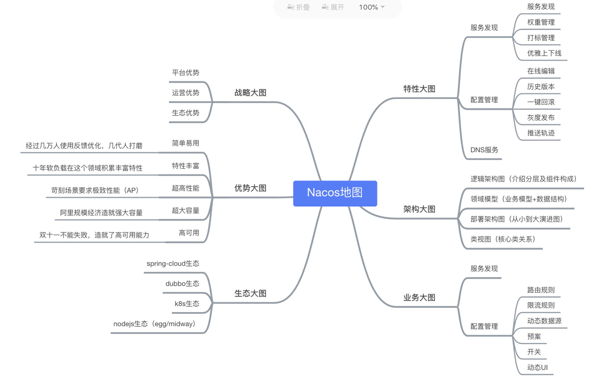

- 特性大图：要从功能特性，非功能特性，全面介绍我们要解的问题域的特性诉求
- 架构大图：通过清晰架构，让您快速进入 Nacos 世界
- 业务大图：利用当前特性可以支持的业务场景，及其最佳实践
- 生态大图：系统梳理 Nacos 和主流技术生态的关系
- 优势大图：展示 Nacos 核心竞争力
- 战略大图：要从战略到战术层面讲 Nacos 的宏观优势

### Nacos生态关系图

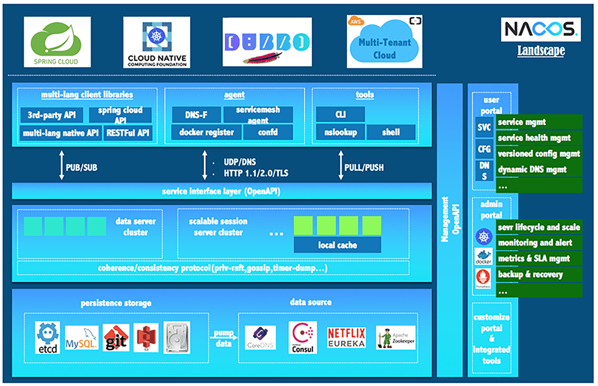

### Nacos基本概念说明

* **地域：** 物理的数据中心，资源创建成功后不能更换。
* **可用区：** 同一地域内，电力和网络互相独立的物理区域。同一可用区内，实例的网络延迟较低。
* **接入点：** 地域的某个服务的入口域名。
* **命名空间：** 用于进行租户粒度的配置隔离。不同的命名空间下，可以存在相同的Group或`Data ID`。
* **配置：** 系统开发过程中，通常会将需要变更的参数、变量等从代码中分离出来独立管理，以独立的配置文件的形式存在。
* **配置管理：** 系统配置的编辑、存储、分发、变更管理、历史版本管理、变更审计等所有与配置相关的活动。
* **配置项：** 一个具体的可配置的参数与其值域，通常以 key=value 的形式存在。
* **配置集：** 一组相关或者不相关的配置项的集合称为配置集。
* **配置集id：** Nacos 中的某个配置集的id
* **配置分组：** Nacos 中的一组配置集，是组织配置的维度之一。
* **配置快照：** Nacos 的客户端 SDK 会在本地生成配置的快照。
* **服务：** 通过预定义接口网络访问的提供给客户端的软件功能。
* **服务名：** 服务提供的标识，通过该标识可以唯一确定其指代的服务。
* **服务注册中心：** 存储服务实例和服务负载均衡策略的数据库。
* **服务发现：** 在计算机网络上，（通常使用服务名）对服务下的实例的地址和元数据进行探测，并以预先定义的接口提供给客户端进行查询。
* **元信息：** Nacos数据描述信息，如服务版本、权重、容灾策略、负载均衡策略、鉴权配置、各种自定义标签，从作用范围来看，分为服务级别的元信息、集群的元信息及实例的元信息。
* **应用：** 用于标识服务提供方的服务的属性。
* **服务分组：** 不同的服务可以归类到同一分组。
* **虚拟集群：** 同一个服务下的所有服务实例组成一个默认集群, 集群可以被进一步按需求划分，划分的单位可以是虚拟集群。
* **实例：** 提供一个或多个服务的具有可访问网络地址（IP:Port）的进程。
* **权重：** 实例级别的配置。权重为浮点数。权重越大，分配给该实例的流量越大。
* **健康检查：** 以指定方式检查服务下挂载的实例的健康度，从而确认该实例是否能提供服务。
* **健康保护阈值：** 为了防止因过多实例不健康导致流量全部流向健康实例 ，继而造成流量压力把健康实例 压垮并形成雪崩效应，应将健康保护阈值定义为一个 0 到 1 之间的浮点数。当域名健康实例占总服务实例的比例小于该值时，无论实例是否健康，都会将这个实例返回给客户端。这样做虽然损失了一部分流量，但是保证了集群的剩余健康实例能正常工作。

### 基本架构设计图

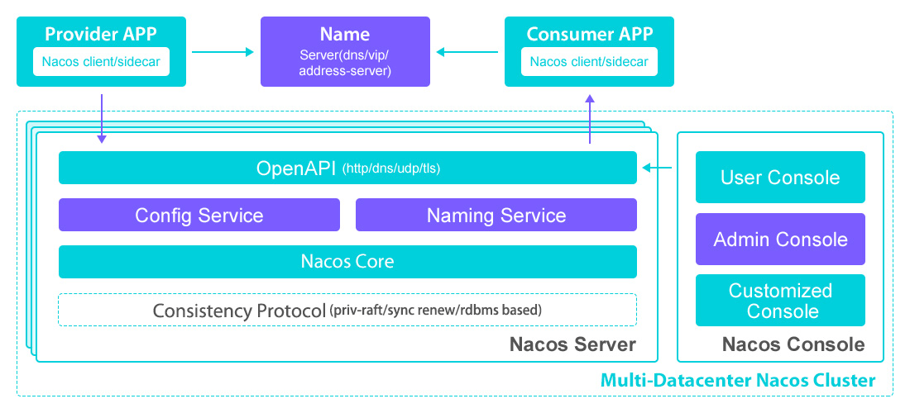

### 逻辑架构及其组件

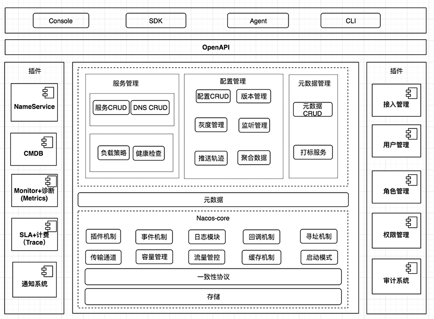

- **服务管理：**实现服务CRUD，域名CRUD，服务健康状态检查，服务权重管理等功能
- **配置管理：**实现配置管CRUD，版本管理，灰度管理，监听管理，推送轨迹，聚合数据等功能
- **元数据管理**：提供元数据CURD 和打标能力
- **插件机制：**实现三个模块可分可合能力，实现扩展点SPI机制
- **事件机制**：实现异步化事件通知，sdk数据变化异步通知等逻辑
- **日志模块：**管理日志分类，日志级别，日志可移植性（尤其避免冲突），日志格式，异常码+帮助文档
- **回调机制：**sdk通知数据，通过统一的模式回调用户处理。接口和数据结构需要具备可扩展性
- **寻址模式：**解决ip，域名，nameserver、广播等多种寻址模式，需要可扩展
- **推送通道：**解决server与存储、server间、server与sdk间推送性能问题
- **容量管理：**管理每个租户，分组下的容量，防止存储被写爆，影响服务可用性
- **流量管理：**按照租户，分组等多个维度对请求频率，长链接个数，报文大小，请求流控进行控制
- **缓存机制：**容灾目录，本地缓存，server缓存机制。容灾目录使用需要工具
- **启动模式：**按照单机模式，配置模式，服务模式，dns模式，或者all模式，启动不同的程序+UI
- **一致性协议：**解决不同数据，不同一致性要求情况下，不同一致性机制
- **存储模块：**解决数据持久化、非持久化存储，解决数据分片问题
- **Nameserver：**解决namespace到clusterid的路由问题，解决用户环境与nacos物理环境映射问题
- **CMDB：**解决元数据存储，与三方cmdb系统对接问题，解决应用，人，资源关系
- **Metrics：**暴露标准metrics数据，方便与三方监控系统打通
- **Trace：**暴露标准trace，方便与SLA系统打通，日志白平化，推送轨迹等能力，并且可以和计量计费系统打通
- **接入管理：**相当于阿里云开通服务，分配身份、容量、权限过程
- **用户管理：**解决用户管理，登录，sso等问题
- **权限管理：**解决身份识别，访问控制，角色管理等问题
- **审计系统：**扩展接口方便与不同公司审计系统打通
- **通知系统：**核心数据变更，或者操作，方便通过SMS系统打通，通知到对应人数据变更
- **OpenAPI：**暴露标准Rest风格HTTP接口，简单易用，方便多语言集成
- **Console：**易用控制台，做服务管理、配置管理等操作
- **SDK：**多语言sdk
- **Agent：**dns-f类似模式，或者与mesh等方案集成
- **CLI：**命令行对产品进行轻量化管理，像git一样好用

### Nacos领域模型

#### 数据模型

`Nacos`数据模型 `Key` 由三元组唯一确定, `Namespace`默认是空串，公共`Namespace`是`public`，默认`Group`是`DEFAULT_GROUP`。


#### 服务领域模型

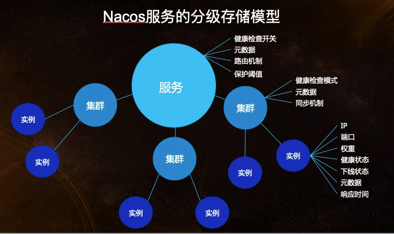

#### 配置领域模型

​	围绕配置，主要有两个关联的实体，一个是配置变更历史，一个是服务标签（用于打标分类，方便索引），由 ID 关联。

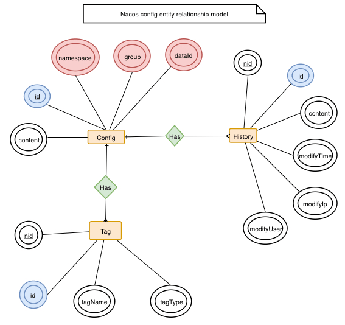

### Nacos类视图

#### Nacos-SDK类视图

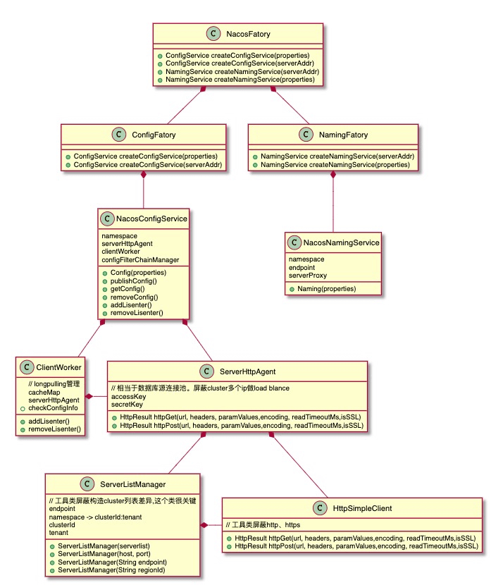

#### 服务部分类视图

待续

### 构建物、部署及启动模式

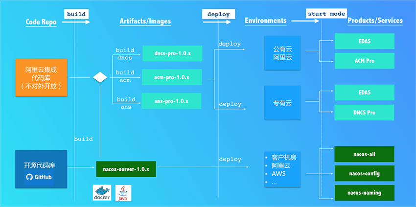

### 同类相关产品对比

--| Nacos |Eureka |Consul |CoreDNS |Zookeeper
 --- | ---| --- | --- | ---| --- 
一致性协议 | CP+AP | AP | CP | — | CP
健康检查 | TCP/HTTP/MYSQL/Client Beat | Client Beat | TCP/HTTP/gRPC/Cmd | — | Keep Alive
负载均衡策略 | 权重/metadata/Selector | Ribbon | Fabio | RoundRobin | —
雪崩保护 | 有 | 有 | 无 | 无 | 无
自动注销实例 | 支持 | 支持 | 不支持 | 不支持 | 支持
访问协议 | HTTP/DNS | HTTP | HTTP/DNS | DNS | TCP
监听支持 | 支持 | 支持 | 支持 | 不支持 | 支持
多数据中心 | 支持 | 支持 | 支持 | 不支持 | 不支持
跨注册中心同步 | 支持 | 不支持 | 支持 | 不支持 | 不支持
SpringCloud集成 | 支持 | 支持 | 支持 | 不支持 | 不支持
Dubbo集成 | 支持 | 不支持 | 不支持 | 不支持 | 支持
K8S集成 | 支持 | 不支持 | 支持 | 支持 | 不支持
开源状态 | 开源 | 2.x闭源 | 开源 | 开源 | 开源 

### nacos安装部署

文档中只提供单机部署说明，其他部署方式请移步[官网](https://nacos.io/zh-cn/docs/deployment.html)。

* **下载安装包**

**下载地址：**https://github.com/alibaba/nacos/tags


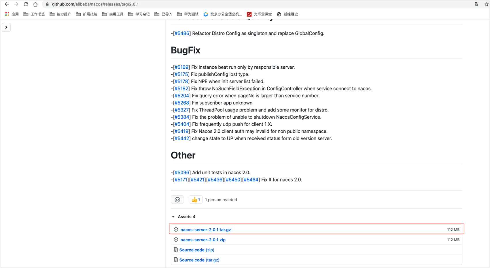

* 单机模式部署

```shell
$ wget https://github.com/alibaba/nacos/releases/download/2.0.1/nacos-server-2.0.1.tar.gz
$ tar -zxf nacos-server-2.0.1.tar.gz
$ cd nacos
$ ./bin/startup.sh -m standalone

# 访问地址
http://101.200.55.87:8848/nacos/index.html
# 默认用户名密码
nacos/nacos
```

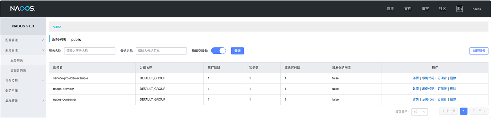

## SpringCloudAlibabaNacosDiscovery

使用 Spring Cloud Alibaba Nacos Discovery，可基于 Spring Cloud 的编程模型快速接入 Nacos 服务注册功能。

### 服务注册/发现: NacosDiscovery

​     服务发现是微服务架构体系中最关键的组件之一。如果尝试着用手动的方式来给每一个客户端来配置所有服务提供者的服务列表是一件非常困难的事，而且也不利于 服务的动态扩缩容。Nacos Discovery 可以帮助您将服务自动注册到 Nacos 服务端并且能够动态感知和刷新某个服务实例的服务列表。除此之外，Nacos Discovery 也将服务实例自身的一些元数据信息-例如 host，port, 健康检查URL，主页等内容注册到 Nacos。

### 引入NacosDiscovery服务配置

```xml
<dependency>
    <groupId>com.alibaba.cloud</groupId>
    <artifactId>spring-cloud-starter-alibaba-nacos-discovery</artifactId>
</dependency>
```

### 完整配置文件参考说明

​    Provider和Consumer的配置是一样的，可以通用。

* **POM配置文件**

```xml
<?xml version="1.0" encoding="UTF-8"?>
<project xmlns="http://maven.apache.org/POM/4.0.0"
         xmlns:xsi="http://www.w3.org/2001/XMLSchema-instance"
         xsi:schemaLocation="http://maven.apache.org/POM/4.0.0 http://maven.apache.org/xsd/maven-4.0.0.xsd">
  <parent>
    <artifactId>nacos-study</artifactId>
    <groupId>com.oscar</groupId>
    <version>0.0.1-SNAPSHOT</version>
  </parent>
  <modelVersion>4.0.0</modelVersion>
  <groupId>com.oscar</groupId>
  <artifactId>nacos-provider</artifactId>
  <version>0.0.1-SNAPSHOT</version>
  <parent>
    <groupId>org.springframework.boot</groupId>
    <artifactId>spring-boot-starter-parent</artifactId>
    <version>2.2.6.RELEASE</version>
    <relativePath/> <!-- lookup parent from repository -->
  </parent>
  <properties>
    <java.version>1.8</java.version>
    <spring-cloud.version>Hoxton.SR9</spring-cloud.version>
    <project.build.sourceEncoding>UTF-8</project.build.sourceEncoding>
    <project.reporting.outputEncoding>UTF-8</project.reporting.outputEncoding>
    <spring.cloud.alibaba.version>2.2.3.RELEASE</spring.cloud.alibaba.version>
  </properties>
  <dependencyManagement>
		<dependencies>
			<dependency>
				<groupId>org.springframework.cloud</groupId>
				<artifactId>spring-cloud-dependencies</artifactId>
				<version>${spring-cloud.version}</version>
				<type>pom</type>
				<scope>import</scope>
			</dependency>
			<dependency>
				<groupId>com.alibaba.cloud</groupId>
				<artifactId>spring-cloud-alibaba-dependencies</artifactId>
				<version>${spring.cloud.alibaba.version}</version>
				<type>pom</type>
				<scope>import</scope>
			</dependency>
		</dependencies>
	</dependencyManagement>
	<dependencies>
		<dependency>
			<groupId>org.springframework.boot</groupId>
			<artifactId>spring-boot-starter-web</artifactId>
		</dependency>
		<dependency>
			<groupId>org.springframework.boot</groupId>
			<artifactId>spring-boot-starter-actuator</artifactId>
		</dependency>
		<!--注册中心客户端-->
		<dependency>
			<groupId>com.alibaba.cloud</groupId>
			<artifactId>spring-cloud-starter-alibaba-nacos-discovery</artifactId>
		</dependency>
	</dependencies>
	<build>
		<plugins>
			<plugin>
				<groupId>org.springframework.boot</groupId>
				<artifactId>spring-boot-maven-plugin</artifactId>
			</plugin>
		</plugins>
	</build>
</project>
```

* **application.properties配置**

  一些关于 Nacos 基本的配置也必须在 application.properties(也可以是application.yaml)配置。

  ```properties
  server.port=8081
  spring.cloud.nacos.discovery.server-addr=localhost:8848
  spring.cloud.nacos.server-addr=localhost:8848
  spring.application.name=nacos-provider
  spring.cloud.nacos.username=nacos
  spring.cloud.nacos.password=nacos
  ```

* **启动一个Provider实例**

```java
@SpringBootApplication
@EnableDiscoveryClient
public class NacosProviderDemoApplication {
    public static void main(String[] args) {
        SpringApplication.run(NacosProviderDemoApplication.class, args);
    }
    @RestController
    public class EchoController {
        @GetMapping(value = "/echo/{string}")
        public String echo(@PathVariable String string) {
            return "Hello Nacos Discovery " + string;
        }
    }
}
```

> 如果不想使用 Nacos 作为您的服务注册与发现，可以将 `spring.cloud.nacos.discovery` 设置为 `false`。

* **启动一个Consumer实例**

       Consumer应用可能还没像启动一个 Provider 应用那么简单。因为在 Consumer 端需要去调用 Provider 端提供的REST 服务。例子中我们使用最原始的一种方式， 即显示的使用 LoadBalanceClient 和 RestTemplate 结合的方式来访问。

> 通过带有负载均衡的RestTemplate 和 FeignClient 也是可以访问的。

```java
@SpringBootApplication
@EnableDiscoveryClient
public class NacosConsumerApp {
    @RestController
    public class NacosController{
        @Autowired
        private LoadBalancerClient loadBalancerClient;
        @Autowired
        private RestTemplate restTemplate;
        @Value("${spring.application.name}")
        private String appName;
        @GetMapping("/echo/app-name")
        public String echoAppName(){
            //使用 LoadBalanceClient 和 RestTemplate 结合的方式来访问
            ServiceInstance serviceInstance = loadBalancerClient.choose("nacos-provider");
            String url = String.format("http://%s:%s/echo/%s",serviceInstance.getHost(),serviceInstance.getPort(),appName);
            System.out.println("request url:"+url);
            return restTemplate.getForObject(url,String.class);
        }
    }
    //实例化 RestTemplate 实例
    @Bean
    public RestTemplate restTemplate(){
        return new RestTemplate();
    }
    public static void main(String[] args) {
        SpringApplication.run(NacosConsumerApp.class,args);
    }
}
```

​    案例中我们注入了一个 LoadBalancerClient 的实例，并且手动的实例化一个 RestTemplate，同时将 `spring.application.name` 的配置值 注入到应用中来， 目的是调用 Provider 提供的服务时，希望将当前配置的应用名给显示出来。

> 在启动 Consumer 应用之前请先将 Nacos 服务启动好。

### NacosDiscovery配置项信息

| 配置项              | Key                                              | 默认值                              | 说明                                                         |
| ------------------- | ------------------------------------------------ | ----------------------------------- | ------------------------------------------------------------ |
| 服务端地址          | `spring.cloud.nacos.discovery.server-addr`       | `${spring.cloud.nacos.server-addr}` | Nacos Server 启动监听的ip地址和端口                          |
| 服务名              | `spring.cloud.nacos.discovery.service`           | `${spring.application.name}`        | 注册的服务名                                                 |
| 权重                | `spring.cloud.nacos.discovery.weight`            | `1`                                 | 取值范围 1 到 100，数值越大，权重越大                        |
| 网卡名              | `spring.cloud.nacos.discovery.network-interface` |                                     | 当IP未配置时，注册的IP为此网卡所对应的IP地址，如果此项也未配置，则默认取第一块网卡的地址 |
| 注册的IP地址        | `spring.cloud.nacos.discovery.ip`                |                                     | 优先级最高                                                   |
| 注册的端口          | `spring.cloud.nacos.discovery.port`              | `-1`                                | 默认情况下不用配置，会自动探测                               |
| 命名空间            | `spring.cloud.nacos.discovery.namespace`         |                                     | 常用场景之一是不同环境的注册的区分隔离，例如开发测试环境和生产环境的资源（如配置、服务）隔离等 |
| AccessKey           | `spring.cloud.nacos.discovery.access-key`        |                                     | 当要上阿里云时，阿里云上面的一个云账号名                     |
| SecretKey           | `spring.cloud.nacos.discovery.secret-key`        |                                     | 当要上阿里云时，阿里云上面的一个云账号密码                   |
| Metadata            | `spring.cloud.nacos.discovery.metadata`          |                                     | 使用Map格式配置，用户可以根据自己的需要自定义一些和服务相关的元数据信息 |
| 日志文件名          | `spring.cloud.nacos.discovery.log-name`          |                                     |                                                              |
| 集群                | `spring.cloud.nacos.discovery.cluster-name`      | `DEFAULT`                           | Nacos集群名称                                                |
| 接入点              | `spring.cloud.nacos.discovery.endpoint`          |                                     | 地域的某个服务的入口域名，通过此域名可以动态地拿到服务端地址 |
| 是否集成Ribbon      | `ribbon.nacos.enabled`                           | `true`                              | 一般都设置成true即可                                         |
| 是否开启Nacos Watch | `spring.cloud.nacos.discovery.watch.enabled`     | `true`                              | 可以设置成false来关闭 watch                                  |

## SpringCloudAlibabaNacosConfig

使用 Spring Cloud Alibaba Nacos Config，可基于 Spring Cloud 的编程模型快速接入 Nacos 配置管理功能。编辑远程配置文件内容

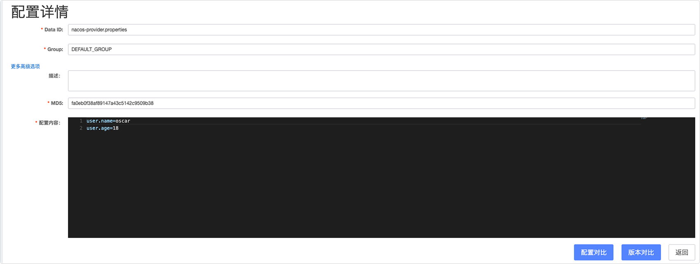

> 注意DataId默认是以 properties为扩展名。

### 引入NacosConfig配置管理

```xml
<dependency>
    <groupId>com.alibaba.cloud</groupId>
    <artifactId>spring-cloud-starter-alibaba-nacos-config</artifactId>
</dependency>
```

### 使用远程配置案例代码

```java
@SpringBootApplication
public class NacosConfigApplication {
    public static void main(String[] args) {
        ConfigurableApplicationContext applicationContext = SpringApplication.run(ConfigApplication.class, args);
        String userName = applicationContext.getEnvironment().getProperty("user.name");
        String userAge = applicationContext.getEnvironment().getProperty("user.age");
        System.err.println("user name :"+userName+"; age: "+userAge);
    }
}
```

```properties
spring.application.name=nacos-provider
spring.cloud.nacos.config.server-addr=localhost:8848
# 修改DataId文件扩展名，默认是properties，此处设置成properties
spring.cloud.nacos.config.file-extension=properties
# 关闭配置动态刷新
spring.cloud.nacos.config.refresh.enabled=false
# 关闭 Spring Cloud Nacos Config
spring.cloud.nacos.config.enabled = false
# 配置使用的环境，启用对应的DataId为nacos-provider-develop.properties，
# 启动项目时可以使用 -Dspring.profiles.active=<profile> 指定环境
spring.profiles.active=develop
# 设置自定义命名空间(namespace)
spring.cloud.nacos.config.namespace=b3404bc0-d7dc-4855-b519-570ed34b62d7
# 设置自定义组，默认使用DEFAULT_GROUP
spring.cloud.nacos.config.group=DEVELOP_GROUP

# Nacos Config 0.2.1 版本后，可支持自定义 Data Id 的配置
# 1、Data Id 在默认的组 DEFAULT_GROUP,不支持配置的动态刷新
spring.cloud.nacos.config.ext-config[0].data-id=ext-config-common01.properties

# 2、Data Id 不在默认的组，不支持动态刷新
spring.cloud.nacos.config.ext-config[1].data-id=ext-config-common02.properties
spring.cloud.nacos.config.ext-config[1].group=GLOBALE_GROUP

# 3、Data Id 既不在默认的组，也支持动态刷新
spring.cloud.nacos.config.ext-config[2].data-id=ext-config-common03.properties
spring.cloud.nacos.config.ext-config[2].group=REFRESH_GROUP
spring.cloud.nacos.config.ext-config[2].refresh=true
```

> ​    DataId默认使用`spring.application.name` 配置跟文件扩展名结合(配置格式默认使用 properties), 
>
> ​    因此该配置文件对应的 Nacos Config 配置的 DataId 为 nacos-provider.properties, GROUP 为 DEFAULT_GROUP
>
> ​    多个 Data Id 同时配置时，他的优先级关系是 `spring.cloud.nacos.config.ext-config[n].data-id` 其中 n 的值越大，优先级越高。`spring.cloud.nacos.config.ext-config[n].data-id` 的值必须带文件扩展名，文件扩展名支持 properties、yaml、yml。 此时 `spring.cloud.nacos.config.file-extension` 的配置对自定义扩展配置的 Data Id文件扩展名没有影响。

### 配置文件优先级

Nacos Config 目前提供了三种配置能力从 Nacos 拉取相关的配置

- A: 通过 `spring.cloud.nacos.config.shared-dataids` 支持多个共享 Data Id 的配置
- B: 通过 `spring.cloud.nacos.config.ext-config[n].data-id` 的方式支持多个扩展 Data Id 的配置
- C: 通过内部相关规则(应用名、应用名+ Profile )自动生成相关的 Data Id 配置

当三种方式共同使用时，他们的一个优先级关系是:

→A为优先级最高的

→B的优先级低于A，

→C的优先级是最低的

### 更多NacosConfig配置信息

| 配置项                           | Key                                            | 默认值          | 说明                                                         |
| -------------------------------- | ---------------------------------------------- | --------------- | ------------------------------------------------------------ |
| 服务端地址                       | `spring.cloud.nacos.config.server-addr`        |                 | Nacos Server 启动监听的ip地址和端口                          |
| 配置对应的 DataId                | `spring.cloud.nacos.config.name`               |                 | 先取 prefix，再取 name，最后取 spring.application.name       |
| 配置对应的 DataId                | `spring.cloud.nacos.config.prefix`             |                 | 先取 prefix，再取 name，最后取 spring.application.name       |
| 配置内容编码                     | `spring.cloud.nacos.config.encode`             |                 | 读取的配置内容对应的编码                                     |
| GROUP                            | `spring.cloud.nacos.config.group`              | `DEFAULT_GROUP` | 配置对应的组                                                 |
| 文件扩展名                       | `spring.cloud.nacos.config.fileExtension`      | `properties`    | 配置项对应的文件扩展名，目前支持 properties 和 yaml(yml)     |
| 获取配置超时时间                 | `spring.cloud.nacos.config.timeout`            | `3000`          | 客户端获取配置的超时时间(毫秒)                               |
| 接入点                           | `spring.cloud.nacos.config.endpoint`           |                 | 地域的某个服务的入口域名，通过此域名可以动态地拿到服务端地址 |
| 命名空间                         | `spring.cloud.nacos.config.namespace`          |                 | 常用场景之一是不同环境的配置的区分隔离，例如开发测试环境和生产环境的资源（如配置、服务）隔离等 |
| AccessKey                        | `spring.cloud.nacos.config.accessKey`          |                 | 当要上阿里云时，阿里云上面的一个云账号名                     |
| SecretKey                        | `spring.cloud.nacos.config.secretKey`          |                 | 当要上阿里云时，阿里云上面的一个云账号密码                   |
| Nacos Server 对应的 context path | `spring.cloud.nacos.config.contextPath`        |                 | Nacos Server 对外暴露的 context path                         |
| 集群                             | `spring.cloud.nacos.config.clusterName`        |                 | 配置成Nacos集群名称                                          |
| 共享配置                         | `spring.cloud.nacos.config.sharedDataids`      |                 | 共享配置的 DataId, "," 分割                                  |
| 共享配置动态刷新                 | `spring.cloud.nacos.config.refreshableDataids` |                 | 共享配置中需要动态刷新的 DataId, "," 分割                    |
| 自定义 Data Id 配置              | `spring.cloud.nacos.config.extConfig`          |                 | 属性是个集合，内部由 `Config` POJO 组成。`Config` 有 3 个属性，分别是 `dataId`, `group` 以及 `refresh` |

# 问题解决说明

## 找不到Bootstrapper类定义

```
java.lang.NoClassDefFoundError: org/springframework/boot/Bootstrapper
```

* **原因分析**

一般是因为springcloud版本和springboot版本不兼容导致的

* **解决办法**

修改成兼容的版本即可

```xml
<spring-boot.version>2.2.6.RELEASE</spring-boot.version>
<spring-cloud.version>Hoxton.SR9</spring-cloud.version>
<spring.cloud.alibaba.version>2.2.3.RELEASE</spring.cloud.alibaba.version>
```

| SpringCloud              | SpringBoot                                      |
| ------------------------ | ----------------------------------------------- |
| Angel版本                | 兼容Spring Boot 1.2.x                           |
| Brixton版本              | 兼容Spring Boot 1.3.x ，兼容Spring Boot 1.4.x   |
| Camden版本               | 兼容Spring Boot 1.4.x ，兼容Spring Boot 1.5.x   |
| Dakston版本、Edgware版本 | 兼容Spring Boot 1.5.x ，不兼容Spring Boot 2.0.x |
| Finchley版本             | 兼容Spring Boot 2.0.x ，不兼容Spring Boot 1.5.x |
| Greenwich版本            | 兼容Spring Boot 2.1.x                           |
| Hoxtonl版本              | 兼容Spring Boot 2.2.x                           |

## NACOS登录一直访问固定地址

```java
  .   ____          _            __ _ _
 /\\ / ___'_ __ _ _(_)_ __  __ _ \ \ \ \
( ( )\___ | '_ | '_| | '_ \/ _` | \ \ \ \
 \\/  ___)| |_)| | | | | || (_| |  ) ) ) )
  '  |____| .__|_| |_|_| |_\__, | / / / /
 =========|_|==============|___/=/_/_/_/
 :: Spring Boot ::        (v2.2.6.RELEASE)

2021-06-08 19:39:49.324  INFO 12567 --- [           main] c.a.n.c.c.impl.LocalConfigInfoProcessor  : LOCAL_SNAPSHOT_PATH:/Users/windless/nacos/config
2021-06-08 19:39:49.339 ERROR 12567 --- [           main] c.a.n.c.config.http.ServerHttpAgent      : [NACOS ConnectException httpGet] currentServerAddr:http://localhost:8848, err : Connection refused (Connection refused)
2021-06-08 19:39:49.424 ERROR 12567 --- [ecurity.updater] c.a.nacos.client.security.SecurityProxy  : [SecurityProxy] login http request failed url: http://localhost:8848/nacos/v1/auth/users/login, params: {username=nacos}, bodyMap: {password=nacos}, errorMsg: Connection refused (Connection refused)
```

* **问题原因**

​    项目启动时Nacos会登录鉴权，如果`spring.cloud.nacos.server-addr`没有设置，默认访问`localhost:8848`，`spring.cloud.nacos.discovery.server-addr`配置是在Nacos登录鉴权以后才加载的，所以配置这个选项也无法解决登录的问题，同时这个选项默认值是`${spring.cloud.nacos.server-addr}`。

```properties
server.port=8081
spring.application.name=nacos-provider
spring.cloud.nacos.username=nacos
spring.cloud.nacos.password=nacos
spring.cloud.nacos.discovery.server-addr=10.10.10.10:8848
```

* **解决办法**

添加`spring.cloud.nacos.server-addr`配置

```properties
server.port=8081
spring.application.name=nacos-provider
spring.cloud.nacos.username=nacos
spring.cloud.nacos.password=nacos
spring.cloud.nacos.server-addr=10.10.10.10:8848
spring.cloud.nacos.discovery.server-addr=10.10.10.10:8848
```

**问题原因：**

# 参考文档地址

[主流微服务注册中心浅析和对比](https://developer.aliyun.com/article/698930)

[Spring Cloud Alibaba Nacos Discovery](https://github.com/alibaba/spring-cloud-alibaba/blob/master/spring-cloud-alibaba-docs/src/main/asciidoc-zh/nacos-discovery.adoc)

[Spring Cloud Alibaba Nacos Config](https://github.com/alibaba/spring-cloud-alibaba/blob/master/spring-cloud-alibaba-docs/src/main/asciidoc-zh/nacos-config.adoc)

[org.springframework.boot.Bootstrapper](https://blog.csdn.net/qq_43416157/article/details/116593037)

