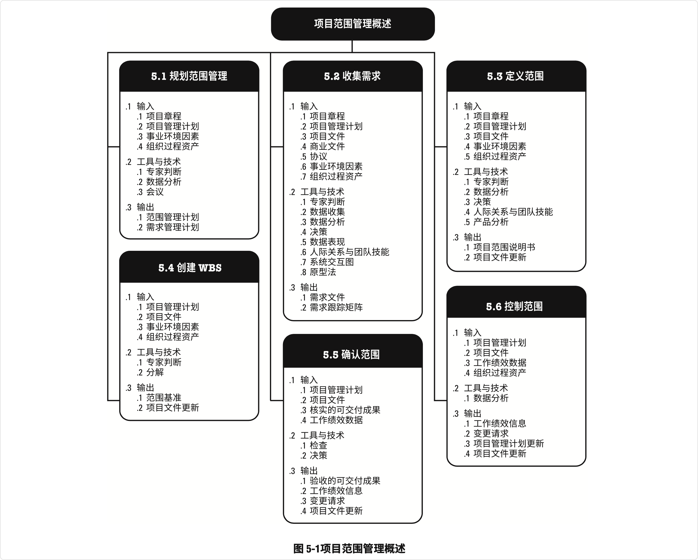
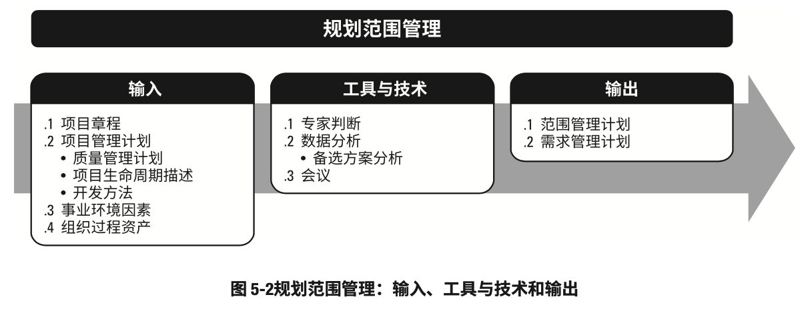
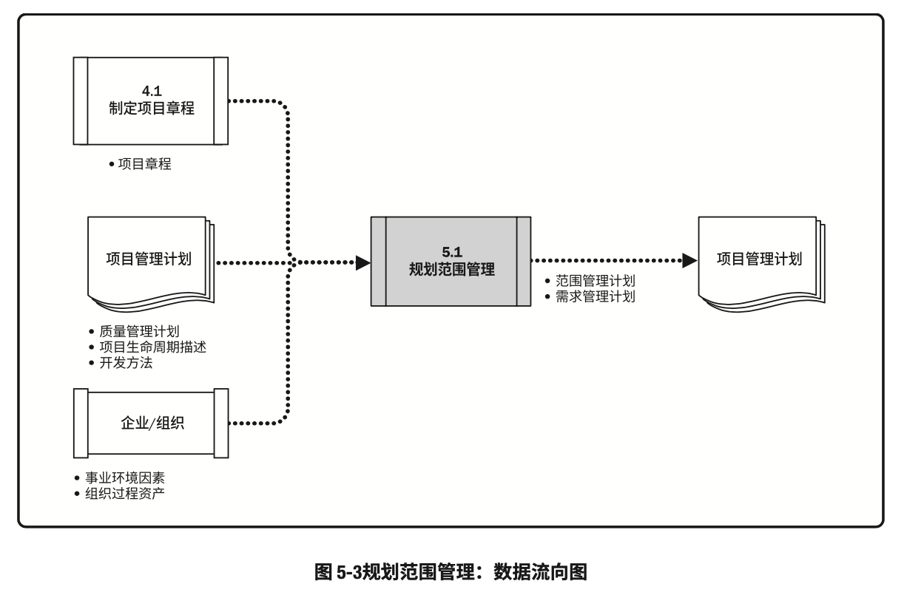
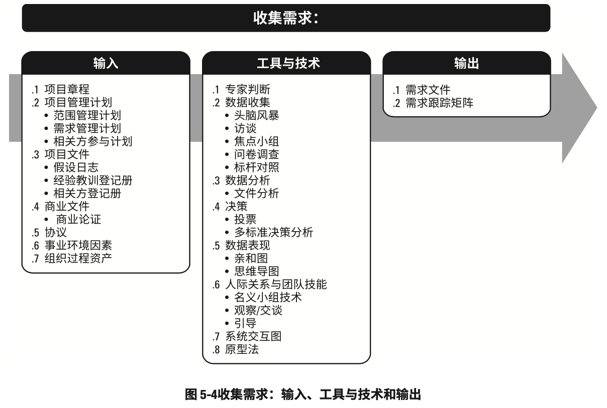
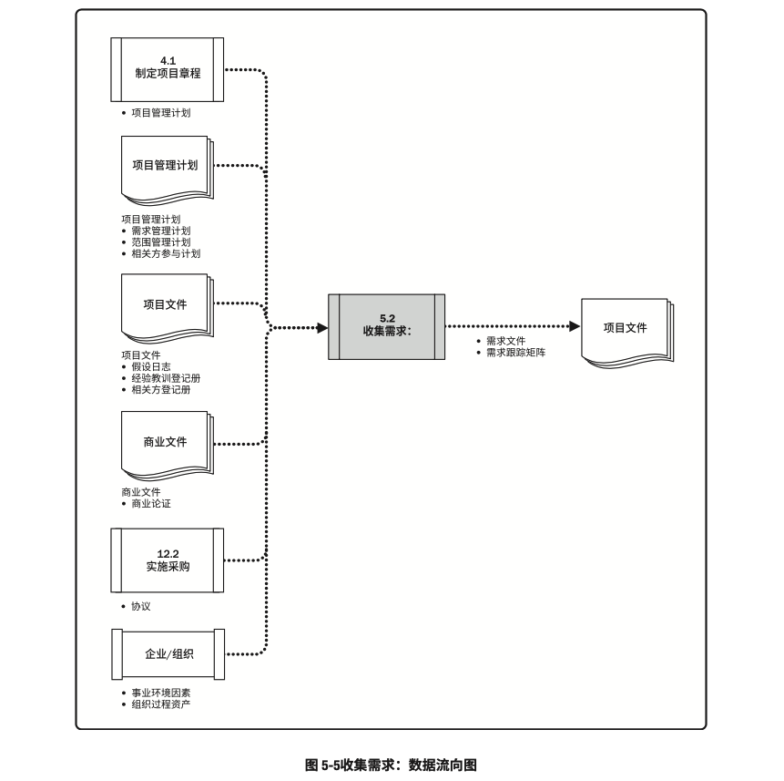

# 5 项目管理范围

项目范围管理包括确保项目做且只做所需的全部工作，以成功完成项目的各个过程。

* 项目范围管理过程包括
  * **5.1 规划范围管理：**为记录如何定义、确认和控制项目范围及产品范围，而创建范围管理计划 的过程
  * **5.2 收集需求：** 为实现项目目标而确定、记录并管理相关方的需要和需求的过程
  * **5.3 定义范围：** 制定项目和产品详细描述的过程
  * **5.4 创建WBS：** 将项目可交付成果和项目工作分解为较小的、更易于管理的组件的过程
  * **5.5 确认范围：** 正式验收已完成的项目可交付成果的过程
  * **5.6 控制范围：** 监督项目和产品的范围状态，管理范围基准变更的过程

## -项目范围管理的核心概念

在项目环境中，“范围”这一术语有两种含义:

**产品范围: **某项产品、服务或成果所具有的特征和功能。

**项目范围 : **为交付具有规定特性与功能的产品、服务或成果而必须完成的工作。项目范围有时 也包括产品范围。

    从预测型方法到适应型或敏捷型方法，项目生命周期可以处于这个连续区间内的任何位置。在预测型生命周期中，在项目开始时就对项目可交付成果进行定义，对任何范围变化都要进行渐进管 理。而在适应型或敏捷型生命周期中，通过多次迭代来开发可交付成果，并在每次迭代开始时定义和批准详细的范围。

    采用适应型生命周期，旨在应对大量变更，需要相关方持续参与项目；在迭代中重复开展收集需求、定义范围和创建WBS三个过程。在一个迭代开始时，团队应该努力确定产品未完项中，哪些最优先项应在下一次迭代中交付。

    适应型或敏捷型生命周期中，发起和客户代表应该持续参与项目。在每次迭代中重复开展**确认范围**和**控制范围**两个过程。预测型项目中，在每个可交付成果生成时或者在阶段审查点开展**确认范围**，**控制范围**则是一个持续性的过程。

    预测型项目中，经过批准的项目范围说明书、工作分解结构(WBS)和相应的WBS词典构成**项目范围基准**。只有通过正式变更控制程序，才能进行基准变更。在开展确认范围、控制范围及其他控制过程时，基准被用作比较的基础。适应型生命周期的项目，使用未完项(包括产品需求和用户故事)反映当前需求。

    确认范围是正式验收已完成的项目可交付成果的过程。从控制质量过程输出的核实的可交付成果 是确认范围过程的输入，而验收的可交付成果是确认范围过程的输出之一，由获得授权的相关方正式签字批准。因此，相关方需要在规划阶段早期介入，对可交付成 果的质量提出意见，以便控制质量过程能够据此评估绩效并提出必要的变更建议。

## -目范围管理的发展趋势和新兴实践

    需求一直是项目管理中的重点，并且还将继续得到项目管理从业者的更多关注。商业分析活动可在项目启动和项目经理任命之前就开始。需求管理过程始于需要评估，而需要评估又可能始于项目组合规划、项目集规划或单个项目。

​    在项目范围管理过程中，收集、记录和管理相关方需求。项目范围管理的范围趋势和新兴实践(包括但不限于)注重与商业分析专业人士的合作，以便:

* 确定问题并识别商业需要;
* 识别并推荐能够满足这些需要的可行解决方案;
* 收集、记录并管理相关方需求，以满足商业和项目目标; 
* 推动项目集或项目的产品、服务或最终成果的成功应用 。

    需求管理过程结束于需求关闭，应该将商业分析的角色连同职责分配给具有足够商业分析技能和专业知识的人员，项目经理与商业分析师之间应该是伙伴式合作关系。如果项目经理和商业分析师能够理解彼此在 促进项目目标实现过程中的角色和职责，项目成功的可能性就更大。

## -裁剪时需要考虑的因素

因为每个项目都是独特的，所以项目经理需要裁剪项目范围管理过程。裁剪时应考虑的因素(包括但不限于):

* **知识和需求管理: **组织是否拥有正式或非正式的知识和需求管理体系?为了在未来项目中重复 使用需求，项目经理应建立哪些指南?

* **确认和控制: **组织是否拥有正式或非正式的与确认和控制相关的政策、程序和指南? 
* **开发方法: **组织是否采用敏捷方法管理项目?开发方法属于迭代型还是增量型?是否采用预测型方法?混合型方法是否有效?
* **需求的稳定性: **项目中是否存在需求不稳定的领域?是否有必要采用精益、敏捷或其他适应型 技术来处理不稳定的需求，直至需求稳定且定义明确?
* **治理: **组织是否拥有正式或非正式的审计和治理政策、程序和指南?

## -敏捷或适应型环境中需要考虑的因素

    对于需求不断变化、风险大或不确定性高的项目，在项目开始时通常无法明确项目的范围，需要在项目期间逐渐明确。敏捷方法特意在项目早期缩短定义和协商范围的时间，并为持续探索和明确范围而延长创建相应过程的时间。不断涌现的需求往往导致真实的业务需求 与最初所述的业务需求之间存在差异。因此，敏捷方法有目的地构建和审查原型，并通过多次发布版本来明确需求。这样范围会在整个项目期间被定义和再定义。在敏捷方法中，把需求列入未完项。

## 5.1 规划范围管理

    规划范围管理是为记录如何定义、确认和控制项目范围及产品范围，而创建范围管理计划的过程。主要作用是在整个项目期间对如何管理范围提供指南和方向。本过程仅开展一次或仅在项目的预定义点开展。

    范围管理计划是项目或项目集管理计划的组成部分，描述如何定义、制定、监督、控制和确认项目范围。

### 规划范围管理:输入

#### 项目章程 

     项目章程记录项目目的、项目概述、假设条件、制约因素，以及项目意图实现的高层级需求。

#### 项目管理计划

 项目管理计划组件(包括但不限于):

* **质量管理计划: **在项目中实施组织的质量政策、方法和标准的方式会影响管理项目和产品范围的方式。

* **项目生命周期描述: **项目生命周期定义了项目从开始到完成所经历的一系列阶段。 

* **开发方法: **开发方法定义了项目是采用瀑布式、迭代型、适应型、敏捷型还是混合型开发方法。

#### 事业环境因素

能够影响规划范围管理过程的事业环境因素(包括但不限于):

* 组织文化; 
* 基础设施; 
* 人事管理制度; 
* 市场条件。

#### 组织过程资产

能够影响规划范围管理过程的组织过程资产(包括但不限于)

* 政策和程序
* 历史信息和经验教训知识库

### 规划范围管理:工具与技术

#### 专家判断

应该就以下主题，考虑具备相关专业知识或接受过相关培训的个人或小组的意见

* 以往类似项目
* 特定行业、学科和应用领域的信息

#### 数据分析

    适用于本过程的数据分析技术包括但不限于备选方案分析。本技术用于评估收集需求、详述项目和产品范围、创造产品、确认范围和控制范围的各种方法

#### 会议

    项目团队可以参加项目会议来制定范围管理计划。参会者可能包括项目经理、项目发起人、选定的项目团队成员、选定的相关方、范围管理各过程的负责人，以及其他必要人员

### 规划范围管理:输出

#### 范围管理计划

    范围管理计划是项目管理计划的组成部分，描述将如何定义、制定、监督、控制和确认项目范 围。范围管理计划要对将用于下列工作的管理过程做出规定：

* 制定项目范围说明书
* 根据详细项目范围说明书创建 WBS
* 确定如何审批和维护范围基准
* 正式验收已完成的项目可交付成果

根据项目需要，范围管理计划可以是正式或非正式的，非常详细或高度概括的

#### 需求管理计划

需求管理计划是项目管理计划的组成部分，描述将如何分析、记录和管理项目和产品需求。有些组织称之为“商业分析计划”，需求管理计划的主要内容(包括但不限于)：

* 如何规划、跟踪和报告各种需求活动;
* 配置管理活动，例如，如何启动变更，如何分析其影响，如何进行追溯、跟踪和报告，以及变更审批权限

* 需求优先级排序过程;

* 测量指标及使用这些指标的理由

* 反映哪些需求属性将被列入跟踪矩阵的跟踪结构

## 5.2 收集需求

    收集需求是为实现目标而确定、记录并管理相关方的需要和需求的过程。本过程的主要作用是， 为定义产品范围和项目范围奠定基础，且仅开展一次或仅在项目的预定义点开展。图 5-4 描述本过程 的输入、工具与技术和输出

    PMBOK没有专门讨论产品需求，因为产品需求因行业而异。让相关方积极参与需求的探索和分解工作(分解成项目和产品需求)，并仔细确定、记录和管理对产品、服务或成果的需求，能直接促进项目 成功。需求是指根据特定协议或其他强制性规范，产品、服务或成果必须具备的条件或能力。它包 括发起人、客户和其他相关方的已量化且书面记录的需要和期望。应该足够详细地探明、分析和记 录这些需求，将其包含在范围基准中，并在项目执行开始后对其进行测量。需求将成为工作分解结 构(WBS)的基础，也将成为成本、进度、质量和采购规划的基础。

### 收集需求:输入

#### 项目章程

    项目章程记录了项目概述以及将用于制定详细需求的高层级需求

#### 项目管理计划

项目管理计划组件(包括但不限于)：

* **范围管理计划：**范围管理计划包含如何定义和制定项目范围的信息
* **需求管理计划：**需求管理计划包含如何收集、分析和记录项目需求的信息
* **相关方参与计划：**从相关方参与计划中了解相关方的沟通需求和参与程度， 以便评估并适应相关方对需求活动的参与程度

#### 项目文件

可作为本过程输入的项目文件(包括但不限于):

* **假设日志。**假设日志识别了有关产品、项目、环境、相关方以及会影响需求的其 他因素的假设条件。

* **经验教训登记册。**经验教训登记册提供了有效的需求收集技术，尤其针对使用迭 代型或适应型产品开发方法的项目。

* **相关方登记册。**相关方登记册用于了解哪些相关方能够提供需求方面的信息， 及记录相关方对项目的需求和期望。

