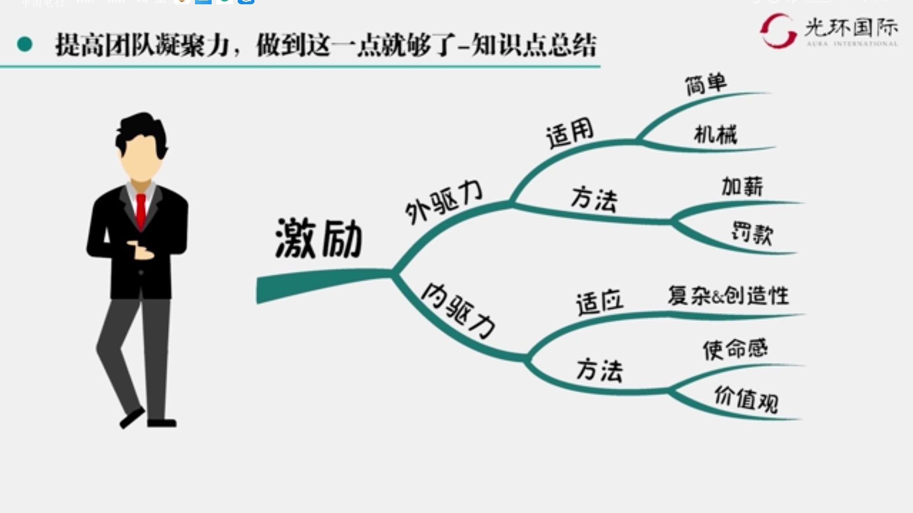
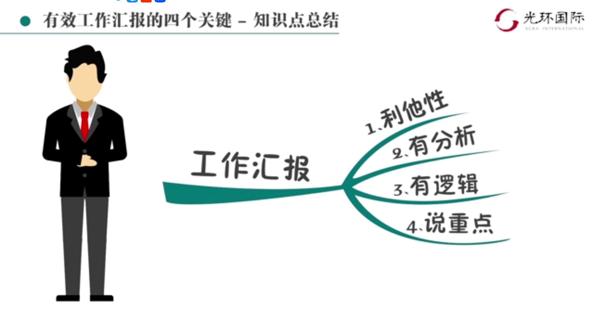

# 新晋项目经理闭坑指南

> 大旗一挥，无人领命
>
> 谈话加薪，无动于衷
>
> 花里胡哨，不是报告
>
> 不动战略，偏离航道
>
> 掩耳盗铃，破罐破摔
>
> 质量速度，不能兼顾

## 大旗一挥，无人领命

善用五种权利，打造高效团队

## 谈话加薪，无动于衷

提高项目凝聚力

## 花里胡哨，不是报告

* 利他性
  * 让领导做选择题、判断题
  * 不让领导做简答题、论述题
* 有分析
  * 抓住本质问题
  * 给出解决方案
* 有逻辑
  * 结论先行
  * 上下对应
  * 分类清楚
  * 排序逻辑
* 说重点
  * 领导持续关注汇报的时间是2分钟
  * 管理者听汇报不赖烦时长话短说

## 不懂战略，偏离航道

工作方向千万不要偏离公司战略主航道

## 掩耳盗铃，破罐破摔

做好事先事，避免死亡行军

* 商业论证，资源投入
  * 市场可达路径
  * 市场风险
  * 投资回报计划
* 项目的特性
  * 项目是一种投资
  * 为公司和客户创造价值

## 质量速度，不能兼顾

如何找到交付速度和质量的平衡点

* 牺牲一点质量、断送整个企业
* 一着不慎，满盘皆输
* 压缩供应链=压缩质量=丢失信誉
* 长期守护=终生受益
* 笑傲江湖
  * 天下产品出细微
  * 一入市场岁月催
  * 皇图霸业谈笑中
  * 没有质量一场空

## 全球公认的项目经理能力模型

* 技术项目管理
  * 编制网络图
  * 做项目预算
  * 项目管理工具
* 领导力
  * 沟通
  * 激励
* 战略和商务管理
  * 夜观天色
  * 识别军情

