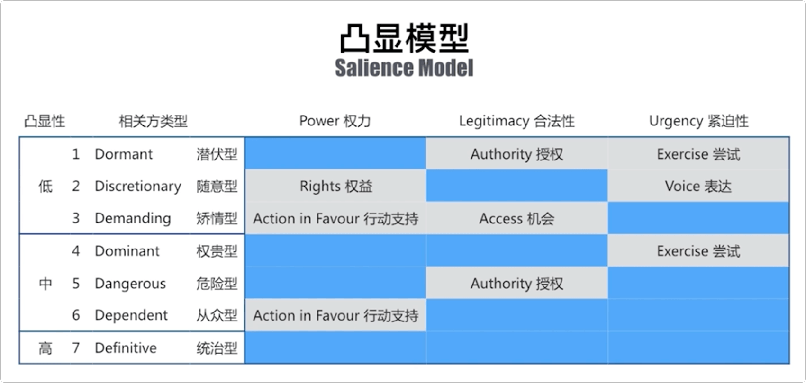

# 相关方管理

## 什么是相关方

|                             共创                             |                             合并                             |
| :----------------------------------------------------------: | :----------------------------------------------------------: |
|  |  |

|                          相关方管理                          |                            知识点                            |
| :----------------------------------------------------------: | :----------------------------------------------------------: |
|  |  |

## 相关方分析

|                          相关方分类                          |                          相关方分析                          |
| :----------------------------------------------------------: | :----------------------------------------------------------: |
|  |  |

|                        按距离由近及远                        |                          相关方类型                          |
| :----------------------------------------------------------: | :----------------------------------------------------------: |
|  |  |

|                         相关方影响力                         |                          相关方态度                          |
| :----------------------------------------------------------: | :----------------------------------------------------------: |
|  |  |

|                         权力利益矩阵                         |                         相关方立方体                         |
| :----------------------------------------------------------: | :----------------------------------------------------------: |
|  |  |

|                           凸显模型                           |                           凸显模型                           |
| :----------------------------------------------------------: | :----------------------------------------------------------: |
|  |  |

## 相关方影响方向

|                      西游记：项目相关方                      |                          相关方管理                          |
| :----------------------------------------------------------: | :----------------------------------------------------------: |
|  |  |

## 相关方登记

|                         相关方登记册                         | 相关方参与程度评估矩阵                                       |
| :----------------------------------------------------------: | ------------------------------------------------------------ |
|  |  |

|                      相关方管理学习要点                      |                            知识点                            |
| :----------------------------------------------------------: | :----------------------------------------------------------: |
|  |  |

