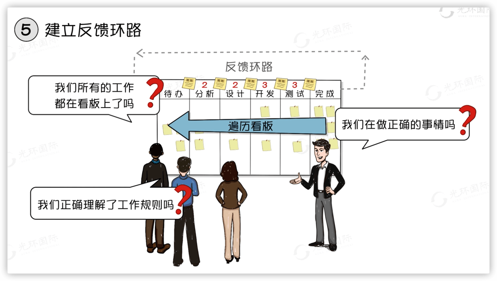

# 进度管理

## 时间的特征

时间管理就是说怎么在一个合理的进度计划内完成我们项目中所有的工作。

* 时间的特性
  * 时间不等人
  * 投入有上限
  * 对谁都公平

|                          时间的特征                          |                   敏捷开发中产品需求的来源                   |
| :----------------------------------------------------------: | :----------------------------------------------------------: |
|  |  |

## 看板动画

|                            在制品                            |                    高在制品数量的恶性循环                    |
| :----------------------------------------------------------: | :----------------------------------------------------------: |
|  |  |

|                          推动式生产                          |                          拉动式生产                          |
| :----------------------------------------------------------: | :----------------------------------------------------------: |
|  |  |

|                         软件开发看板                         |              看板核心实践(6个)：可视化工作流程               |
| :----------------------------------------------------------: | :----------------------------------------------------------: |
|  |  |

|              看板核心实践(6个)：限制在制品(WIP)              |              看板核心实践(6个)：管理和度量流动               |
| :----------------------------------------------------------: | :----------------------------------------------------------: |
|  |  |

|              看板核心实践(6个)：显示化流程规则               |               看板核心实践(6个)：建立反馈环路                |
| :----------------------------------------------------------: | :----------------------------------------------------------: |
|  |  |

|                看板核心实践(6个)：协作式改进                 |                   看板核心实践(6个)：总结                    |
| :----------------------------------------------------------: | :----------------------------------------------------------: |
|  |  |

## 洋葱圈规划

 

|                          洋葱圈规划                          |                        时间管理的过程                        |
| :----------------------------------------------------------: | :----------------------------------------------------------: |
|  |  |

|                        敏捷的时间管理                        | 滚动式规划                                                   |
| :----------------------------------------------------------: | ------------------------------------------------------------ |
|  |  |

## 紧前关系绘图法PDM

|                         四种逻辑关系                         | 依赖关系                                                     |
| :----------------------------------------------------------: | ------------------------------------------------------------ |
|  |  |

## 滞后量和提前量

|                        滞后量和提前量                        | 前导图                                                       |
| :----------------------------------------------------------: | ------------------------------------------------------------ |
|  |  |

## 估算资源

|                           学习曲线                           |                         成本效益分析                         |
| :----------------------------------------------------------: | :----------------------------------------------------------: |
|  |  |

|                           资源日历                           |                          资源直方图                          |
| :----------------------------------------------------------: | :----------------------------------------------------------: |
|  |  |

## 五种估算资源方法

活动的历时估算，及评估活动需要几天，有几种方法，分别是专家判断、类比评估、参数评估。

|                           专家判断                           |                           类比估算                           |
| :----------------------------------------------------------: | :----------------------------------------------------------: |
|  |  |

|                           参数评估                           |                       三点估算：β分布                        |
| :----------------------------------------------------------: | :----------------------------------------------------------: |
|  |  |

|                        三点估算法例题                        |                       三点估算：标准差                       |
| :----------------------------------------------------------: | :----------------------------------------------------------: |
|  |  |

|             三点估算法：三角分布（相比β有误差）              |                      三点估算：正态分布                      |
| :----------------------------------------------------------: | :----------------------------------------------------------: |
|  |  |

|                   三点估算：正态分布(7天)                    |                   三点估算：正态分布(5天)                    |
| :----------------------------------------------------------: | :----------------------------------------------------------: |
|  |  |

|             三点估算：正态分布(5天)  标准差0.5d              | 自下而上估算                                                 |
| :----------------------------------------------------------: | ------------------------------------------------------------ |
|  |  |

|                       五种估算方法对比                       |                    敏捷场景的活动历时估算                    |
| :----------------------------------------------------------: | :----------------------------------------------------------: |
|  |  |

## 储备分析

|                           储备分析                           |                           项目风险                           |
| :----------------------------------------------------------: | :----------------------------------------------------------: |
|  |  |

* 风险类型
  * 已知风险：U盘会坏已知
  * 已知-未知风险：坐飞机延误已知、延误多长时间未知
  * 未知-未知风险：坐飞机出事未知、什么时候出事未知

|                        应急和管理储备                        |
| :----------------------------------------------------------: |
|  |

## 进度计划工具

|                          里程碑计划                          |                        横道图(甘特图)                        |
| :----------------------------------------------------------: | :----------------------------------------------------------: |
|  |  |

|                            网络图                            |                          时标网络图                          |
| :----------------------------------------------------------: | :----------------------------------------------------------: |
|  | l |

|                  进度前锋线图(双代号网络图)                  |
| :----------------------------------------------------------: |
|  |

## 关键路径法CPM

|                           活动路径                           | 关键路径法(CPM)                                              |
| :----------------------------------------------------------: | ------------------------------------------------------------ |
|  |  |

|                关键路径法案例(办公室装修项目)                | 关键路径表述                                                 |
| :----------------------------------------------------------: | ------------------------------------------------------------ |
|  |  |

## 项目的3种浮动时间

|                         自由浮动时间                         |                          总浮动时间                          |
| :----------------------------------------------------------: | :----------------------------------------------------------: |
|  |  |

|                        总浮动时间案例                        |                       自由浮动时间案例                       |
| :----------------------------------------------------------: | :----------------------------------------------------------: |
|  |  |

|                         项目浮动时间                         |                         项目浮动时间                         |
| :----------------------------------------------------------: | :----------------------------------------------------------: |
|  |  |

## 关键链法

|                          学生综合症                          |                          帕金森定律                          |
| :----------------------------------------------------------: | :----------------------------------------------------------: |
|  |  |

|                           安全时间                           |                      墨菲定律和三点估算                      |
| :----------------------------------------------------------: | :----------------------------------------------------------: |
|  |  |

|                           关键链法                           |                      路径汇聚和接驳缓冲                      |
| :----------------------------------------------------------: | :----------------------------------------------------------: |
|  |  |

* **关键链和关键路径的区别**
  * 关键路径法是开始就把所有资源分配出去了
  * 关键链法只分配必要资源如果有特殊情况在申请富裕的资源。

## 资源优化(平衡、平滑)

|                         资源平衡(前)                         |                         资源平衡(后)                         |
| :----------------------------------------------------------: | :----------------------------------------------------------: |
|  |  |

|                         资源平滑(前)                         |                         资源平滑(后)                         |
| :----------------------------------------------------------: | :----------------------------------------------------------: |
|  |  |

## 进度压缩技术

|                           快速跟进                           |                             赶工                             |
| :----------------------------------------------------------: | :----------------------------------------------------------: |
|  |  |

|             进度压缩的代价(主要压缩关键路径活动)             |
| :----------------------------------------------------------: |
|  |

## 燃尽图

|                            燃尽图                            |
| :----------------------------------------------------------: |
|  |

## 章节总结

