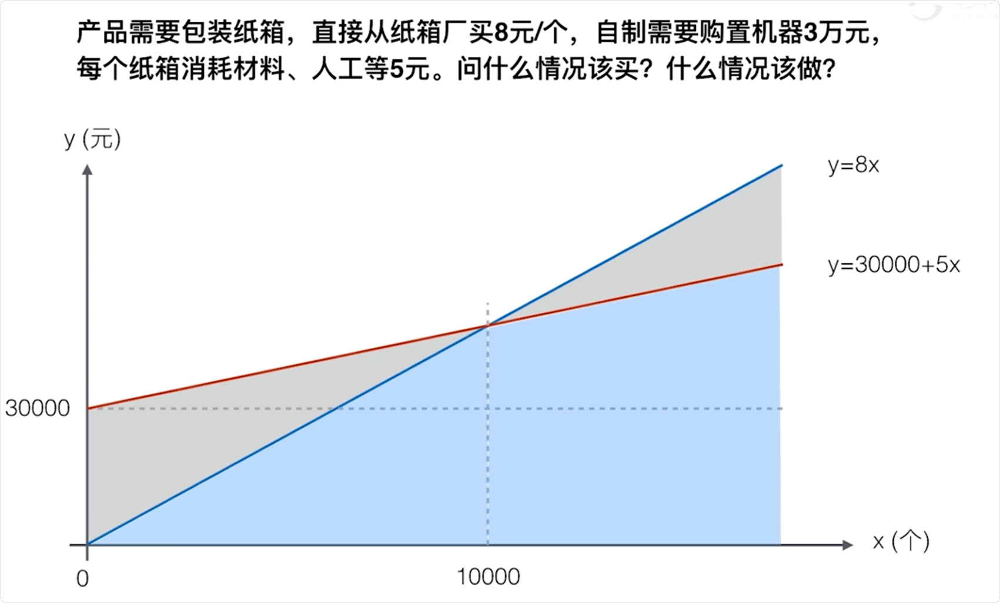

# 采购管理

## 建筑信息模型国际标准采购合同范本

|                         采购管理过程                         |                       建筑信息模型BIM                        |
| :----------------------------------------------------------: | :----------------------------------------------------------: |
|  |  |

|                     国际标准采购合同范本                     | 敏捷场景下的采购管理                                         |
| :----------------------------------------------------------: | ------------------------------------------------------------ |
|  |  |

## 采购合同类型

|                         采购合同类型                         |           总价类型：固定总价合同FFP(总价包死合同)            |
| :----------------------------------------------------------: | :----------------------------------------------------------: |
|  |  |

|           总价类型：总价加激励费合同 FPIF(最复杂)            | 总价类型：总价加经济价格调整(EP-EPA)                         |
| :----------------------------------------------------------: | ------------------------------------------------------------ |
|  |  |

|                成本补偿类型：成本+固定费 CPFF                |                成本补偿类型：成本+激励费 CPIF                |
| :----------------------------------------------------------: | :----------------------------------------------------------: |
|  |  |

|                成本补偿类型：成本+奖励费 CPAF                | 工料合同                                                     |
| :----------------------------------------------------------: | ------------------------------------------------------------ |
|  |  |

## 采购文件

|                           招标文件                           |                         提前准备文件                         |
| :----------------------------------------------------------: | :----------------------------------------------------------: |
|  |  |

## 采购策略之交付方法

|                      设计-招标-建造 DBB                      |                          总承包 EPC                          | 特许经营                                                     |
| :----------------------------------------------------------: | :----------------------------------------------------------: | ------------------------------------------------------------ |
|  |  |  |

## 合同类型和风险分担

## 自制外购分析

|                             案例                             | 自制-外购分析                                                |
| :----------------------------------------------------------: | ------------------------------------------------------------ |
|  |  |

|                         供方选择分析                         |                           独立估算                           |
| :----------------------------------------------------------: | :----------------------------------------------------------: |
|  |  |

|                          投标人会议                          |                                                              |
| :----------------------------------------------------------: | ------------------------------------------------------------ |
|  |  |

|                     投标人会议VS采购谈判                     |                            知识点                            |
| :----------------------------------------------------------: | :----------------------------------------------------------: |
|  |  |

## 索赔管理、替代争议解决方法

|                         争议解决方案                         | 采购审计                                                     |
| :----------------------------------------------------------: | ------------------------------------------------------------ |
|  |  |

##  采购合同结束方式

|                      采购合同的结束形式                      | 管理采购中的责任                                             |
| :----------------------------------------------------------: | ------------------------------------------------------------ |
|  |  |

|                           项目收尾                           | 采购管理学习要点                                             |
| :----------------------------------------------------------: | ------------------------------------------------------------ |
|  |  |

