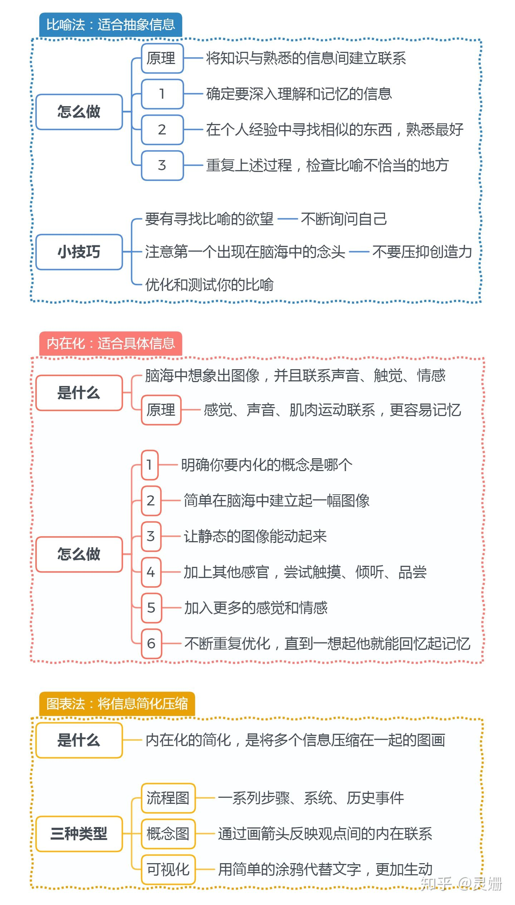

# 高效学习方法



|  |  |
| -------------------------------------------------- | -------------------------------------------------- |
|  |  |
|  |  |
|  |                                                    |

# 附录A

## 参考文章链接

[强烈推荐：用10张竖屏思维导图，读懂《如何高效学习》](https://zhuanlan.zhihu.com/p/92731082)