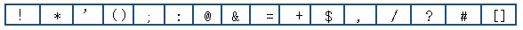

# [百分号编码（URL编码）](https://www.cnblogs.com/nyw1983/p/11755792.html)

百分号编码又叫做URL编码，是一种编码机制，只要用于URI（包含URL和URN）编码中。

URL中那些字符需要编码，又为什么进行编码

## 一、URL是什么？

------

 **URL（Uniform Resource Locator）**，统一资源定位符，是地址的别名。包含了关于文件储存位置和浏览器应该如何处理他的信息。互联网上的每一个文件都有唯一的URL。

**URL分为三个部分**：

第一部分模式；

第二部分文件所在的主机名称

第三部分路径（目录+文件名）

一般来说，URL只能使用英文字母、阿拉伯数字和某些标点符号，不能使用其他的文字和符号

URL只能使用 ASCII 字符集来通过网络进行发送。由于URL经常包含ASCII 码之外的字符，所以必须将 URL 转换为有效的ASCII 码的格式。

URL编码通常会使用 % 后面跟随两个十六进制数字来替换 非ASCII 字符；

URL不能包含空格。所以进行编码时经常使用 + 来替换空格；

## 二、为什么使用百分号编码（URL编码）

**为什么会需要编码？**

那是因为这样东西不适合传输。原因可能有很多种：大小过大，包含隐私数据。对于URL而言，之所以进行编码是因为URL中有一些字符会引起歧义。

**例如：**URL参数字符串中使用键值对这样的形式来传参，键值对之间使用了 & 符号分隔。

如果value字符串中包含了 @ 或 & 等字符，那么一定会造成接收URL的服务器解析错误，因此就需要对造成歧义的 @ 和 & 进行转义，对其进行编码。

还有，如果URL的字符集使用的ASCII 码，不是 Unicode，这就意味着不可以在 URL 中包含任何的非 ASCII 码，例如：中文，否则客户端浏览器和服务器设定的字符集不同的情况下，输入的中文就会出现乱码。

百分号编码（URL编码）会对URL不允许出现的字符或者其他特殊情况的允许的字符进行编码，对于被编码的字符，最终会转为百分号 % 开头，后面跟这昂个十六进制数字的形式。例如：空格（SP）是不允许的字符，在ACSII码中对应的的二进制值是 00100000 ，最终转换为 %20。

URL编码的原则就是使用安全的字符（没有特殊用途或者特殊意义的可打印字符）去掉那些不安全的字符，以保证内容的正常显示。

## 三、需要编码的字符

**RFC3986文档中规定，URL中只需要包含英文字母（a~zA~Z）、数字（0~9）、（- _ . ~）四个特殊字符以及所有保留字符。**

URL经常包含ASCII 码之外的字符，所以必须将 URL 转换为有效的ASCII 码的格式。

有一些字符需要经过编码才不会引起URL语义的转变

### ASCII字符集中没有对应的可打印字符

Url中只允许使用可打印字符。US-ASCII码中的10-7F字节全都表示控制字符，这些字符都不能直接出现在Url中。同时，对于80-FF字节（ISO-8859-1），由于已经超出了US-ACII定义的字节范围，因此也不可以放在Url中。

**保留字符**

**只有字母和数字[0-9 a-z A-Z]、一些特殊符号"$ - _ . + ! \* '(),"[不包括双引号]、以及某些保留字，才可以不经过编码直接用于URL。**

URL 可以划分为若干个 组件、协议、主机、路径等。有一些字符（： / ? # [ ] @）用以分隔不同的组件。

例如：冒号（:）用于分隔协议和主机；

斜线（/）用于分隔主机和路径；

问号（？）同于分隔路径和查询参数；

还有一些字符（! $ & ' () * + , ; =）用于在每个组件中起到分隔作用的。

例如：等号（=）用于表示查询参数中的键值对；

and符（&）用于分隔查询多个键值对；

当组件中的普通数据包含这些特殊字符的时候，就需要对其进行编码。

### （一）保留字符

Url可以划分成若干个组件，协议、主机、路径等。有一些字符（:/?#[]@）是用作分隔不同组件的。例如:冒号用于分隔协议和主机，/用于分隔主机和路径，?用于分隔路径和查询参数，等等。还有一些字符（!$&'()*+,;=）用于在每个组件中起到分隔作用的，如=用于表示查询参数中的键值对，&符号用于分隔查询多个键值对。当组件中的普通数据包含这些特殊字符时，需要对其进行编码。

RFC3986中指定了以下字符为保留字符：

### （二）不安全字符

还有一些字符，当他们直接放在Url中的时候，可能会引起解析程序的歧义。这些字符被视为不安全字符，原因有很多。

| 空格       | Url在传输的过程，或者用户在排版的过程，或者文本处理程序在处理Url的过程，都有可能引入无关紧要的空格，或者将那些有意义的空格给去掉 |
| ---------- | ------------------------------------------------------------ |
| 引号以及<> | 引号和尖括号通常用于在普通文本中起到分隔Url的作用            |
| #          | 通常用于表示书签或者锚点                                     |
| %          | 百分号本身用作对不安全字符进行编码时使用的特殊字符，因此本身需要编码 |
| {}\|\^[]`~ | 某一些网关或者传输代理会篡改这些字符                         |

 对于Url中的合法字符，编码和不编码是等价的，但是对于上面提到的字符，如果不经过编码，很有可能会造成Url语义的不同。

因此对于Url而言，只有普通英文字符和数字，特殊结构字符 **$-_.+!\*'()**还有保留字符，才能出现在未经过编码的Url中。

其他字符均需要经过编码之后才能出现在Url中。

但是由于历史原因，目前尚存在一些不标准的编码实现。例如对于~符号，虽然RFC3986文档规定，对于波浪符号~，不需要进行Url编码，但是还是有很多老的

关或者传输代理会

## 四、如何对Url中的非法字符进行编码 

|               |       |              |              |
| ------------- | ----- | ------------ | ------------ |
| backspace %08 | I %49 | v %76        | ó %D3        |
| tab %09       | J %4A | w %77        | &Ocirc; %D4  |
| linefeed %0A  | K %4B | x %78        | &Otilde; %D5 |
| creturn %0D   | L %4C | y %79        | &Ouml; %D6   |
| space %20     | M %4D | z %7A        | &Oslash; %D8 |
| ! %21         | N %4E | { %7B        | ù %D9        |
| " %22         | O %4F | \| %7C       | ú　 %DA      |
| # %23         | P %50 | } %7D        | &Ucirc; %DB  |
| $ %24         | Q %51 | ~ %7E        | ü %DC        |
| % %25         | R %52 | ￠ %A2       | Y %DD        |
| & %26         | S %53 | ￡ %A3       | T %DE        |
| ' %27         | T %54 | ￥ %A5       | &szlig; %DF  |
| ( %28         | U %55 | \| %A6       | à %E0        |
| ) %29         | V %56 | § %A7        | á %E1        |
| * %2A         | W %57 | &laquo; %AB  | a %E2        |
| + %2B         | X %58 | &not; %AC    | &atilde; %E3 |
| , %2C         | Y %59 | ˉ %AD        | &auml; %E4   |
| - %2D         | Z %5A | o %B0        | &aring; %E5  |
| . %2E         | [ %5B | ± %B1        | &aelig; %E6  |
| / %2F         | \ %5C | a %B2        | &ccedil; %E7 |
| 0 %30         | ] %5D | , %B4        | è %E8        |
| 1 %31         | ^ %5E | μ %B5        | é %E9        |
| 2 %32         | _ %5F | &raquo; %BB  | ê %EA        |
| 3 %33         | ` %60 | &frac14; %BC | &euml; %EB   |
| 4 %34         | a %61 | &frac12; %BD | ì %EC        |
| 5 %35         | b %62 | &iquest; %BF | í %ED        |
| 6 %36         | c %63 | à %C0        | &icirc; %EE  |
| 7 %37         | d %64 | á %C1        | &iuml; %EF   |
| 8 %38         | e %65 | &Acirc; %C2  | e %F0        |
| 9 %39         | f %66 | &Atilde; %C3 | &ntilde; %F1 |
| : %3A         | g %67 | &Auml; %C4   | ò %F2        |
| ; %3B         | h %68 | &Aring; %C5  | ó %F3        |
| < %3C         | i %69 | &AElig; %C6  | &ocirc; %F4  |
| = %3D         | j %6A | &Ccedil; %C7 | &otilde; %F5 |
| > %3E         | k %6B | è %C8        | &ouml; %F6   |
| %3F           | l %6C | é　 %C9      | ÷　 %F7      |
| @ %40         | m %6D | ê %CA        | &oslash; %F8 |
| A %41         | n %6E | &Euml; %CB   | ù %F9        |
| B %42         | o %6F | ì　 %CC      | ú　 %FA      |
| C %43         | p %70 | í %CD        | &ucirc; %FB  |
| D %44         | q %71 | &Icirc; %CE  | ü %FC        |
| E %45         | r %72 | &Iuml; %CF   | y %FD        |
| F %46         | s %73 | D %D0        | t %FE        |
| G %47         | t %74 | &Ntilde; %D1 | &yuml; %FF   |
| H %48         | u %75 | ò %D2        |              |

**Url编码通常也被称为百分号编码（Url Encoding，also known as percent-encoding）**，是因为它的编码方式非常简单，使用%百分号加上两位的字符——0123456789ABCDEF——代表一个字节的十六进制形式。Url编码默认使用的字符集是US-ASCII。例如a在US-ASCII码中对应的字节是0x61，那么Url编码之后得到的就是%61，我们在地址栏上输入http://g.cn/search?q=%61%62%63，实际上就等同于在google上搜索abc了。又如@符号在ASCII字符集中对应的字节为0x40，经过Url编码之后得到的是%40。

**常见字符的Url编码列表：**

**对于非ASCII字符，需要使用ASCII字符集的超集进行编码得到相应的字节，然后对每个字节执行百分号编码**。

对于Unicode字符，RFC文档建议使用utf-8对其进行编码得到相应的字节，然后对每个字节执行百分号编码。如“中文”使用UTF-8字符集得到的字节为0xE4 0xB8 0xAD 0xE6 0x96 0x87，经过Url编码之后得到“%E4%B8%AD%E6%96%87”。

**如果某个字节对应着ASCII字符集中的某个非保留字符，则此字节无需使用百分号表示**。

例如“Url编码”，使用UTF-8编码得到的字节是0x55 0x72 0x6C 0xE7 0xBC 0x96 0xE7 0xA0 0x81，由于前三个字节对应着ASCII中的非保留字符“Url”，因此这三个字节可以用非保留字符“Url”表示。最终的Url编码可以简化成“Url%E7%BC%96%E7%A0%81” ，当然，如果你用"%55%72%6C%E7%BC%96%E7%A0%81”也是可以的。

由于历史的原因，有一些Url编码实现并不完全遵循这样的原则