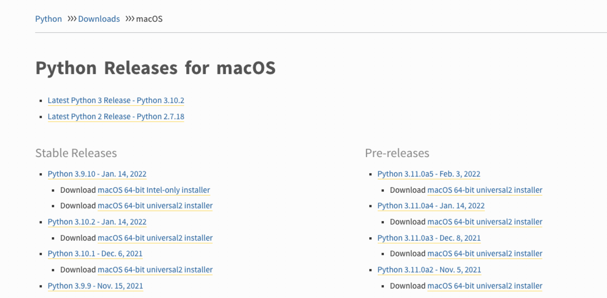

# Python环境部署

* 环境说明

```shell
系统版本：macOS Monterey 12.2.1 (21D62)
MacBook Pro (15-inch, 2018)
处理器：2.6 GHz 六核Intel Core i7
内存：16 GB 2400 MHz DDR4
图形卡：Radeon Pro 560X 4 GB
```

## python环境安装

### 通过brew安装python3环境

```shell
$ brew install python3
```

### 通过官网下载程序安装包

选择mac下载区地址：[https://www.python.org/downloads/ma...](https://link.zhihu.com/?target=https%3A//www.python.org/downloads/macos/)

打开链接，可以看到各个版本的 Python：



> 旧版本在下面，滚动屏幕即可，历史版本都在一个页面。

下载macOS 64 位 Intel 安装程序，下载完后双击安装程序进入Python安装向导，然后按照向导一步一步向下安装，一切保持默认即可。


## 管理Python多版本

### 使用conda管理Python多版本

>  conda分为anaconda和miniconda。
>
>  anaconda是包含一些常用包的版本（这里的常用不代表你常用），
>
>  miniconda则是精简版，需要啥装啥，推荐使用miniconda。

anaconda和miniconda安装教程网上都有此处不做说明，仅提供参考：

* [anaconda安装教程](https://anaconda.org.cn/anaconda/install/)
* [miniconda安装教程](https://conda.io/en/latest/miniconda.html#installing)

#### conda命令使用说明

```shell 
# 1、检查conda是否被安装
$ conda --version

# 2、升级当前版本的conda
$ conda update conda

# 3、利用现有的python3再创建一个分离的python3环境
## 这条命令将会给biopython包创建一个新的环境，位置在/envs/python3
$ conda create --name python3 biopython
$ conda create -n python3 python=3 biopython
## 注： -n和–name是等价的

# 4、创建python2的环境
## 检查可以的python版本
$ conda search --full --name python
## 安装python2环境
$ conda create -n python2 python=2

# 5、查看当前环境中已经被安装的包
$ conda list
## 对于python2环境中的包,可以先激活python2环境，然后通过上述命令查看
$ conda activate python2
$ conda list

# 6、查看已经存在的环境以及切换环境
## 显示已有环境和默认环境(默认环境带*号)
$ conda info -e
## 切换到指定环境
$ conda activate python2
## 退回到默认环境
$ conda deactivate

# 7.查找包是否可以通过conda安装
$ conda search beautifulsoup4
## 安装新包的命令
## 如果不使用–name选项，则该包默认会被安装在当前的环境中,--name是指定环境
$ conda install --name python2 beautifulsoup4
```

#### conda镜像源配置

```shell
# 1、查看当前镜像源配置，镜像源被称为频道(channels)
$ conda config --show-sources

# 2、添加镜像源
$ conda config --add channels image_url
## 添加清华的源
$ conda config --add channels https://mirrors.tuna.tsinghua.edu.cn/anaconda/pkgs/free/
## 中科大的源
$ conda config --add channels https://mirrors.ustc.edu.cn/anaconda/pkgs/free/ 
## 阿里云的源
$ conda config --add channels http://mirrors.aliyun.com/pypi/simple/

# 3、移除镜像源
$ conda config --remove channels image_url
## 移除中科大的源
$ conda config --remove channels https://mirrors.ustc.edu.cn/anaconda/pkgs/free/ 
```

### 使用pyenv管理Python多版本


## 附录A - 参考资料

* [python多版本切换和使用](https://blog.csdn.net/qq_32458499/article/details/82928920)

* [anaconda安装教程](https://anaconda.org.cn/anaconda/install/)
* [miniconda安装教程](https://conda.io/en/latest/miniconda.html#installing)
* [miniconda安装包下载地址](https://conda.io/en/latest/miniconda_hashes.html)
* [Python安装包下载地址](https://www.python.org/downloads/macos/)


