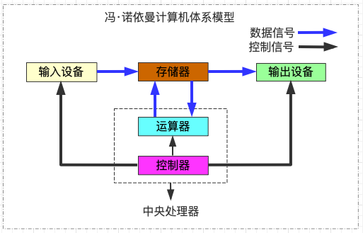
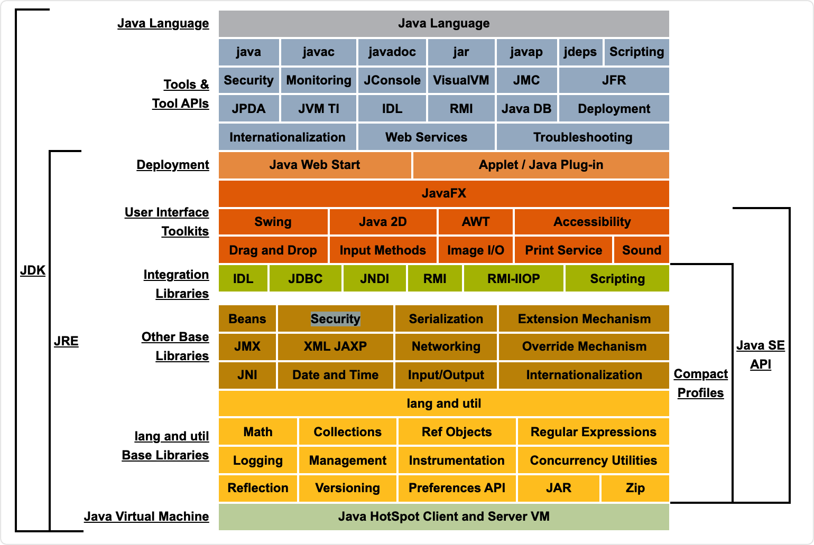
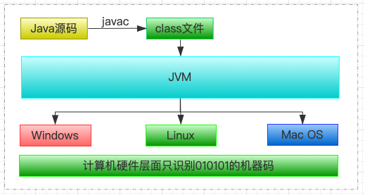
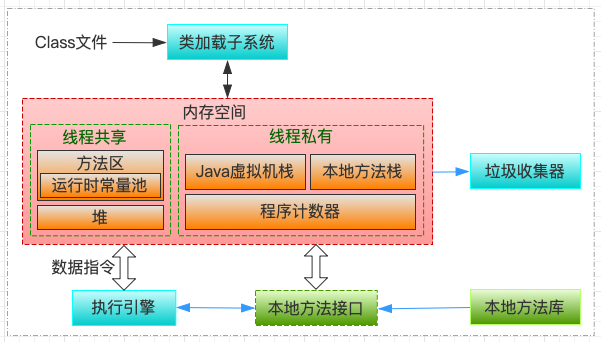
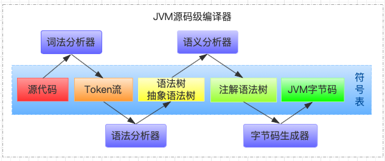
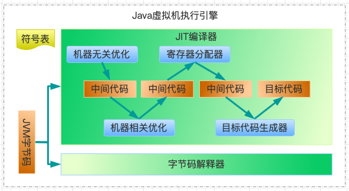
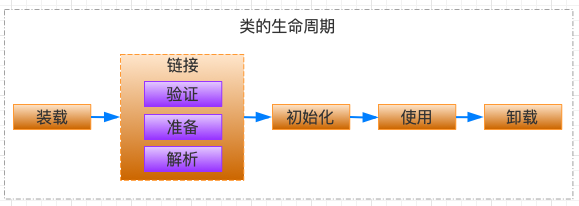
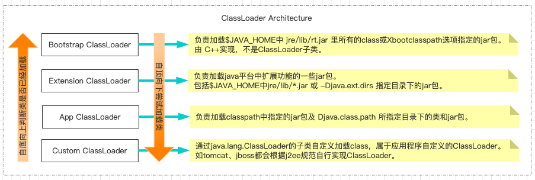

# JVM知识汇总

## JVM基本情况介绍

    JVM是Java Virtual Machine（Java虚拟机）的缩写，JVM是一种用于计算设备的规范，它是一个虚构出来的计算机，是通过在实际的计算机上仿真模拟各种计算机功能来实现的，因此JVM本身设计遵循冯诺依曼计算机结构。



    Java语言的一个非常重要的特点就是与平台的无关性。而使用Java虚拟机是实现这一特点的关键。一般的高级语言如果要在不同的平台上运行，至少需要编译成不同的目标代码。而引入Java语言虚拟机后，Java语言在不同平台上运行时不需要重新编译。Java语言使用Java虚拟机屏蔽了与具体平台相关的信息，使得Java语言编译程序只需生成在Java虚拟机上运行的目标代码（字节码），就可以在多种平台上不加修改地运行。Java虚拟机在执行字节码时，把字节码解释成具体平台上的机器指令执行。这就是Java的能够“一次编译，到处运行”的原因。



从上图能清晰看到Java平台包含的各个逻辑模块，也能了解到JDK与JRE的区别，对于JVM自身的物理结构，我们可以从下图鸟瞰一下：

|                        JVM平台无关性                         |                      JVM自身的物理结构                       |
| :----------------------------------------------------------: | :----------------------------------------------------------: |
|  |  |

## JAVA代码编译和执行过程

    java代码编译是由Java源码编译器来完成，流程图如下所示：



Java字节码的执行是由JVM执行引擎来完成，流程图如下所示：



## JVM中的类加载机制

### 类加载过程



#### 装载(Load)

> 查找和导入class文件

1. 通过一个类的全限定名获取定义此类的二进制字节流
2. 将字节流所代表的静态存储结构转化为方法区的运行时数据结构
3. 在Java堆中生成一个代表这个类的java.lang.Class对象，作为对方法区中这些数据的访问入口

> 获取类的二进制字节流的阶段是我们JAVA程序员最关注的阶段，也是操控性最强的一个阶段。因为这个阶段我们可以对于类加载器进行操作，比如我们想自定义类加载器进行操作用以完成加载，又或者我们想通过 JAVA Agent来完成我们的字节码增强操作。

在装载阶段完成之后，内存当中运行时数据区的方法区以及堆就已经有数据了:

* **方法区:**类信息，静态变量，常量
* **堆:**代表被加载类的java.lang.Class对象

> 即时编译之后的热点代码并不在这个阶段进入方法区

#### 链接(Link)

**验证(Verify)**

> 验证主要是为了确保Class文件中的字节流包含的信息完全符合当前虚拟机的要求，并且还要求这些信息不会危害虚拟机自身的安全，导致虚拟机的崩溃。

* 文件格式验证

  > 验证字节流是否符合Class文件格式的规范，并且能被当前版本的虚拟机处理，该验证的主要目的是保证输入的字节流能正确地解析并存储于方法区之内。这阶段的验证是基于二进制字节流进行的，只有经过该阶段的验证后，**字节流才会进入内存的方法区中进行存储，后面验证都是基于方法区的存储结构进行的。**

  * 是否以16进制cafebaby开头
  * 版本号是否正确

* 元数据验证

  > 对类的元数据信息进行语义校验(其实就是对Java语法校验)，保证不存在不符合Java语法 规范的元数据信息。

  * 是否有父类
  * 是否继承了final类
  * 一个非抽象类是否实现了所有的抽象方法

> 对类的元数据信息进行语义校验(Java语法校验)，保证不存在不符合Java语法规范的元数据信息。

* 字节码验证

  > 进行数据流和控制流分析，确定程序语义是合法的、符合逻辑的。对类的方法体进行校验分析，保证被校验的类的方法在运行时不会做出危害虚拟机安全的行为。

  * 运行检查
  * 栈数据类型和操作码操作参数吻合
  * 跳转指令指向合理的位置

* 符号引用验证

  > 这是最后一个阶段的验证，它发生在虚拟机将符号引用转化为直接引用的时候(解析阶段)， 可以看作是对类自身以外的信息(常量池中的各种符号引用)进行匹配性的校验。符号引用 验证的目的是确保解析动作能正常执行。

  * 常量池中描述类是否存在
  * 访问的方法或者字段是否存在且具有足够的权限

很多情况下可能认为代码肯定是没问题的，验证的过程完全没必要，其实可以添加参数来取消认证

```
-Xverify:none
```

**准备(Prepare)**

* **为类变量(静态变量)分配内存并且设置该类变量的默认初始值**

数据类型 | 零值
---|---
int | 0
long | 0L
short |  (short)0
char |  ‘\u0000’
byte |  (byte)0
boolean | false
float | 0.0f
double | 0.0d
reference | null

* **这里不包含用final修饰的static，因为final在编译的时候就会分配了，准备阶段会显式初始化**
* **这里不会为实例变量(没加static)分配初始化**，类变量会分配在方法区中，而实例变量是会随着对象一起分配到Java堆中。

进行分配内存的只包括类变量(静态变量)，不包括实例变量，实例变量是在对象实例化时随着对象一起分配在java堆中的。通常情况下，初始值为零值，假设public static int a=1;那么a在准备阶段过后的初始值为0，不是1，这时候只是开辟了内存空间，并没有运行java代码，a赋值为1的指令是程序被编译后，存放于类构造器()方法之中，所以a被赋值为1是在初始化阶段才会执行。

### 类加载器优先级和功能



## JVM内存模型

| 1.8之前 | 1.8开始 |
| :-----: | :-----: |
|         |         |

## JVM调优参数

## JVM垃圾回收

## JVM垃圾回收算法

### 标记-清除(Mark-Sweep)

### 标记-复制(Mark-Copying)

### 标记-整理(Mark-Compact)

### 分代收集算法

## JVM垃圾回收器

### Serial

### Serial Old

### ParNew

### Parallel Scavenge

### Parallel Old

### CMS

### G1(Garbage-First)

### ZGC

## 执行引擎

        JVM采取的是混合模式，也就是解释+编译的方式，对于大部分不常用的代码，不需要浪费时间将其编 译成机器码，只需要用到的时候再以解释的方式运行;对于小部分的热点代码，可以采取编译的方式， 追求更高的运行效率。

### 解释执行

        Interpreter，解释器逐条把字节码翻译成机器码并执行，跨平台的保证。刚开始执行引擎只采用了解释执行的，但是后来发现某些方法或者代码块被调用执行的特别频繁时，就会把这些代码认定为“热点代码”。

#### 热点代码探测

* 方法调用计数器
* 回边计数器


### JIT即时编译器

        Just-In-Time compilation(JIT)，即时编译器先将字节码编译成对应平台的可执行文件，运行速度快。即时编译器会把这些热点代码编译成与本地平台关联的机器码，并且进行各层次的优化，保存到内存中。

#### 本地代码存储位置

* code cache

        JVM生成的native code存放的内存空间称之为Code Cache；JIT编译、JNI等都会编译代码到native code，其中JIT生成的native code占用了Code Cache的绝大部分空间。

* 方法内联


#### 即使编译器类型

* HotSpot虚拟机里面内置了两个JIT:C1和C2

> C1也称为Client Compiler，适用于执行时间短或者对启动性能有要求的程序 
> C2也称为Server Compiler，适用于执行时间长或者对峰值性能有要求的程序

* Java7开始，HotSpot会使用分层编译的方式

> 也就是会结合C1的启动性能优势和C2的峰值性能优势，热点方法会先被C1编译，然后热点方法中的热点会被 C2再次编译


## 附录A

### 参考资料

```
* 《Java 虚拟机规范(Java SE 8版)》
* 《深入理解 Java 虚拟机 第二版》
* 《深入理解 Java 虚拟机 第三版》
* 《实战 Java 虚拟机》
```

```http
JVM_虚拟机目录: https://blog.csdn.net/TZ845195485/article/details/93238857
压缩指针失效_JVM内存超32G题:https://blog.csdn.net/m0_37670016/article/details/112794887
压缩指针失效: https://www.baeldung.com/jvm-compressed-oops
数据存储说明：https://baike.baidu.com/item/存储单位/3943356?fromtitle=计算机存储单位&fromid=795305&fr=aladdin
Java GC机制详解: https://www.cnblogs.com/jobbible/p/9800222.html
JVM 中的永久代: https://blog.csdn.net/hehmxy/article/details/83317885
JVM内存：年轻代、老年代、永久代（推荐 转）:https://blog.csdn.net/weixin_30642305/article/details/98390172?utm_medium=distribute.pc_relevant.none-task-blog-2%7Edefault%7EBlogCommendFromMachineLearnPai2%7Edefault-2.control&depth_1-utm_source=distribute.pc_relevant.none-task-blog-2%7Edefault%7EBlogCommendFromMachineLearnPai2%7Edefault-2.control
JVM配置参数列表: https://www.cnblogs.com/fightingcode/p/11232694.html
```


