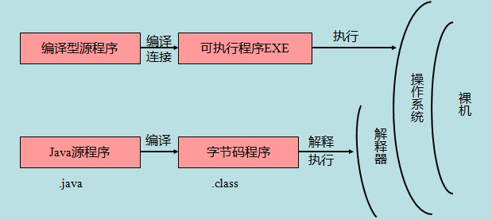

# Java基础知识汇总
  已经从事多年java开发工作，很多基础知识还不是太了解，从零开始学习java知识，文章只记载一些自己认为重要的内容，不会大而全的记录所有知识点。
## Java开发环境变量配置

* JAVA_HOME  = <font color="green">C:\Program Files (x86)\Java\jdk1.8.0_91</font>   
* CLASSPATH = <font color="green">.;%JAVA_HOME%\lib\dt.jar;%JAVA_HOME%\lib\tools.jar</font>   
* Path = <font color="green">%JAVA_HOME%\bin;%JAVA_HOME%\jre\bin</font>  

> JAVA_HOME需要更换成功自己真实的路径。  
> CLASSPATH需要注意前面有一个`.`,表示当前目录。

## Java 源程序与编译型运行区别
如下图所示：

  

## Java基本数据类型
Java语言提供了八种基本类型。六种数字类型（四个整数型，两个浮点型），一种字符类型，还有一种布尔型。
* byte:
    * byte 数据类型是8位、有符号的，以二进制补码表示的整数,默认值`0`；
    * 取值区间：`-128（-2^7）` -> `127（2^7-1）`；
    * `byte`类型用在大型数组中节约空间，主要代替整数，因为`byte`变量占用的空间只有`int`类型的四分之一；
* short:
    * short 数据类型是16位、有符号的以二进制补码表示的整数，默认值`0`；
    * 取值区间：`-32768（-2^15）` -> `32767（2^15 - 1）`；
    * Short 数据类型也可以像`byte`那样节省空间。一个`short`变量是`int`型变量所占空间的二分之一；
* int:
    * int 数据类型是32位、有符号的以二进制补码表示的整数，默认值`0`；
    * 取值区间：`-2,147,483,648（-2^31）` -> `2,147,483,647（2^31 - 1）`；
    * 一般地整型变量默认为`int`类型；
* long:
    * long 数据类型是64位、有符号的以二进制补码表示的整数，默认值`0L`；
    * 取值区间：`-9,223,372,036,854,775,808（-2^63）` -> `9,223,372,036,854,775,807（2^63 -1）`；
    * 这种类型主要使用在需要比较大整数的系统上；
* float:
    * float 数据类型是单精度、32位、符合`IEEE 754`标准的浮点数，默认值是`0.0f`；
    * float 在储存大型浮点数组的时候可节省内存空间；
    * 浮点数不能用来表示精确的值，如货币；
* double:
    * double 数据类型是双精度、64 位、符合 IEEE 754 标准的浮点数，默认值是`0.0d`；
    * 浮点数的默认类型为 double 类型；
    * double类型同样不能表示精确的值，如货币；
* boolean:
    * boolean 数据类型表示一位的信息，默认值是`false`；
    * 只有两个取值：`true`和`false`；
    * 这种类型只作为一种标志来记录`true/false`情况；
* char:
    * char 类型是一个单一的16位`Unicode`字符，char 数据类型可以储存任何字符，默认值是`'u0000'`；
    * 最小值是`\u0000`（十进制等效值为 0）；
    * 最大值是`\uffff`（即为 65535）；

## Java变量类型

- 类变量：独立于方法之外的变量，用 static 修饰。
- 实例变量：独立于方法之外的变量，不过没有 static 修饰。
- 局部变量：类的方法中的变量。

### 类变量（静态变量）

- 类变量也称为静态变量，在类中以 static 关键字声明，但必须在方法之外。
- 无论一个类创建了多少个对象，类只拥有类变量的一份拷贝。
- 静态变量除了被声明为常量外很少使用，静态变量是指声明为 public/private，final 和 static 类型的变量。静态变量初始化后不可改变。
- 静态变量储存在静态存储区。经常被声明为常量，很少单独使用 static 声明变量。
- 静态变量在第一次被访问时创建，在程序结束时销毁。
- 与实例变量具有相似的可见性。但为了对类的使用者可见，大多数静态变量声明为 public 类型。
- 默认值和实例变量相似。数值型变量默认值是 0，布尔型默认值是 false，引用类型默认值是 null。变量的值可以在声明的时候指定，也可以在构造方法中指定。此外，静态变量还可以在静态语句块中初始化。
- 静态变量可以通过：*ClassName.VariableName*的方式访问。
- 类变量被声明为 public static final 类型时，类变量名称一般建议使用大写字母。如果静态变量不是 public 和 final 类型，其命名方式与实例变量以及局部变量的命名方式一致。

### 实例变量

- 实例变量声明在一个类中，但在方法、构造方法和语句块之外；
- 当一个对象被实例化之后，每个实例变量的值就跟着确定；
- 实例变量在对象创建的时候创建，在对象被销毁的时候销毁；
- 实例变量的值应该至少被一个方法、构造方法或者语句块引用，使得外部能够通过这些方式获取实例变量信息；
- 实例变量可以声明在使用前或者使用后；
- 访问修饰符可以修饰实例变量；
- 实例变量对于类中的方法、构造方法或者语句块是可见的。一般情况下应该把实例变量设为私有。通过使用访问修饰符可以使实例变量对子类可见；
- 实例变量具有默认值。数值型变量的默认值是0，布尔型变量的默认值是false，引用类型变量的默认值是null。变量的值可以在声明时指定，也可以在构造方法中指定；
- 实例变量可以直接通过变量名访问。但在静态方法以及其他类中，就应该使用完全限定名：ObejectReference.VariableName。

### 局部变量

- 局部变量声明在方法、构造方法或者语句块中；
- 局部变量在方法、构造方法、或者语句块被执行的时候创建，当它们执行完成后，变量将会被销毁；
- 访问修饰符不能用于局部变量；
- 局部变量只在声明它的方法、构造方法或者语句块中可见；
- 局部变量是在栈上分配的。
- 局部变量没有默认值，所以局部变量被声明后，必须经过初始化，才可以使用。

## Java修饰符

- 访问修饰符
- 非访问修饰符

### 访问修饰符

Java中，可以使用访问控制符来保护对类、变量、方法和构造方法的访问。Java 支持 4 种不同的访问权限。

* **default** (即默认，什么也不写）: 在同一包内可见，不使用任何修饰符。使用对象：类、接口、变量、方法。

- **private** : 在同一类内可见。使用对象：变量、方法。 **注意：不能修饰类（外部类）**
- **public** : 对所有类可见。使用对象：类、接口、变量、方法
- **protected** : 对同一包内的类和所有子类可见。使用对象：变量、方法。 **注意：不能修饰类（外部类）**。

**访问修饰符权限关系：**

| 修饰符      | 当前类 | 同一包内 | 子孙类(同一包) | 子孙类(不同包)                                               | 其他包 |
| :---------- | :----- | :------- | :------------- | :----------------------------------------------------------- | :----- |
| `public`    | Y      | Y        | Y              | Y                                                            | Y      |
| `protected` | Y      | Y        | Y              | Y/N（[说明](https://www.runoob.com/java/java-modifier-types.html#protected-desc)） | N      |
| `default`   | Y      | Y        | Y              | N                                                            | N      |
| `private`   | Y      | N        | N              | N                                                            | N      |

**访问修饰符继承规则**

- 父类中声明为 public 的方法在子类中也必须为 public。
- 父类中声明为 protected 的方法在子类中要么声明为 protected，要么声明为 public，不能声明为 private。
- 父类中声明为 private 的方法，不能够被继承。

### 非访问修饰符

为了实现一些其他的功能，Java 提供了许多非访问修饰符。

* static：修饰符，用来修饰类方法和类变量。
* final：修饰符，用来修饰类、方法和变量，final 修饰的类不能够被继承，修饰的方法不能被继承类重新定义，修饰的变量为常量，是不可修改的。
* abstract：修饰符，用来创建抽象类和抽象方法。
* synchronized：关键字声明的方法同一时间只能被一个线程访问。synchronized 修饰符可以应用于四个访问修饰符。
* volatile：volatile 修饰的成员变量在每次被线程访问时，都强制从共享内存中重新读取该成员变量的值。而且，当成员变量发生变化时，会强制线程将变化值回写到共享内存。这样在任何时刻，两个不同的线程总是看到某个成员变量的同一个值。一个 volatile 对象引用可能是 null。
* transient：序列化的对象包含被 transient 修饰的实例变量时，java 虚拟机(JVM)跳过该特定的变量。该修饰符包含在定义变量的语句中，用来预处理类和变量的数据类型。

## Java运算符

计算机的最基本用途之一就是执行数学运算，作为一门计算机语言，Java提供了一套丰富的运算符来操纵变量。运算符分成以下几组：

- 算术运算符
- 关系运算符
- 位运算符
- 逻辑运算符
- 赋值运算符
- 其他运算符

### 算术运算符

算术运算符用在数学表达式中，它们的作用和在数学中的作用一样。下表列出了所有的算术运算符。  
表格中的实例假设整数变量A的值为10，变量B的值为20：

| 操作符 | 描述                              | 例子                               |
| :----- | :-------------------------------- | :--------------------------------- |
| +      | 加法 - 相加运算符两侧的值         | A + B 等于 30                      |
| -      | 减法 - 左操作数减去右操作数       | A – B 等于 -10                     |
| *      | 乘法 - 相乘操作符两侧的值         | A * B等于200                       |
| /      | 除法 - 左操作数除以右操作数       | B / A等于2                         |
| ％     | 取余 - 左操作数除以右操作数的余数 | B%A等于0                           |
| ++     | 自增: 操作数的值增加1             | B++ 或 ++B 等于 21（区别详见下文） |
| --     | 自减: 操作数的值减少1             | B-- 或 --B 等于 19（区别详见下文） |

### 自增自减运算符

* **自增（++）自减（--）运算符**是一种特殊的算术运算符，在算术运算符中需要两个操作数来进行运算，而自增自减运算符是一个操作数。
  * int b = ++a; 拆分运算过程为: a=a+1=4; b=a=4, 最后结果为b=4,a=4
  * int d = --c; 拆分运算过程为: c=c-1=2; d=c=2, 最后结果为d=2,c=2

* **前缀自增自减法(++a,--a):** 先进行自增或者自减运算，再进行表达式运算。

* **后缀自增自减法(a++,a--):** 先进行表达式运算，再进行自增或者自减运算 实例：

### 关系运算符

下表为Java支持的关系运算符  
表格中的实例整数变量A的值为10，变量B的值为20：

| 运算符 | 描述                                                         | 例子            |
| :----- | :----------------------------------------------------------- | :-------------- |
| ==     | 检查如果两个操作数的值是否相等，如果相等则条件为真。         | (A == B) 为假。 |
| !=     | 检查如果两个操作数的值是否相等，如果值不相等则条件为真。     | (A != B) 为真。 |
| >      | 检查左操作数的值是否大于右操作数的值，如果是那么条件为真。   | (A> B) 为假。   |
| <      | 检查左操作数的值是否小于右操作数的值，如果是那么条件为真。   | (A <B) 为真。   |
| >=     | 检查左操作数的值是否大于或等于右操作数的值，如果是那么条件为真。 | (A> = B) 为假。 |
| <=     | 检查左操作数的值是否小于或等于右操作数的值，如果是那么条件为真。 | (A <= B) 为真。 |

### 位运算符

Java定义了位运算符，应用于整数类型(int)，长整型(long)，短整型(short)，字符型(char)，和字节型(byte)等类型。  
位运算符作用在所有的位上，并且按位运算。假设a = 60，b = 13;它们的二进制格式表示将如下：

```shell
A = 0011 1100
B = 0000 1101
-----------------
A&B = 0000 1100
A | B = 0011 1101
A ^ B = 0011 0001
~A= 1100 0011
```

下表列出了位运算符的基本运算，假设整数变量 A 的值为 60 和变量 B 的值为 13：

| 操作符 | 描述                                                         | 例子                        |
| :----- | :----------------------------------------------------------- | :-------------------------- |
| ＆     | 如果相对应位都是1，则结果为1，否则为0                        | (A＆B)得到12，即0000 1100   |
| \|     | 如果相对应位都是 0，则结果为 0，否则为 1                     | (A\|B)得到61，即 0011 1101  |
| ^      | 如果相对应位值相同，则结果为0，否则为1                       | (A^B)得到49，即 0011 0001   |
| 〜     | 按位取反运算符翻转操作数的每一位，即0变成1，1变成0。         | (〜A)得到-61，即1100 0011   |
| <<     | 按位左移运算符。左操作数按位左移右操作数指定的位数。         | (A<<2)得到240，即 1111 0000 |
| >>     | 按位右移运算符。左操作数按位右移右操作数指定的位数。         | (A>>2)得到15即 1111         |
| >>>    | 按位右移补零操作符。左操作数的值按右操作数指定的位数右移，移动得到的空位以零填充。 | (A>>>2)得到15即0000 1111    |

### 逻辑运算符

下表列出了逻辑运算符的基本运算，假设布尔变量A为真，变量B为假

| 操作符 | 描述                                                         | 例子            |
| :----- | :----------------------------------------------------------- | :-------------- |
| &&     | 称为逻辑与运算符。当且仅当两个操作数都为真，条件才为真。     | (A&&B) 为假。   |
| \| \|  | 称为逻辑或操作符。如果任何两个操作数任何一个为真，条件为真。 | (A\|\|B) 为真。 |
| ！     | 称为逻辑非运算符。用来反转操作数的逻辑状态。如果条件为true，则逻辑非运算符将得到false。 | !(A&&B) 为真。  |

### 赋值运算符

| 操作符 | 描述                                                         | 例子                                     |
| :----- | :----------------------------------------------------------- | :--------------------------------------- |
| =      | 简单的赋值运算符，将右操作数的值赋给左侧操作数               | C = A + B将把A + B得到的值赋给C          |
| + =    | 加和赋值操作符，它把左操作数和右操作数相加赋值给左操作数     | C + = A等价于C = C + A                   |
| - =    | 减和赋值操作符，它把左操作数和右操作数相减赋值给左操作数     | C - = A等价于C = C - A                   |
| * =    | 乘和赋值操作符，它把左操作数和右操作数相乘赋值给左操作数     | C * = A等价于C = C * A                   |
| / =    | 除和赋值操作符，它把左操作数和右操作数相除赋值给左操作数     | C / = A，C 与 A 同类型时等价于 C = C / A |
| (％)=  | 取模和赋值操作符，它把左操作数和右操作数取模后赋值给左操作数 | C％= A等价于C = C％A                     |
| << =   | 左移位赋值运算符                                             | C << = 2等价于C = C << 2                 |
| >> =   | 右移位赋值运算符                                             | C >> = 2等价于C = C >> 2                 |
| ＆=    | 按位与赋值运算符                                             | C＆= 2等价于C = C＆2                     |
| ^ =    | 按位异或赋值操作符                                           | C ^ = 2等价于C = C ^ 2                   |
| \| =   | 按位或赋值操作符                                             | C \| = 2等价于C = C \| 2                 |

### 条件运算符（?:）

条件运算符也称三元运算符。该运算符有3个操作数，需要判断布尔表达式的值。该运算符的主要是决定哪个值应该赋值给变量。

```java
variable x = (expression) ? value if true : value if false
```

### instanceof 运算符

该运算符用于操作对象实例，检查该对象是否是一个特定类型（类类型或接口类型）。

```java
( Object reference variable ) instanceof  (class/interface type)
```

### Java运算符优先级

| 类别     | 操作符                                     | 关联性   |
| :------- | :----------------------------------------- | :------- |
| 后缀     | () [] . (点操作符)                         | 左到右   |
| 一元     | expr++ expr--                              | 从左到右 |
| 一元     | ++expr --expr + - ～ ！                    | 从右到左 |
| 乘性     | * /％                                      | 左到右   |
| 加性     | + -                                        | 左到右   |
| 移位     | >> >>>  <<                                 | 左到右   |
| 关系     | > >= < <=                                  | 左到右   |
| 相等     | == !=                                      | 左到右   |
| 按位与   | ＆                                         | 左到右   |
| 按位异或 | ^                                          | 左到右   |
| 按位或   | \|                                         | 左到右   |
| 逻辑与   | &&                                         | 左到右   |
| 逻辑或   | \| \|                                      | 左到右   |
| 条件     | ？：                                       | 从右到左 |
| 赋值     | = + = - = * = / =％= >> = << =＆= ^ = \| = | 从右到左 |
| 逗号     | ，                                         | 左到右   |

## java循环结构

Java中有三种主要的循环结构：

- **while** 循环
- **do…while** 循环
- **for** 循环

### while 循环

```java
while( 布尔表达式 ) {
  //循环内容
}
```

只要布尔表达式为 true，循环就会一直执行下去。

### do…while 循环

对于 while 语句而言，如果不满足条件，则不能进入循环。但有时候我们需要即使不满足条件，也至少执行一次。

```java
do {
       //代码语句
}while(布尔表达式);
```

**注意：**布尔表达式在循环体的后面，所以语句块在检测布尔表达式之前已经执行了。 如果布尔表达式的值为 true，则语句块一直执行，直到布尔表达式的值为 false。

### for循环

虽然所有循环结构都可以用 while 或者 do...while表示，但 Java 提供了另一种语句` for循环`，使一些循环结构变得更加简单。

```java
for(初始化; 布尔表达式; 更新) {
    //代码语句
}
```

### Java 增强 for 循环

Java5 引入了一种主要用于数组的增强型 for 循环。

```java
for(声明语句 : 表达式){
   //代码句子
}
```

**声明语句：**声明新的局部变量，变量类型必须和数组元素类型匹配。其作用域限定在循环语句块，其值与此时数组元素的值相等。  
**表达式：**表达式是要访问的数组名，或者是返回值为数组的方法。

### break 关键字

break 主要用在循环语句或者 switch 语句中，用来跳出整个语句块。  
break 跳出最里层的循环，并且继续执行该循环下面的语句。

```java
break;
```

### continue 关键字

continue 适用于任何循环控制结构中。作用是让程序立刻跳转到下一次循环的迭代。

```java
continue;
```

## Java 条件语句

### if...else语句

if 语句后面可以跟 else 语句，当 if 语句的布尔表达式值为 false 时，else 语句块会被执行。

```java
if(布尔表达式 1){
   //如果布尔表达式 1的值为true执行代码
}else if(布尔表达式 2){
   //如果布尔表达式 2的值为true执行代码
}else if(布尔表达式 3){
   //如果布尔表达式 3的值为true执行代码
}else {
   //如果以上布尔表达式都不为true执行代码
}
```

### 嵌套的 if…else 语句

使用嵌套的 if…else 语句是合法的。也就是说你可以在另一个 if 或者 else if 语句中使用 if 或者 else if 语句。

```java
if(布尔表达式 1){
   ////如果布尔表达式 1的值为true执行代码
   if(布尔表达式 2){
      ////如果布尔表达式 2的值为true执行代码
   }
}
```

## Java switch case 语句

switch case 语句判断一个变量与一系列值中某个值是否相等，每个值称为一个分支。

```java
switch(expression){
    case value :
       //语句
       break; //可选
    case value :
       //语句
       break; //可选
    //你可以有任意数量的case语句
    default : //可选
       //语句
}
```

**switch case 语句有如下规则:**

- switch 语句中的变量类型可以是： byte、short、int 或者 char。从 Java SE 7 开始，switch 支持字符串 String 类型了，同时 case 标签必须为字符串常量或字面量。
- switch 语句可以拥有多个 case 语句。每个 case 后面跟一个要比较的值和冒号。
- case 语句中的值的数据类型必须与变量的数据类型相同，而且只能是常量或者字面常量。
- 当变量的值与 case 语句的值相等时，那么 case 语句之后的语句开始执行，直到 break 语句出现才会跳出 switch 语句。
- 当遇到 break 语句时，switch 语句终止。程序跳转到 switch 语句后面的语句执行。case 语句不必须要包含 break 语句。如果没有 break 语句出现，程序会继续执行下一条 case 语句，直到出现 break 语句。
- switch 语句可以包含一个 default 分支，该分支一般是 switch 语句的最后一个分支（可以在任何位置，但建议在最后一个）。default 在没有 case 语句的值和变量值相等的时候执行。default 分支不需要 break 语句。

**switch case 执行时，一定会先进行匹配，匹配成功返回当前 case 的值，再根据是否有 break，判断是否继续输出，或是跳出判断。**


# 参考文档：

[菜鸟Java教程](https://www.runoob.com/java/java-package.html)