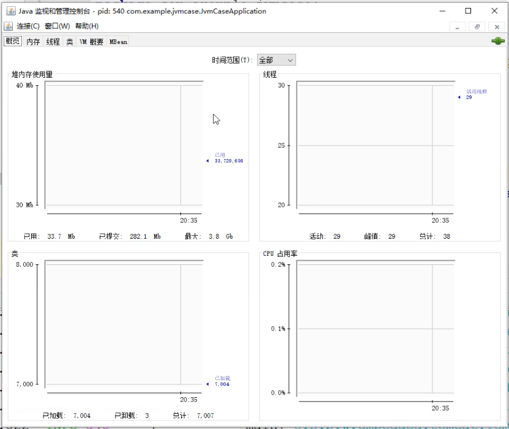

# Java常用命令工具

## jar命令

```shell
# 语法 
$ jar {ctxui}[vfmn0PMe] [jar-file] [manifest-file] [entry-point] [-C dir] files ...
# 将两个类文件归档到一个名为 classes.jar 的档案中: 
$ jar cvf classes.jar Foo.class Bar.class 
# 创建带manifest.mf文件的jar包
$ jar cvfm classes.jar mymanifest -C foo/ .
# 忽略manifest.mf文件
$ jar cvfM hello.jar hello
# 显示jar包
$ jar tvf hello.jar
# 解压jar包
$ jar xvf hello.jar
# jar中添加文件
$ jar uf hello.jar HelloWorld.java
# 创建不压缩内容jar包
$ jar cvf0 hello.jar *.class
```

```shell
# 选项:
-c  创建新档案
-t  列出档案目录
-x  从档案中提取指定的 (或所有) 文件
-u  更新现有档案
-v  在标准输出中生成详细输出
-f  指定档案文件名
-m  包含指定清单文件中的清单信息
-n  创建新档案后执行 Pack200 规范化
-e  为捆绑到可执行 jar 文件的独立应用程序,指定应用程序入口点
-0  仅存储; 不使用任何 ZIP 压缩
-P  保留文件名中的前导 '/' (绝对路径) 和 ".." (父目录) 组件
-M  不创建条目的清单文件
-i  为指定的 jar 文件生成索引信息
-C  更改为指定的目录并包含以下文件,如果任何文件为目录, 则对其进行递归处理。清单文件名, 档案文件名和入口点名称的指定顺序与 'm', 'f' 和 'e' 标记的指定顺序相同。
```


## javap命令

**功能说明：**java字节码信息查看工具。

​		jdk自带的一个工具,可以对代码反编译,也可以查看java编译器生成的字节码.

```shell
# 语法
$ javap <options> <classes>
# 翻译成java代码
$ javap DocFooter.class
# 翻译成可视化字节码
$ javap -c DocFooter.class
```

```shell
# 选项(options)
-help --help -?    		 输出此用法消息
-version           		 版本信息
-v -verbose        	 	 输出附加信息
-l                 		 输出行号和本地变量表
-public            		 仅显示公共类和成员
-protected         		 显示受保护的/公共类和成员
-package           		 显示程序包/受保护的/公共类和成员 (默认)
-p -private        		 显示所有类和成员
-c                 		 对代码进行反汇编
-s                 		 输出内部类型签名
-sysinfo           		 显示正在处理的类的系统信息 (路径, 大小, 日期, MD5 散列)
-constants         		 显示最终常量
-classpath <path>  		 指定查找用户类文件的位置
-cp <path>             指定查找用户类文件的位置
-bootclasspath <path>  覆盖引导类文件的位置
```

## jps命令

**功能说明：**java虚拟机进程信息工具。

        虚拟机进程状态工具, 可以用于查看当前运行的java行程以及相关参数

```shell
# 语法
$ jps [ options ] [ hostid ]
# 列出本地主机上检测的JVM
$ jps
# 列出远程主机上的检测JVM。
$ jps -l remote.domain
# 列出远程主机上已检测的JVM，其RMI注册表具有非默认端口。
$ jps -m remote.domain:2002
```

```shell
# 选项(options)
-q 				 抑制传递给main方法的类名、JAR 文件名和参数的输出，仅生成本地JVM标识符列表。
-m 				 显示传递给main方法的参数。对于嵌入式JVM，输出可能为空。
-l 				 显示应用程序主类的完整包名或应用程序JAR文件的完整路径名。
-v 				 显示传递给JVM的参数。
-V 				 抑制传递给main方法的类名、JAR文件名和参数的输出，仅生成本地JVM标识符列表。
-J-option  将选项传递给JVM，其中选项是Java应用程序启动器参考页面上描述的选项之一。例：-J-Xms48m将启动内存设置为48MB。
# 主机标识(hostId)格式
[协议：][[//]主机名][：端口][/服务器名]
# 协议：通信协议。省略协议且未指定主机名，默认协议是特定于平台的、优化的本地协议。如果省略协议并指定主机名，则默认协议为rmi。
# 主机名：指示目标主机的主机名或IP地址。如果省略主机名参数，则目标主机是本地主机。
# 端口：与远程服务器通信的默认端口。默认RMI端口1099
# 服务器名称：该参数的处理取决于实现。对于优化的本地协议，该字段将被忽略。
```

## jinfo命令

**功能说明：**java虚拟机进程配置信息工具。

```shell
# 语法：连接到正在运行的进程
$ jinfo [选项] <pid>
# 语法：连接到正在运行的进程
$ jinfo [选项] <executable <core>
# 语法：连接到远程调试服务器
$ jinfo [选项] [server_id@]<远程服务器IP或主机名>
# 获取应用进程所有配置信息
$ jinfo 3126
# 获取应用进程的命令行参数信息
$ jinfo -flags 3126
# 打印应用进程的系统参数信息(System.getProperties())
$ jinfo -sysprops 3126
```

```shell
# 选项(options)
# 没有配置选项打印-flags和-sysprops
-flag <name> 			    打印指定VM标志的值
-flag [+|-]<name>     启用或禁用命名的VM标志
-flag <name>=<value>  将命名的VM标志设置为给定值
-flags                打印VM标志
-sysprops             打印Java系统属性
-h | -help            打印此帮助消息
```

## jstat命令

**功能说明：** java虚拟机进程统计信息监控工具
        用于监视虚拟机各种运行状态信息的命令行工具.它尅显示本地或者远程虚拟机进程中的类装载、内存、垃圾收集、JIT编译等运行数据.

```shell
# 语法
$ jstat -<option> [-t] [-h<lines>] <vmid> [<interval> [<count>]]
# 每2s执行一次查询统计,执行5次gc统计输出
$ jstat -gc 3126 2 5
# 结果集说明
S0: 新生代中Survivor space 0区已使用空间的百分比
S1: 新生代中Survivor space 1区已使用空间的百分比
E: 新生代已使用空间的百分比
O: 老年代已使用空间的百分比
P: 永久带已使用空间的百分比
YGC: 从应用程序启动到当前，发生Yang GC 的次数
YGCT: 从应用程序启动到当前，Yang GC所用的时间【单位秒】
FGC: 从应用程序启动到当前，发生Full GC的次数
FGCT: 从应用程序启动到当前，Full GC所用的时间
GCT: 从应用程序启动到当前，用于垃圾回收的总时间【单位秒】
```

```shell
# 选项
-class : 监视类装载、卸载数量、总空间以及类装载所耗费的时间.
-compiler : 显示编译器编译过的方法、耗时等信息.
-gc : 显示Java堆状况、包括Eden区、两个survivor区、老年代、永久代等的容量、已用空间、GC次数以及时间等信息.
-gccapacity: 显示VM内存中三代(young,old,perm）对象的使用和占用大小
-gcutil : gc统计信息, 输出主要关注已使用空间占总弓箭的百分比
-gccause : 与-gcutil基本相同, 会额外输出导致上一次GC产生的原因
-gcnew : 显示新生代GC状况
-gcnewcapacity : 显示内容与-gcnew相同,输出主要关注使用到的最大最小空间
-gcold : 显示老年代GC状况
-gcoldcapacity : 显示内容与-gcold相同,输出主要关注使用到的最大最小空间
-printcompilation : 当前vm执行的信息
```

## jstack命令

**功能说明：** java虚拟机进程堆栈跟踪工具, 制作线程Dump

        命令用于生成虚拟机当前时刻的线程快照(一般称为threaddump或者javacore文件), 线程快照就是当前虚拟机内每一条线程正在执行的方法堆栈的集合,生成线程快照的主要目的是定位线程出现长时间停顿的原因，如线程间死锁、死循环、请求外部资源导致的长时间等待等.
        在实际运行中，往往一次 dump的信息，还不足以确认问题。建议产生三次dump信息，如果每次dump都指向同一个问题，我们才确定问题的典型性。

```shell
# 语法：连接到正在运行的进程
$ jstack [-l] <pid>
# 语法：连接到挂起的进程
$ jstack -F [-m] [-l] <pid>
# 语法：连接到核心文件
$ jstack [-m] [-l] <executable> <core>
# 连接到远程调试服务器
$ jstack [-m] [-l] [server_id@]<远程服务器 IP 或主机名>
# 使用jstack查看线程堆栈
$ jstack -l 3126
# 输出堆中对象统计信息
jmap -histo 15051
```

```shell
# 选项
-F 当正常输出的请求不被响应时,强制输出线程堆栈
-m 打印java和native方法(c/c++)的堆栈信息
-l 长列表,打印关于锁的附加信息
```


## jmap命令

**功能说明：** java虚拟机进程堆内存映射,制作堆Dump

        用户生成堆转储快照(HeapDump), jmap的作用不仅仅是为了获取HeapDump文件, 它还可以查询finalize执行队列、Java堆和永久待的详细信息, 如空间使用率、当前用的是哪种收集器等.

```shell
# 语法：连接到正在运行的进程
$ jmap [选项] <pid>
# 连接到核心文件
$ jmap [选项] <executable <core>
# 连接到远程调试服务器
$ jmap [选项] [server_id@]<远程服务器 IP 或主机名>
# -heap
$ jmap -heap 15051
# 获取dump文件
$ jmap -dump:live,format=b,file=dump.hprof 24971
```

```shell
# 选项
-heap : 显示Java堆详细信息,如使用哪种回收机,参数配置,分代状况等.只在Linux/Solaris平台下有效
-histo : 显示堆中对象统计信息, 包括类、示例梳理、合计容量
-finalizerinfo : 打印等待终结的对象信息
-dump : 以hprof二进制格式转储Java堆到指定filename的文件中,live子选项是可选的, 如果指定了live子选项,堆中只有活动的对象会被转储.想要浏览heap dump,你可以使用jhat(Java堆分析工具)读取生成的文件.
-F : 强制模式.如果指定的pid没有响应,请使用jmap -dump或jmap -histo选项.
-J<flag> : 指定传递给运行jmap的JVM的参数.
# -heap结果集说明
Parallel GC with 4 thread(s): 说明使用的GC为Parallel GC
Heap Configuration: 堆内存初始化配置
	MinHeapFreeRatio: 对应jvm启动参数-XX:MinHeapFreeRatio设置JVM堆最小空闲比率(default 40)
	MaxHeapFreeRatio: 对应jvm启动参数 -XX:MaxHeapFreeRatio设置JVM堆最大空闲比率(default 70)
	MaxHeapSize: 对应jvm启动参数-XX:MaxHeapSize=设置JVM堆的最大大小
	NewSize: 对应jvm启动参数-XX:NewSize=设置JVM堆的‘新生代’的默认大小
	MaxNewSize: 对应jvm启动参数-XX:MaxNewSize=设置JVM堆的‘新生代’的最大大小
	OldSize: 对应jvm启动参数-XX:OldSize=<value>:设置JVM堆的‘老生代’的大小
	NewRatio: 对应jvm启动参数-XX:NewRatio=:‘新生代’和‘老生代’的大小比率
	SurvivorRatio: 对应jvm启动参数-XX:SurvivorRatio=设置年轻代中Eden区与Survivor区的大小比值
	PermSize: 对应jvm启动参数-XX:PermSize=<value>:设置JVM堆的‘永生代’的初始大小
	MaxPermSize: 对应jvm启动参数-XX:MaxPermSize=<value>:设置JVM堆的‘永生代’的最大大小
Heap Usage: 堆内存使用情况
	PS Young Generation: 当前的年轻代内存分布
		Eden Space: Eden区内存分布
			capacity: 区总容量
			used: 区已使用
			free: 区剩余容量
		From Space: 其中一个Survivor区的内存分布
		To Space: 另一个Survivor区的内存分布
	PS Old Generation: 当前的老年代内存分布
	PS Perm Generation: 当前的 “永生代” 内存分布
```

* jmap使用总结
  * 如果程序内存不足或者频繁GC,很有可能存在内存泄露情况,这时候就要借助Java堆Dump查看对象的情况
  * 要制作堆Dump可以直接使用jvm自带的jmap命令
  * 使用jmap -histo:[live]查看堆内存中的对象的情况.如果有大量对象在持续被引用,并没有被释放掉,那就产生了内存泄露,就要结合代码,把不用的对象释放掉
  * 用 jmap -dump:format=b,file=\<fileName>命令将堆信息保存到一个文件中,再借助jhat命令查看详细内容
  * 在内存出现泄露、溢出或者其它前提条件下,建议多dump几次内存,把内存文件进行编号归档,便于后续内存整理分析.

## jhat命令

 **功能说明：** jjava虚拟机堆转储快照分析工具

        与jmap搭配使用, 用来分析jmap生成的堆转储快照, jhat内置了一个微型的HTTP/HTML服务器, 方便在浏览器中查看jmap生成的HeadpDump文件.

```shell
# 语法
$ jhat [-stack <bool>] [-refs <bool>] [-port <port>] [-baseline <file>] [-debug <int>] [-version] [-h|-help] <file>
# 生成java堆转储文件,并用jhat分析
$ jmap -dump:format=b,file=heapDump 15051
$ jhat -port 8899 heapDump
```

```shell
# 选项
-stack : 关闭对象分配调用栈跟踪,如果分配位置信息在堆转储中不可用,则必须将此标志设置为false. 默认值为true.
-refs : 关闭对象引用跟踪;默认值为true;默认情况下,返回的指针是指向其他特定对象的对象,如反向链接或输入引用,会统计/计算堆中的所有对象.
-port : 设置jhat HTTP server 的端口号. 默认值7000.
-exclude : 指定对象查询时需要排除的数据成员列表文件;例如:如果文件列列出了 java.lang.String.value,那么当从某个特定对象Object o计算可达的对象列表时,引用路径涉及 java.lang.String.value的都会被排除.
-baseline : 指定一个基准堆转储;在两个heap dumps中有相同object ID的对象会被标记为不是新的,其他对象被标记为新的(new),在比较两个不同的堆转储时很有用.
-debug : 设置debug 级别. 0表示不输出调试信息.
-version :启动后只显示版本信息就退出
```

## jconsole命令

**功能说明：** 用于提供JVM活动的图形化视图,包括线程的使用、类的使用和GC活动.

```shell
# 语法
# connection = pid || host:port || JMX URL (service:jmx:<协议>://...)
$ jconsole [ -interval=n ] [ -notile ] [ -pluginpath <path> ] [ -version ] [ connection ... ]

```

```shell
# 选项
-interval   将更新间隔设置为 n 秒 (默认值为 4 秒)
-notile     初始不平铺窗口 (对于两个或多个连接)
-pluginpath 指定 jconsole 用于查找插件的路径
-version    输出程序版本
-J          指定运行 jconsole 的 Java 虚拟机的输入参数
```



## jvisualvm命令

**功能说明：** 监控JVM的GUI工具,可用来剖析运行的应用,分析JVM堆转储.

```shell
# 语法
$ jvisualvm {options} arguments
```

```shell
# 常规选项
--help 显示此帮助
--jdkhome <path> 			到Java(TM) 2 SDK，标准版的路径
-J<jvm_option> 				将 <jvm_option> 传递给 JVM
--cp:p <classpath> 		将 <classpath> 添加到 classpath
--cp:a <classpath> 		将 <classpath> 附加到 classpath模块重新加载选项：
--reload /path/to/module.jar 		安装或重新安装模块 JAR 文件
# 其他模块选项：
--modules
--refresh			刷新所有目录
--list 				打印所有模块、模块版本和启用状态的列表
--install <arg1>...<argN> 			将提供的 JAR 文件作为模块安装
--disable <arg1>...<argN> 			禁止指定代码库名称的模块
--enable <arg1>...<argN> 				允许指定代码库名称的模块
--update <arg1>...<argN> 				更新所有模块或指定的模块
--update-all 			更新所有模块
--extra-uc <arg> 			添加额外的更新中心 (URL)
--openjmx <arg> 			打开JMX连接（主机：端口）指定的应用程序
--openfile <arg> 			打开由 <arg> 指定的文件，该文件可能是应用程序快照、NetBeans Profiler 截图或 HPROF 堆转储。
--openpid <arg> 			打开进程id为 <arg> 的应用程序
--openid <arg> 				打开id为 <arg> 的应用程序
# 核心选项：
--laf <LaF classname>  	使用给定的 LookAndFeel 类而不是默认的
--fontsize <size> 			设置用户界面的基本字体大小，以磅为单位
--locale <language[:country[:variant]]> 		使用指定的语言环境
--userdir <path> 				使用指定目录来存储用户设置
--cachedir <path> 			使用指定目录存放用户缓存，必须与userdir不同
--nosplash 							不显示启动画面
```

## arthas

```
version:查看arthas版本号 help:查看命名帮助信息 cls:清空屏幕 session:查看当前会话信息 quit:退出arthas客户端
内存分析
Java堆分析器，用于查找内存泄漏
Heap Dump，称为堆转储文件，是Java进程在某个时间内的快照。 它在触发快照的时候保存了很多信息:Java对象和类信息。 通常在写Heap Dump文件前会触发一次Full GC。
下载地址 :https://www.eclipse.org/mat/downloads.php
(1)获取dump文件 手动
自动
(2)Dump的信息
All Objects
Class, fields, primitive values and references
All Classes
Classloader, name, super class, static fields
Garbage Collection Roots
Objects defined to be reachable by the JVM
Thread Stacks and Local Variables
The call-stacks of threads at the moment of the snapshot, and per-frame information about local
objects
(3)使用 Histogram:可以列出内存中的对象，对象的个数及其大小
  
jmap -dump:format=b,file=heap.hprof 44808
-XX:+HeapDumpOnOutOfMemoryError -XX:HeapDumpPath=heap.hprof
---
dashboard:当前进程的实时数据面板 thread:当前JVM的线程堆栈信息
jvm:查看当前JVM的信息
sysprop:查看JVM的系统属性
---
sc:查看JVM已经加载的类信息
dump:dump已经加载类的byte code到特定目录 jad:反编译指定已加载类的源码
---
monitor:方法执行监控
watch:方法执行数据观测 trace:方法内部调用路径，并输出方法路径上的每个节点上耗时 stack:输出当前方法被调用的调用路径
```

# 内存分析

## MAT(MemoryAnalyzer)

> Java堆分析器，用于查找内存泄漏
> Heap Dump，称为堆转储文件，是Java进程在某个时间内的快照。 它在触发快照的时候保存了很多信息:Java对象和类信息。 通常在写Heap Dump文件前会触发一次Full GC。
> 下载地址 :https://www.eclipse.org/mat/downloads.php

1、 获取dump文件

```shell
# 手动
$ jmap -dump:format=b,file=heap.hprof 44808
# 自动
-XX:+HeapDumpOnOutOfMemoryError -XX:HeapDumpPath=heap.hprof
# 直接答应日志
-XX:+PrintGCDetails -XX:+PrintGCTimeStamps -XX:+PrintGCDateStamps -Xloggc:$CATALINA_HOME/logs/gc.log
```

2、 Dump的信息

```shell
# All Objects
Class, fields, primitive values and references
# All Classes
Classloader, name, super class, static fields
# Garbage Collection Roots
Objects defined to be reachable by the JVM
# Thread Stacks and Local Variables
The call-stacks of threads at the moment of the snapshot, and per-frame information about local objects
```

3、 使用

* Histogram:可以列出内存中的对象，对象的个数及其大小

```shell
Class Name:类名称，java类名 
Objects:类的对象的数量，这个对象被创建了多少个
Shallow Heap:一个对象内存的消耗大小，不包含对其他对象的引用
Retained Heap:是shallow Heap的总和，即该对象被GC之后所能回收到内存的总和
```

```
右击类名--->List Objects--->with incoming references--->列出该类的实例
```

```
右击Java对象名--->Merge Shortest Paths to GC Roots--->exclude all ...--->找到GC Root以及原因
```

JVM中GC Roots的大致分类

> **Class** 由System Class Loader/Boot Class Loader加载的类对象，这些对象不会被回收。需要注意的是其它的Class Loader实例加载的类对象不一定是GC root，除非这个类对象恰好 是其它形式的GC root;
> **Thread** 线程，激活状态的线程;
> **Stack Local** 栈中的对象。每个线程都会分配一个栈，栈中的局部变量或者参数都是GC root，因为它们的引用随时可能被用到;
> **JNI Local JNI**中的局部变量和参数引用的对象;可能在JNI中定义的，也可能在虚拟机中定 义
> **JNI Global JNI**中的全局变量引用的对象;同上
> **Monitor Used** 用于保证同步的对象，例如wait()，notify()中使用的对象、锁等。
> **Held by JVM** JVM持有的对象。JVM为了特殊用途保留的对象，它与JVM的具体实现有关。比如有System Class Loader, 一些Exceptions对象，和一些其它的Class Loader。对于这些 类，JVM也没有过多的信息。

* Leak Suspects:查找并分析内存泄漏的可能原因

```
Reports--->Leak Suspects--->Details
```

* Top Consumers:列出大对象

## heaphero

https://heaphero.io/

## perfma

https://console.perfma.com/

# 附录A

## 参考文档

[Java常用命令行工具](https://www.cnblogs.com/dennisit/p/9119535.html)


