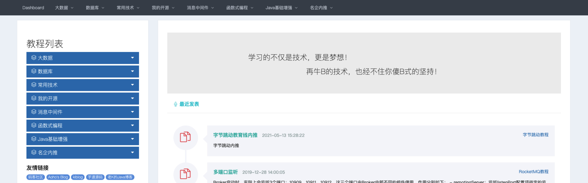
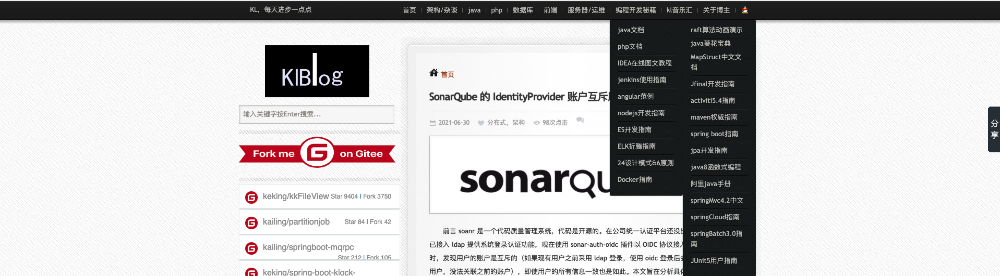
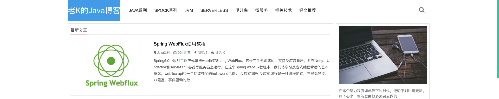
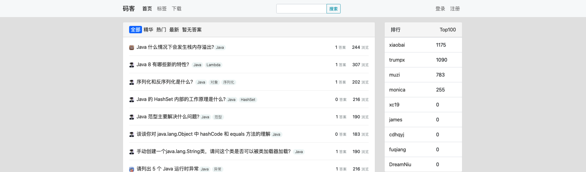

# 框架技术学习

## 技术参考博客网站

### [田守枝Java技术博客](http://www.tianshouzhi.com/)

### [Jarks Blog](http://wuchong.me/) 

### [bugstack虫洞栈](https://bugstack.cn/)

### [Aoho's Blog](http://blueskykong.com/)

### [KL博客](http://www.kailing.pub/index/index.html)

### [老K的Java博客](https://javakk.com/)

### [芋道源码](https://www.iocoder.cn/)

该博客开了只是星球，大部分文章需要加入知识星球才能查看，知识星球获取新的博客地址

## 面试题参考网站

### [码客-互联网面试题汇总](https://oomake.com/)

