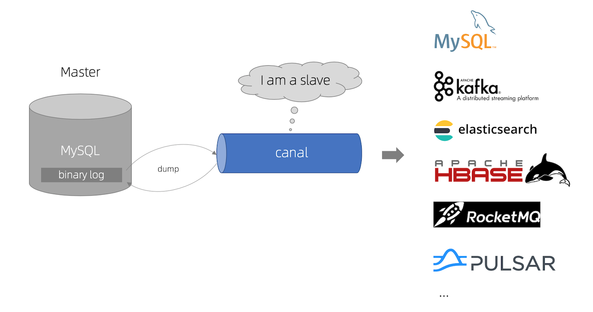

# Canal使用总结

**官网地址：**https://github.com/alibaba/canal

**版本说明：**canal-1.1.5



**canal [kə'næl]**，译意为水道/管道/沟渠，主要用途是基于 MySQL 数据库增量日志解析，提供增量数据订阅和消费

早期阿里巴巴因为杭州和美国双机房部署，存在跨机房同步的业务需求，实现方式主要是基于业务 trigger 获取增量变更。从 2010 年开始，业务逐步尝试数据库日志解析获取增量变更进行同步，由此衍生出了大量的数据库增量订阅和消费业务。

基于日志增量订阅和消费的业务包括

- 数据库镜像
- 数据库实时备份
- 索引构建和实时维护(拆分异构索引、倒排索引等)
- 业务 cache 刷新
- 带业务逻辑的增量数据处理

当前的 canal 支持源端 MySQL 版本包括 5.1.x , 5.5.x , 5.6.x , 5.7.x , 8.0.x

## 工作原理

### MySQL主备复制原理


- MySQL master将数据变更写入二进制日志( binary log, 其中记录叫做二进制日志事件binary log events，可以通过show binlog events进行查看)
- MySQL slave 将 master 的 binary log events 拷贝到它的中继日志(relay log)
- MySQL slave 重放 relay log 中事件，将数据变更反映它自己的数据

### canal 工作原理

- canal 模拟 MySQL slave 的交互协议，伪装自己为 MySQL slave ，向 MySQL master 发送dump 协议
- MySQL master 收到 dump 请求，开始推送 binary log 给 slave (即 canal )
- canal 解析 binary log 对象(原始为 byte 流)

## canal配置说明

### instance配置

| 配置项                                     | 配置说明                      | 默认值  | 备注           |
| ------------------------------------------ | ----------------------------- | ------- | -------------- |
| canal.instance.destination                 | 设置当前正在加载的通道        |         | 类似多环境配置 |
| canal.file.data.dir                        | 存储元游标/解析位置的文件夹   | ../conf |                |
| canal.file.flush.period                    | 元游标/解析位置刷新的时间间隔 | 1000    | 单位毫秒       |
| canal.instance.memory.buffer.size          |                               | 16384   |                |
| canal.instance.memory.buffer.memunit       |                               | 1024    |                |
| canal.instance.memory.batch.mode           |                               | MEMSIZE |                |
| canal.instance.get.ddl.isolation           |                               | false   |                |
| canal.instance.memory.rawEntry             |                               | true    |                |
| canal.instance.filter.transaction.entry    |                               | false   |                |
| canal.instance.destination                 |                               |         |                |
| canal.instance.mysql.slaveId               |                               | 0       |                |
| canal.instance.detecting.enable            |                               | false   |                |
| canal.instance.detecting.sql               |                               |         |                |
| canal.instance.detecting.interval.time     |                               | 5       |                |
| canal.instance.detecting.retry.threshold   |                               | 3       |                |
| canal.instance.detecting.heartbeatHaEnable |                               | false   |                |
| canal.instance.filter.regex                |                               | .*\..*  |                |
| canal.instance.filter.black.regex          |                               |         |                |
| canal.instance.filter.field                |                               |         |                |
| canal.instance.filter.black.field          |                               |         |                |
| canal.instance.transaction.size            |                               | 1024    |                |
| canal.instance.network.receiveBufferSize   |                               | 16384   |                |
| canal.instance.network.sendBufferSize      |                               | 16384   |                |
| canal.instance.network.soTimeout           |                               | 30      |                |
| canal.instance.connectionCharsetNumber     |                               | 33      |                |
| canal.instance.connectionCharset           |                               | UTF-8   |                |
| canal.instance.fallbackIntervalInSeconds   |                               | 60      |                |
| canal.instance.master.address              |                               |         |                |
| canal.instance.dbUsername                  |                               | retl    |                |
| canal.instance.dbPassword                  |                               | retl    |                |
| canal.instance.pwdPublicKey                |                               | retl    |                |
| canal.instance.enableDruid                 |                               | false   |                |
| canal.instance.defaultDatabaseName         |                               |         |                |
| canal.instance.standby.address             |                               |         |                |
| canal.instance.dbUsername                  |                               | retl    |                |
| canal.instance.dbPassword                  |                               | retl    |                |
| canal.instance.pwdPublicKey                |                               | retl    |                |
| canal.instance.enableDruid                 |                               | false   |                |
| canal.instance.defaultDatabaseName         |                               |         |                |
| canal.instance.master.journal.name         |                               |         |                |
| canal.instance.master.position             |                               |         |                |
| canal.instance.master.timestamp            |                               |         |                |
| canal.instance.master.gtid                 |                               |         |                |
| canal.instance.standby.journal.name        |                               |         |                |
| canal.instance.standby.position            |                               |         |                |
| canal.instance.standby.timestamp           |                               |         |                |
| canal.instance.standby.gtid                |                               |         |                |
| canal.instance.filter.query.dml            |                               | false   |                |
| canal.instance.filter.query.dcl            |                               | false   |                |
| canal.instance.filter.query.ddl            |                               | false   |                |
| canal.instance.filter.druid.ddl            |                               | true    |                |
| canal.instance.filter.dml.insert           |                               | false   |                |
| canal.instance.filter.dml.update           |                               | false   |                |
| canal.instance.filter.dml.delete           |                               | false   |                |
| canal.instance.filter.rows                 |                               | false   |                |
| canal.instance.filter.table.error          |                               | false   |                |
| canal.instance.binlog.format               |                               |         |                |
| canal.instance.binlog.image                |                               |         |                |
| canal.instance.tsdb.enable                 |                               | true    |                |
| canal.instance.tsdb.spring.xml             |                               |         |                |
| canal.instance.tsdb.snapshot.interval      |                               | 24      |                |
| canal.instance.tsdb.snapshot.expire        |                               | 360     |                |
| canal.instance.gtidon                      |                               | false   |                |
| canal.instance.parser.parallel             |                               | true    |                |
| canal.instance.parser.parallelThreadSize   |                               |         |                |
| canal.instance.parser.parallelBufferSize   |                               | 256     |                |
| canal.auto.reset.latest.pos.mode           |                               | false   |                |

### Mq通用配置

| 配置项                            | 配置说明                                                     | 参考值                            |
| --------------------------------- | ------------------------------------------------------------ | --------------------------------- |
| canal.mq.topic                    | mq里的topic名，默认                                          | example                           |
| canal.mq.dynamicTopic             | mq里的动态topic规则, 1.1.3版本支持                           | mytest1.user,mytest2\\..*,.*\\..* |
| canal.mq.partition                | 单队列模式的分区下标                                         | 0                                 |
| canal.mq.partitionsNum            | 散列模式的分区数                                             | 3                                 |
| canal.mq.partitionHash            | 散列规则定义                                                 | test.table:id^name,.*\\..*        |
| canal.mq.dynamicTopicPartitionNum | 动态消息队列散列模式的分区数                                 | 3                                 |
| canal.mq.accessChannel            |                                                              |                                   |
| canal.mq.canalBatchSize           | 获取canal数据的批次大小                                      | 50                                |
| canal.mq.canalGetTimeout          | 获取canal数据的超时时间                                      | 100                               |
| canal.mq.flatMessage              | 是否为json格式，如果设置为false,对应MQ收到的消息为protobuf格式，需要通过CanalMessageDeserializer进行解码 | true                              |
| canal.mq.database.hash            |                                                              |                                   |
| canal.mq.build.thread.size        |                                                              |                                   |
| canal.mq.send.thread.size         |                                                              |                                   |

### Kafka配置项

| canal配置项                       | kafka配置项        | 配置说明         | 参考值  |
| --------------------------------- | ------------------ | ---------------- | ------- |
| canal.mq.servers                  | bootstrap.servers  | 服务列表         |         |
| canal.mq.acks                     | acks               |                  |         |
| canal.mq.compressionType          | compression.type   |                  |         |
| canal.mq.retries                  | retries            | 发送失败重试次数 | 0       |
| canal.mq.batchSize                | batch.size         |                  | 16384   |
| canal.mq.lingerMs                 | linger.ms          |                  | 1       |
| canal.mq.maxRequestSize           | max.request.size   |                  | 1048576 |
| canal.mq.bufferMemory             | buffer.memory      |                  |         |
| canal.mq.kafka.kerberos.enable    | kerberos.enable    |                  |         |
| canal.mq.kafka.kerberos.krb5.file | kerberos.krb5.file |                  |         |
| canal.mq.kafka.kerberos.jaas.file | kerberos.jaas.file |                  |         |

> 如果`canal.instance.filter.query.dml = false`必须显示指定`canal.mq.topic`

### rocketMQ配置项

| 配置项                 | 配置说明                                       | 参考值 |
| ---------------------- | ---------------------------------------------- | ------ |
| canal.mq.servers       | namesrv.addr                                   |        |
| canal.mq.producerGroup | producer.group                                 |        |
| canal.mq.namespace     | namespace                                      |        |
| canal.mq.retries       | 发送失败重试次数：retry.times.when.send.failed | 0      |

### K8S安装配置文件

```yaml
apiVersion: apps/v1
kind: StatefulSet
metadata:
  labels:
    k8s-app: canal-server-doris
  name: canal-server-doris
  namespace: scrm-mss
spec:
  podManagementPolicy: OrderedReady
  replicas: 1
  revisionHistoryLimit: 10
  selector:
    matchLabels:
      k8s-app: canal-server-doris
  serviceName: ""
  template:
    metadata:
      creationTimestamp: null
      labels:
        k8s-app: canal-server-doris
    spec:
      containers:
      - env:
        - name: canal.auto.scan
          value: "false"
        - name: canal.destinations
          value: "destination"
        - name: canal.instance.master.address
          value: "192.168.1.12:3306"
        - name: canal.instance.dbUsername
          value: "username"
        - name: canal.instance.dbPassword
          value: "password"
        - name: canal.instance.connectionCharset
          value: UTF-8
        - name: canal.instance.tsdb.enable
          value: "true"
        - name: canal.instance.gtidon
          value: "false"
        - name: canal.instance.filter.regex
          value: db.table1,db.table2
        - name: canal.serverMode
          value: kafka
        - name: canal.mq.servers
          value: 192.168.1.12:9092
        - name: canal.mq.retries
          value: "0"
        - name: canal.mq.topic
          value: "example"
        - name: canal.mq.partition
          value: "0"
        - name: canal.mq.acks
          value: "all"
        - name: canal.mq.dynamicTopic
          value: db.table1,topic:db.table2
        - name: canal.instance.filter.druid.ddl
          value: "true"
        - name: canal.instance.filter.query.dcl
          value: "true"
        - name: canal.instance.filter.query.dml
          value: "false"
        - name: canal.instance.filter.query.ddl
          value: "true"
        - name: canal.instance.filter.table.error
          value: "true"
        image: harbor/namespace/canal-server:tag
        imagePullPolicy: Always
        name: canal-server
        resources:
          limits:
            cpu: "1"
            memory: 1024Mi
          requests:
            cpu: "0.8"
            memory: 512Mi
        securityContext:
          privileged: false
        terminationMessagePath: /dev/termination-log
        terminationMessagePolicy: File
        volumeMounts:
        - mountPath: /home/admin/canal-server/logs
          name: data
      dnsPolicy: ClusterFirst
      imagePullSecrets:
      - name: tcr.ipstcr-dognqnnd-public
      restartPolicy: Always
      schedulerName: default-scheduler
      securityContext: {}
      terminationGracePeriodSeconds: 30
  updateStrategy:
    rollingUpdate:
      partition: 0
    type: RollingUpdate    
  volumeClaimTemplates:
  - metadata:
      name: data
    spec:
      accessModes: [ "ReadWriteOnce" ]
      storageClassName: cfs
      resources:
        requests:
          storage: 10Gi
```

## 问题解决案例

### canal无法往kafka同步

canal往kafka同步报错，数据无法同步，一直在重复发送旧数据，新数据无法发送。

* canal日志

```log
2022-01-06 16:45:53.174 [pool-4-thread-1] ERROR c.a.o.canal.connector.kafka.producer.CanalKafkaProducer - java.util.concurrent.ExecutionException: org.apache.kafka.common.errors.TimeoutException: Failed to update metadata after 60000 ms.
java.lang.RuntimeException: java.util.concurrent.ExecutionException: org.apache.kafka.common.errors.TimeoutException: Failed to update metadata after 60000 ms.
        at com.alibaba.otter.canal.connector.kafka.producer.CanalKafkaProducer.send(CanalKafkaProducer.java:185) ~[na:na]
        at com.alibaba.otter.canal.server.CanalMQStarter.worker(CanalMQStarter.java:181) [canal.server-1.1.5.jar:na]
        at com.alibaba.otter.canal.server.CanalMQStarter.access$100(CanalMQStarter.java:25) [canal.server-1.1.5.jar:na]
        at com.alibaba.otter.canal.server.CanalMQStarter$CanalMQRunnable.run(CanalMQStarter.java:223) [canal.server-1.1.5.jar:na]
        at java.util.concurrent.ThreadPoolExecutor.runWorker(ThreadPoolExecutor.java:1149) [na:1.8.0_181]
        at java.util.concurrent.ThreadPoolExecutor$Worker.run(ThreadPoolExecutor.java:624) [na:1.8.0_181]
        at java.lang.Thread.run(Thread.java:748) [na:1.8.0_181]
Caused by: java.util.concurrent.ExecutionException: org.apache.kafka.common.errors.TimeoutException: Failed to update metadata after 60000 ms.
        at org.apache.kafka.clients.producer.KafkaProducer$FutureFailure.<init>(KafkaProducer.java:1150) ~[na:na]
        at org.apache.kafka.clients.producer.KafkaProducer.doSend(KafkaProducer.java:846) ~[na:na]
        at org.apache.kafka.clients.producer.KafkaProducer.send(KafkaProducer.java:784) ~[na:na]
        at org.apache.kafka.clients.producer.KafkaProducer.send(KafkaProducer.java:671) ~[na:na]
        at com.alibaba.otter.canal.connector.kafka.producer.CanalKafkaProducer.produce(CanalKafkaProducer.java:269) ~[na:na]
        at com.alibaba.otter.canal.connector.kafka.producer.CanalKafkaProducer.send(CanalKafkaProducer.java:262) ~[na:na]
        at com.alibaba.otter.canal.connector.kafka.producer.CanalKafkaProducer.lambda$send$0(CanalKafkaProducer.java:157) ~[na:na]
        at java.util.concurrent.FutureTask.run(FutureTask.java:266) ~[na:1.8.0_181]
        ... 3 common frames omitted
Caused by: org.apache.kafka.common.errors.TimeoutException: Failed to update metadata after 60000 ms.
```

* kafka接收数据

```json
{"data":[{"id":"11","name":"牛8","agr":"20"}],"database":"eip_dw_service","es":1641439797000,"id":48,"isDdl":false,"mysqlType":{"id":"int(10) unsigned","name":"varchar(30)","agr":"int(11)"},"old":null,"pkNames":["id"],"sql":"","sqlType":{"id":4,"name":12,"agr":4},"table":"nw_test_userinfo","ts":1641440136865,"type":"DELETE"}
{"data":[{"id":"11","name":"牛8","agr":"20"}],"database":"eip_dw_service","es":1641439797000,"id":49,"isDdl":false,"mysqlType":{"id":"int(10) unsigned","name":"varchar(30)","agr":"int(11)"},"old":null,"pkNames":["id"],"sql":"","sqlType":{"id":4,"name":12,"agr":4},"table":"nw_test_userinfo","ts":1641440316869,"type":"DELETE"}
```

* 解决思路
  * 1、检查kafka是否正常启动
  * 2、检查kafka服务器端口是否开放
  * 3、检查/etc/hosts文件中是否包含ip与主机名对应关系
  * 4、检查下`canal.instance.filter.query.dml = false`必须显示配置`canal.mq.topic`
  * 5、检查topic是否有问题，尝试重建下topic

* 解决办法

    最终确认是因为没有配置`canal.mq.topic`导致的，需要填加`canal.mq.topic="example"`配置，并在kafka创建名为`example`的topic，究其原因是canal加载的binlog中使用了动态路由topic中不包含的topic，此时canal会把这些数据统一发送到`canal.mq.topic`指定的topic中，默认是topic名是`example`。所以需要确保`canal.mq.topic`正确配置，并`canal.mq.topic`指定的topic在kafka中存在。

## 参考文档地址

[canal无法往kafka同步，报错TimeoutException: Failed to update metadata after 60000 ms](https://blog.csdn.net/yabingshi_tech/article/details/115112491)

