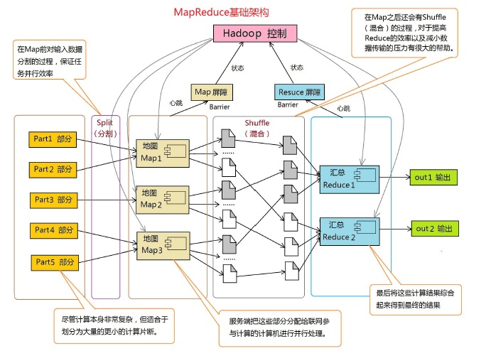
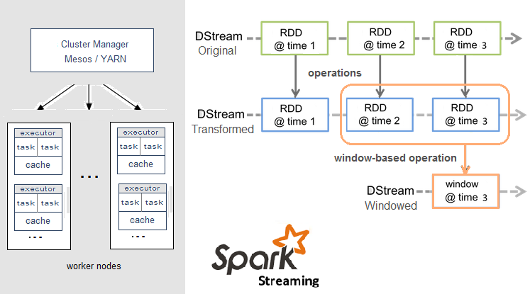
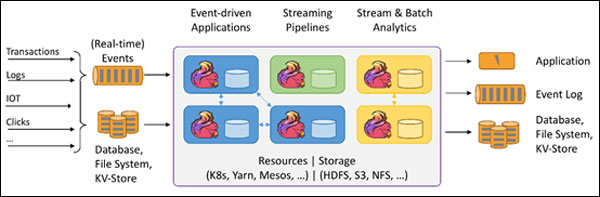
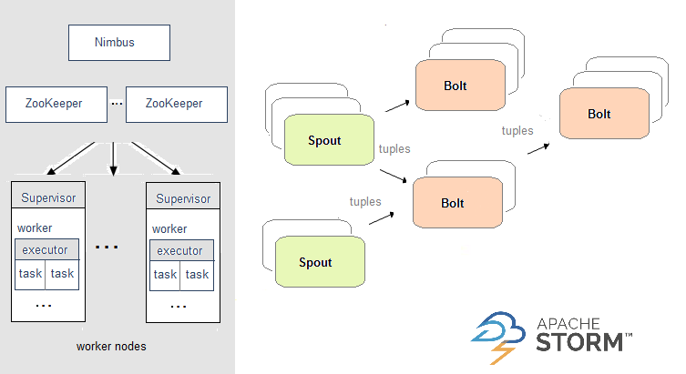
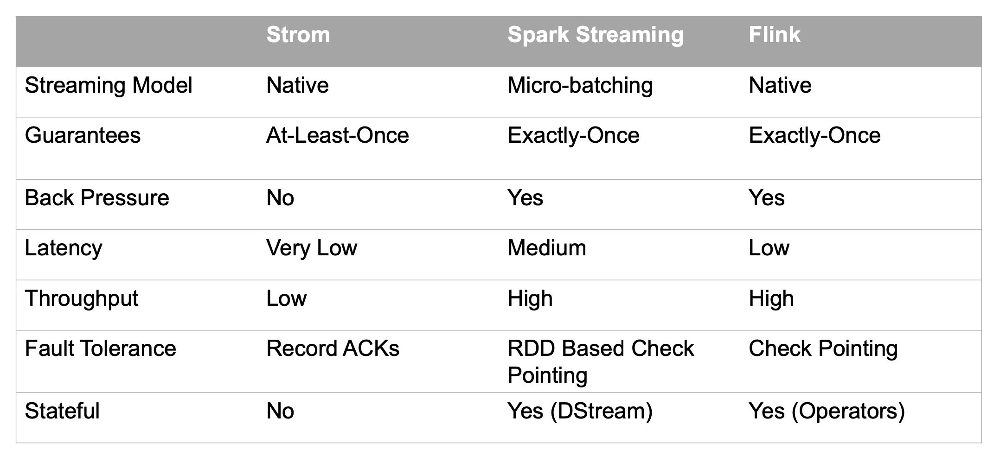

# 数据计算引擎

         大数据的计算模式主要分为批量计算(batch computing)、流式计算(stream computing)、交互计算(interactive computing)、图计算(graph computing)等。其中，流式计算和批量计算是两种主要的大数据计算模式，分别适用于不同的大数据应用场景。

## MapReduce

        开源分布式计算的第一个流行的框架是 Hadoop 项目中的 MapReduce 模块。它将所有计算抽象成 Map 和 Reduce 两个阶段，在计算时通过增加机器，并行的读取数据文件，进行 Map 或 Reduce 的操作，并将结果写到文件中。如此反复得到最终的结果。
        上面过程中，每个 Map 和 Reduce 阶段所能表达的计算逻辑是有限的，因此完整的业务逻辑往往包含了多个阶段。注意到每个阶段都有读取数据文件和数据写出到文件的开销，对于同一个任务的中间结果，其唯一用途就是被下一阶段读取，且读后就成为垃圾文件，对中间结果落盘显然是不合理的重大开销。

## Apache Spark

        Spark Streaming，即核心Spark API的扩展，不像Storm那样一次处理一个数据流。相反，它在处理数据流之前，会按照时间间隔对数据流进行分段切分。Spark针对连续数据流的抽象，我们称为DStream（Discretized Stream）。 DStream是小批处理的RDD（弹性分布式数据集）， RDD则是分布式数据集，可以通过任意函数和滑动数据窗口（窗口计算）进行转换，实现并行操作。

## Apache Flink

        针对流数据+批数据的计算框架。把批数据看作流数据的一种特例，延迟性较低(毫秒级)，且能够保证消息传输不丢失不重复。

        Flink创造性地统一了流处理和批处理，作为流处理看待时输入数据流是无界的，而批处理被作为一种特殊的流处理，只是它的输入数据流被定义为有界的。Flink程序由Stream和Transformation这两个基本构建块组成，其中Stream是一个中间结果数据，而Transformation是一个操作，它对一个或多个输入Stream进行计算处理，输出一个或多个结果Stream。

## Apache Storm

        在Storm中，需要先设计一个实时计算结构，我们称之为拓扑（topology）。之后，这个拓扑结构会被提交给集群，其中主节点（master node）负责给工作节点（worker node）分配代码，工作节点负责执行代码。在一个拓扑结构中，包含spout和bolt两种角色。数据在spouts之间传递，这些spouts将数据流以tuple元组的形式发送；而bolt则负责转换数据流。

## 计算框架的对比

