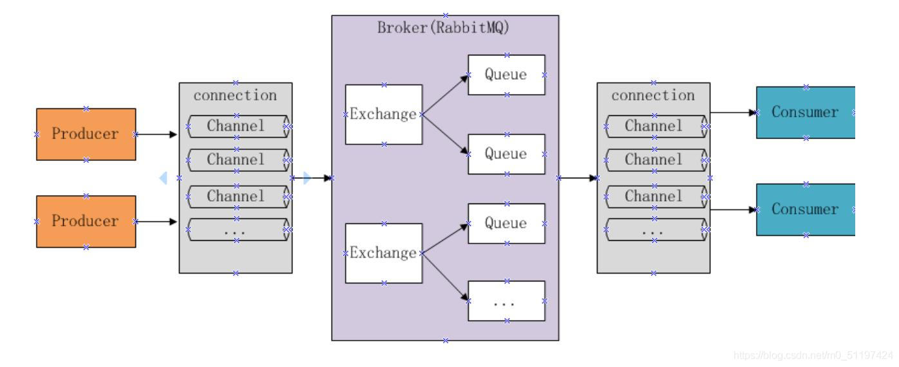
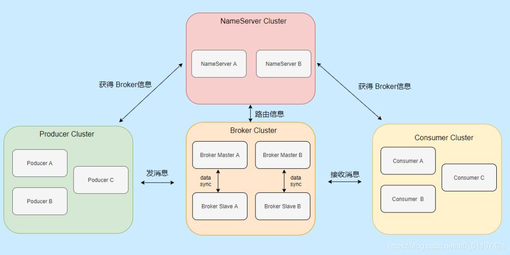
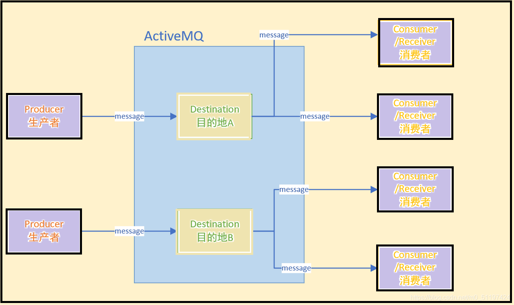
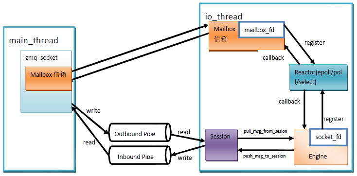
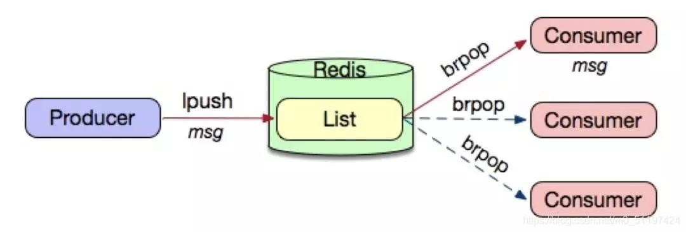

# 消息中间件集
    消息中间件，是利用高效可靠的消息传递机制进行异步的数据传输，并基于数据通信进行分布式系统的集成。通过提供那个消息队列模型和消息传递机制，可以在分布式环境下扩展进程间的通信。

## 消息传递模式

* 点对点模式

        消息生产者讲消息发送到队列种，消息消费者从队列中接收消息。消息可以在队列中进行异步传输。

* 发布/订阅模式

        发布订阅模式是通过一个内容节点来发布和订阅消息，这个内容结点成为主题，消息发布者将消息发布到某个主题，消息订阅者订阅这个主题的消息，主题相当于一个中介。主题的消息的发布与订阅相互独立，该模式的消息的传播是一对多的模式。

## 常见消息队列

### kafka

        Kafka是最初由Linkedin公司开发，是一个分布式、分区的、多副本的、多订阅者，基于zookeeper协调的分布式日志系统（也可以当做MQ系统），常见可以用于web/nginx日志、访问日志，消息服务等等，Linkedin于2010年贡献给了Apache基金会并成为顶级开源项目。

### RabbitMQ

        RabbitMQ是使用Erlang编写的一个开源的消息队列，本身支持很多的协议：AMQP，XMPP, SMTP, STOMP，也正因如此，它非常重量级，更适合于企业级的开发。同时实现了Broker构架，这意味着消息在发送给客户端时先在中心队列排队。对路由，负载均衡或者数据持久化都有很好的支持。

### RocketMQ

        RocketMQ是阿里开源的消息中间件，目前也已经孵化为Apache的顶级项目，它是纯Java开发，具有高吞吐量、高可用性、适合大闺蜜分布式系统的特点。

        该消息队列的设计思路起源于Kafka，他对消息的可靠传输和事务的性能做了优化，目前被阿里集团广泛应用于交易、充值、流计算、消息推送、日志流处理、binglog分发等场景。

### ActiveMQ

         Apache的开源产品，完全支持JMS规范的消息中间件，是一个纯Java的程序，因此只需要操作系统支持Java虚拟机的，ActiveMQ即可执行。

        JMS即为Java Message Service的应用程序接口，是一个Java平台中关于面向消息中间件的API，用于在两个程序之间，或分布式系统中发送消息，进行异步通信。

### zeroMQ

        ZeroMQ（简称ZMQ）是一个基于消息队列的多线程网络库，其对套接字类型、连接处理、帧、甚至路由的底层细节进行抽象，提供跨越多种传输协议的套接字。

​        ZMQ是网络通信中新的一层，介于应用层和传输层之间（按照TCP/IP划分），其是一个可伸缩层，可并行运行，分散在分布式系统间。

​        ZMQ不是单独的服务，而是一个嵌入式库，它封装了网络通信、消息队列、线程调度等功能，向上层提供简洁的API，应用程序通过加载库文件，调用API函数来实现高性能网络通信。

### Redis消息队列

        Redis中列表List类型是按照插入顺序的字符串链表，和数据结构中的普遍链表一样，可以在头部left和尾部right添加新的元素。插入时如何键不存在Redis将为该键创建一个新的链表。如果链表中所有元素均被删除，那么该键也被删除。

        Redis的列表List可以包含的最大元素数量为4294967295，从元素插入和删除的效率来看，如果是在链表的两头插入或删除元素将是非常高效的操作。即使链表中已经存储了数百万条记录，该操作也能在常量时间内完成。然后需要说明的是，如果元素插入或删除操作是作用于链表中间，那将是非常低效的。

        Redis中对列表List的操作命令中，L表示从左侧头部开始插入和弹出，R表示从右侧尾部开始插入和弹出。

        Redis提供了两种方式来做消息队列，一种是生产消费模式，另一种是发布订阅模式。

### pulsar

# 参考文档

[消息队列对比](https://blog.csdn.net/m0_51197424/article/details/118096549)

[ZeroMQ](https://www.cnblogs.com/zengzy/p/5122634.html)]

