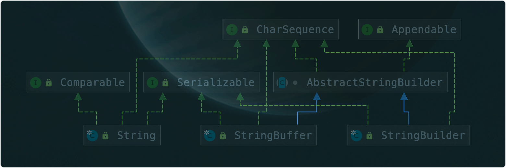
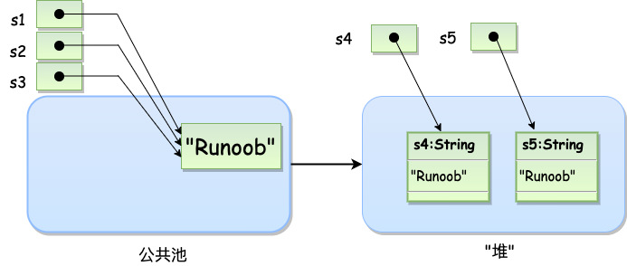

# 字符串知识汇总

## 字符串相关类关系图



### String类详解

字符串广泛应用 在 Java 编程中，在 Java 中字符串属于对象，Java 提供了 String 类来创建和操作字符串。

### 创建字符串

```java
String str = "oscar";
// 通过直接赋值所创建的对象，是直接存储在方法区常量池中的字符串常量。
```

```java
String str2=new String("oscar");
// 通过构造方法创建的String对象，存放在java虚拟机的堆内存，堆内存里存放的是字符串常量的地址，字符串常量存放在方法区的常量池中：

String s1 = "Runoob";              // String 直接创建
String s2 = "Runoob";              // String 直接创建
String s3 = s1;                    // 相同引用
String s4 = new String("Runoob");   // String 对象创建
String s5 = new String("Runoob");   // String 对象创建
```




### String类特性

* String对象是由final修饰的，本身不能继承，没有子类重写的情况
* 底层实现是一个final修饰的char数组，因此数据是不可变的
* 对外提供的所有修改字符串的方法，都返回一个新的字符串对象
* 每次修改都会产生新对象，建议使用StringBuilder和StringBuffer进行大量的字符串修改操作


